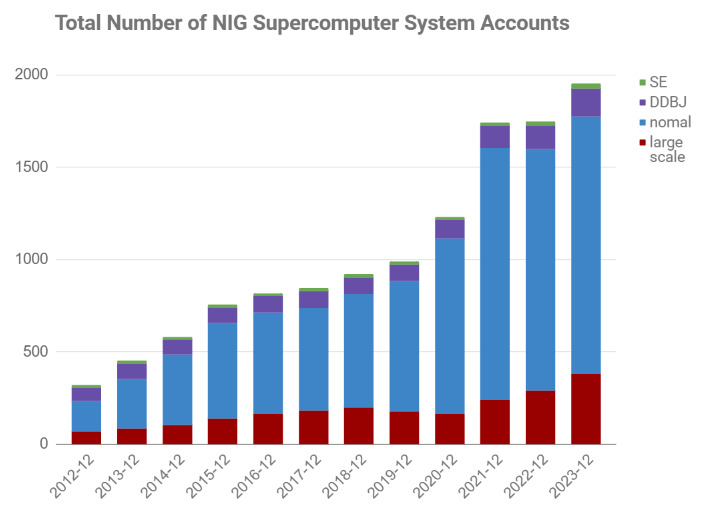
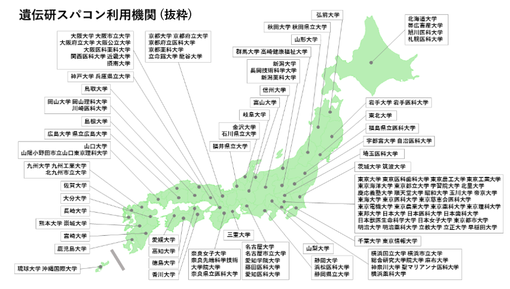

## ユーザー数 {#number-of-users}

<table>
<tr>
<th width="300">集計日</th>
<th width="300">login user (normal)</th>
<th width="300">login user (large scale)</th>
<th width="300">DDBJ</th>
<th width="300">SE</th>
<th width="300">合計</th>
</tr>
<tr>
<td>2012.12.31</td>
<td>165</td>
<td>69</td>
<td>70</td>
<td>16</td>
<td>320</td>
</tr>
<tr>
<td>2013.12.31</td>
<td>270</td>
<td>84</td>
<td>80</td>
<td>19</td>
<td>453</td>
</tr>
<tr>
<td>2014.12.31</td>
<td>380</td>
<td>105</td>
<td>82</td>
<td>13</td>
<td>580</td>
</tr>
<tr>
<td>2015.12.31</td>
<td>519</td>
<td>139</td>
<td>83</td>
<td>15</td>
<td>756</td>
</tr>
<tr>
<td>2016.12.31</td>
<td>549</td>
<td>165</td>
<td>88</td>
<td>14</td>
<td>816</td>
</tr>
<tr>
<td>2017.12.31</td>
<td>557</td>
<td>182</td>
<td>92</td>
<td>15</td>
<td>846</td>
</tr>
<tr>
<td>2018.12.31</td>
<td>616</td>
<td>199</td>
<td>88</td>
<td>18</td>
<td>921</td>
</tr>
<tr>
<td>2019.12.31</td>
<td>706</td>
<td>178</td>
<td>91</td>
<td>15</td>
<td>990</td>
</tr>
<tr>
<td>2020.12.31</td>
<td>949</td>
<td>165</td>
<td>100</td>
<td>17</td>
<td>1231</td>
</tr>
<tr>
<td>2021.12.31</td>
<td>1365</td>
<td>240</td>
<td>119</td>
<td>19</td>
<td>1662</td>
</tr>
<tr>
<td>2022.12.31</td>
<td>1310</td>
<td>290</td>
<td>128</td>
<td>20</td>
<td>1748</td>
</tr>
<tr>
<td>2023.12.31</td>
<td>1394</td>
<td>381</td>
<td>151</td>
<td>27</td>
<td>1953</td>
</tr>
</table>

## 利用機関数 {#number-of-institutions}

[科研費の申請機関](https://www-kaken.jsps.go.jp/kaken1/kikanList.do)を1つの機関として集計。（科研費の申請機関でない場合は大学、企業などを１つの機関と数えた。企業については非公開とする。）
具体的な機関名については「[利用機関ごとのアカウント数](/report/accounts_by_institution)」参照。（大学・国公立研究機関のみ集計。企業については非公開。）

<table>
<tbody>
<tr>
<th width="150" rowspan="2">集計日</th>
<th width="300" colspan="3">国内</th>
<th width="300" colspan="3">海外</th>
<th width="100" rowspan="2">総数</th>
</tr>
<tr>
<td>大学・国公立研究機関</td>
<td>企業</td>
<td>計</td>
<td>大学・国公立研究機関</td>
<td>企業</td>
<td>計</td>
</tr>
<tr>
<td>2016.12.31</td>
<td>135</td>
<td>18</td>
<td>153</td>
<td>5</td>
<td>1</td>
<td>6</td>
<td>159</td>
</tr>
<tr>
<td>2017.12.31</td>
<td>129</td>
<td>15</td>
<td>144</td>
<td>5</td>
<td>1</td>
<td>6</td>
<td>150</td>
</tr>
<tr>
<td>2018.12.31</td>
<td>129</td>
<td>15</td>
<td>144</td>
<td>5</td>
<td>1</td>
<td>6</td>
<td>150</td>
</tr>
<tr>
<td>2019.12.31</td>
<td>137</td>
<td>12</td>
<td>149</td>
<td>6</td>
<td>1</td>
<td>7</td>
<td>156</td>
</tr>
<tr>
<td>2020.12.31</td>
<td>148</td>
<td>14</td>
<td>162</td>
<td>14</td>
<td>0</td>
<td>14</td>
<td>176</td>
</tr>
<tr>
<td>2021.12.31</td>
<td>161</td>
<td>14</td>
<td>175</td>
<td>17</td>
<td>0</td>
<td>17</td>
<td>192</td>
</tr>
<tr>
<td>2022.12.31</td>
<td>173</td>
<td>19</td>
<td>192</td>
<td>12</td>
<td>0</td>
<td>12</td>
<td>204</td>
</tr>
<tr>
<td>2023.12.31</td>
<td>170</td>
<td>34</td>
<td>204</td>
<td>16</td>
<td>0</td>
<td>16</td>
<td>220</td>
</tr>
</tbody>
</table>

## 発行済み査読付き論文数 {#peer-reviewed-papers}

集計期間：1月1日〜12月31日

<table>
<tr>
<th width="300">論文雑誌の出版年</th>
<th width="300">各年度末アカウント継続申請時に集計した論文数</th>
<th width="300">各年度末アカウント継続申請時の集計後に追加で申請があった論文数</th>
<th width="300">計</th>
</tr>
<tr>
<td>2012</td>
<td>9</td>
<td>0</td>
<td>9</td>
</tr>
<tr>
<td>2013</td>
<td>23</td>
<td>0</td>
<td>23</td>
</tr>
<tr>
<td>2014</td>
<td>53</td>
<td>0</td>
<td>53</td>
</tr>
<tr>
<td>2015</td>
<td>43</td>
<td>0</td>
<td>43</td>
</tr>
<tr>
<td>2016</td>
<td>83</td>
<td>0</td>
<td>83</td>
</tr>
<tr>
<td>2017</td>
<td>93</td>
<td>0</td>
<td>93</td>
</tr>
<tr>
<td>2018</td>
<td>113</td>
<td>0</td>
<td>113</td>
</tr>
<tr>
<td>2019</td>
<td>104</td>
<td>1</td>
<td>105</td>
</tr>
<tr>
<td>2020</td>
<td>124</td>
<td>1</td>
<td>125</td>
</tr>
<tr>
<td>2021</td>
<td>167</td>
<td>13</td>
<td>180</td>
</tr>
<tr>
<td>2022</td>
<td>177</td>
<td>7</td>
<td>184</td>
</tr>
<tr>
<td>2023</td>
<td>203</td>
<td>0</td>
<td>203</td>
</tr>
</table>

