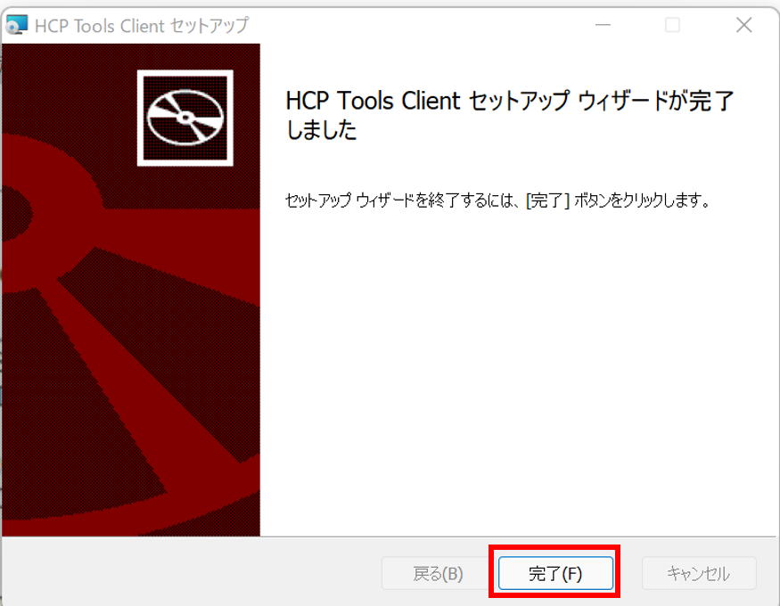

## インストーラの入手

以下のリンクからインストーラがダウンロード可能です。

- <a href="https://github.com/oogasawa/nigsc_HCPtools/raw/main/1.3.0R-45/Windows/HCP_Tools_Client.msi">HCP_Tools_Client.msi</a>
- <a href="https://github.com/oogasawa/nigsc_HCPtools/tree/main/1.3.0R-45/Windows">HCP_Tools_Client.md5sum</a>


過去のバージョンなどは<a href="https://github.com/oogasawa/nigsc_HCPtools">こちらからダウンロード可能です。</a>


## HCP toolsクライアントソフトウェアのインストール

`HCP_Tools_Client.msi`をダブルクリックします。


「使用許諾契約書に同意します(A)」にチェックを入れ、「インストール(I)」ボタンをクリックします。


デバイスの変更許可に「はい」と応えると、インストールが開始します。


インストールが完了すると、下記の画面が表示されるので、「完了」ボタンをクリックします。




インストール後、実行コマンドが`C:\Program Files`の下に、設定ファイルが`C:\ProgramData`の下に存在することを確認して下さい。

- 実行コマンド : 'C:\Program Files\Clealink\HCP Tools\hcp.exe'
- 設定ファイル: 'C:\ProgramData\Clealink\HCP Tools\hcp.conf'


## 設定ファイルの編集 

HCP toolsの設定ファイルをユーザディレクトリに設置し、ユーザ認証のための公開鍵の設定を追記します。
HCP toolsのユーザ認証のための公開鍵はSSHの公開鍵と同じで構いません。(SSH公開鍵暗号方式によるユーザ認証の説明は[こちら](/application/ssh_keys)をご覧ください。)


### 設定ファイルの設置

HCP toolsは、ユーザディレクトリ直下の`.hcp`ディレクトリ（または`_hcp`ディレクトリ）の中にある設定ファイルを参照します。
PowerShellをご使用の場合は以下のコマンドで設定ファイルの雛形をコピーできます。

```bash
mkdir C:\Users\ユーザ名\.hcp
cp "C:\ProgramData\Clealink\HCP Tools\*.conf" C:\Users\ユーザ名\.hcp
```


### 公開鍵の設定の追記

HCP toolsは、公開鍵・秘密鍵によりユーザ認証を行います。

この場合の公開鍵・秘密鍵は遺伝研スパコンのSSHログインに用いる公開鍵・秘密鍵ファイルで構いません。
これらを用いる場合は、クライアントマシン（Windows)のユーザディレクトリ`C:\Users\ユーザ名\.ssh`の下に秘密鍵ファイル(`id_rsa`)が置かれていることを確認してください。（[SSHの公開鍵の設定方法](/application/ssh_keys)に従うとすでに秘密鍵ファイルがここに置かれているはずです。）


次に`C:\Users\ユーザ名\.hcp\hcp.conf`を開いて、一番下の行に`PrivateKeyFile C:\Users\ユーザ名\.ssh\id_rsa`を追記し保存します。

```
# This is the HCP tools client system configuration file of the hchown command.
# This file provides defaults and the values can be changed in per-user configuration files
# or on the command line.
 
# Configuration data is parsed as follows:
#  1. system file (C:\ProgramData\Clealink\HCP Tools\hchown.conf)
#  2. user-home file (~\_hcp\hchown.conf)
#  3. user-specific file (--configfile command line option)
#  4. command line options
#
# Any configuration value is overwritten by the following options specified.
# If you do not have any configuration files and options from the command line,
# the command runs in default options.
# Use the --configtest option to see what options will be applied on the running.
 
# Include a common configuration.
#Include "C:\ProgramData\Clealink\HCP Tools\hcp-common.conf"
 
#LocalPasswordAuthentication yes
#PAMAuthentication yes
#PubkeyAuthentication yes
#WinLogonUserAuthentication yes
#
#StrictHostKeyChecking ask
#PrivateKeyFile ~\_hcp\id_rsa
#
#AcceptableCryptMethod AES256/CTR/VMAC AES256/CBC AES128/CBC
#AcceptableDigestMethod MM128 SHA256 SHA160
#CompressLevel -1
#
#TransportTimeout 180 # in seconds 
#
#FileLock no
#AtomicLikeSaving no .tmp NONE
#
#ApplicationLog INFO
#ApplicationStatLog yes
#TransportStatLog no
 
PrivateKeyFile C:\Users\ユーザ名\.ssh\id_rsa
```

