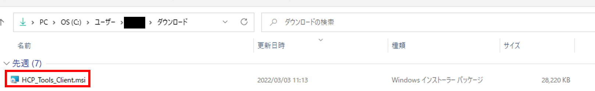

## インストーラの入手

以下の`HCP_Tools_Client.msi`のリンクをクリックします。

クリックすると、HCP toolsクライアントソフトウェアのzipファイルのダウンロードが開始されます。

クリックした時に、ファイルを保存するか聞かれる画面が表示された場合は、「ファイルを保存」を選択してください。

- <a href="https://github.com/oogasawa/nigsc_HCPtools/raw/main/1.3.0R-45/Windows/HCP_Tools_Client.msi">HCP_Tools_Client.msi</a>
- <a href="https://github.com/oogasawa/nigsc_HCPtools/tree/main/1.3.0R-45/Windows">HCP_Tools_Client.md5sum</a>


過去のバージョンなどは<a href="https://github.com/oogasawa/nigsc_HCPtools">こちらからダウンロード可能です。</a>


HCP toolsクライアントソフトウェアは、ユーザの計算機の`'C:\Users\ユーザ名\Downloads\'`の下に、ダウンロードされます。


## HCP toolsクライアントソフトウェアのインストール

`HCP_Tools_Client.msi`をダブルクリックします。




「使用許諾契約書に同意します(A)」にチェックを入れ、「インストール(I)」ボタンをクリックします。


デバイスの変更許可に「はい」と応えると、インストールが開始します。


インストールが完了すると、下記の画面が表示されるので、「完了」ボタンをクリックします。


インストール後、実行コマンドが`C:\Program Files`の下に、設定ファイルが`C:\ProgramData`の下に存在することを確認して下さい。

- 実行コマンド : 'C:\Program Files\Clealink\HCP Tools\hcp.exe'
- 設定ファイル: 'C:\ProgramData\Clealink\HCP Tools\hcp.conf'


## 設定ファイルの設定変更

ユーザディレクトリに`_hcp`ディレクトリを作成し、その中にHCP toolsに必要な設定ファイルをコピーします。

```bash
mkdir C:\Users\ユーザ名\_hcp
cp C:\ProgramData\Clealink\HCP Tools\*.conf C:\Users\ユーザ名\_hcp
```


HCP Toolsのユーザ認証には、遺伝研スパコンのSSH公開鍵・秘密鍵ファイルを使用します。
ユーザディレクトリ`C:\Users\ユーザ名\.ssh`の下に秘密鍵ファイル(`id_rsa`)が置かれていることを確認してください。

SSH公開鍵暗号方式によるユーザ認証の説明は[こちら](/application/ssh_keys)をご覧ください。


`C:\Users\ユーザ名\_hcp\hcp.conf`を開いて、一番下の行に`PrivateKeyFile C:\Users\ユーザ名\.ssh\id_rsa`を追記し保存します。
```
# This is the HCP tools client system configuration file of the hchown command.
# This file provides defaults and the values can be changed in per-user configuration files
# or on the command line.
 
# Configuration data is parsed as follows:
#  1. system file (C:\ProgramData\Clealink\HCP Tools\hchown.conf)
#  2. user-home file (~\_hcp\hchown.conf)
#  3. user-specific file (--configfile command line option)
#  4. command line options
#
# Any configuration value is overwritten by the following options specified.
# If you do not have any configuration files and options from the command line,
# the command runs in default options.
# Use the --configtest option to see what options will be applied on the running.
 
# Include a common configuration.
#Include "C:\ProgramData\Clealink\HCP Tools\hcp-common.conf"
 
#LocalPasswordAuthentication yes
#PAMAuthentication yes
#PubkeyAuthentication yes
#WinLogonUserAuthentication yes
#
#StrictHostKeyChecking ask
#PrivateKeyFile ~\_hcp\id_rsa
#
#AcceptableCryptMethod AES256/CTR/VMAC AES256/CBC AES128/CBC
#AcceptableDigestMethod MM128 SHA256 SHA160
#CompressLevel -1
#
#TransportTimeout 180 # in seconds 
#
#FileLock no
#AtomicLikeSaving no .tmp NONE
#
#ApplicationLog INFO
#ApplicationStatLog yes
#TransportStatLog no
 
PrivateKeyFile C:\Users\ユーザ名\.ssh\id_rsa
```

## 遺伝研スパコンへのSSL-VPN接続

接続方法は、<a href="https://sc.ddbj.nig.ac.jp/personal_genome_division/pg_login#windows%E3%81%BE%E3%81%9F%E3%81%AFmac%E3%81%AE%E5%A0%B4%E5%90%88-forticlient-gui">「ログイン方法(個人ゲノム解析区画)」の「VPNへの接続方法　WindowsまたはMacの場合 (FortiClient GUI)」</a>をご参照ください。

## 個人ゲノム解析区画へのログイン

ログイン方法は、<a href="https://sc.ddbj.nig.ac.jp/personal_genome_division/pg_login#ssh%E3%81%AB%E3%82%88%E3%82%8B%E3%82%B2%E3%83%BC%E3%83%88%E3%82%A6%E3%82%A7%E3%82%A4%E3%81%B8%E3%81%AE%E3%83%AD%E3%82%B0%E3%82%A4%E3%83%B3">「ログイン方法(個人ゲノム解析区画)」の「SSHによるゲートウェイへのログイン」</a>をご参照ください。

## ファイル転送

### アップロード

遺伝研スパコン個人ゲノム解析区画に対してVPNの接続をした後、PowerShellを起動し、以下のコマンドを実行します。

実行すると、ユーザの計算機から個人ゲノム解析区画のユーザのホームディレクトリの下に、ファイルのアップロードができます。

- TCP通信で、ユーザの計算機のホームディレクトリにあるファイル`upload_ex1.txt`を、個人ゲノム解析区画のユーザのホームディレクトリにアップロードする
```
hcp --user ユーザ名 C:\Users\ユーザ名\upload_ex1.txt gwa.ddbj.nig.ac.jp:upload_ex1.txt
```

- オプション「-hpfp」を付け、UDP(HpFP2)通信で、ユーザの計算機のホームディレクトリにあるファイル`upload_ex1.txt`を、個人ゲノム解析区画のユーザのホームディレクトリにアップロードする
```
hcp --user ユーザ名 --hpfp C:\Users\ユーザ名\upload_ex1.txt gwa.ddbj.nig.ac.jp:upload_ex1.txt
```

- オプション「-R」を付け、再帰的に、TCP通信で、ユーザの計算機のホームディレクトリにあるディレクトリ`HCP_upload_ex3`を、個人ゲノム解析区画のユーザのホームディレクトリの下にアップロードする
```
hcp --user akatsumata-pg -R C:\Users\ユーザ名\HCP_upload_ex3\ gwa.ddbj.nig.ac.jp:/home/akatsumata-pg/
```

### ダウンロード

PowerShellから以下のコマンドを実行すると、個人ゲノム解析区画のユーザのホームディレクトリの下からユーザの計算機に、ファイルのダウンロードができます。

- TCP通信で、個人ゲノム解析区画のユーザのホームディレクトリにあるファイル`download_ex1.txt`を、ユーザの計算機のホームディレクトリの下にダウンロードする
```
hcp --user ユーザ名 gwa.ddbj.nig.ac.jp:download_ex1.txt C:\Users\ユーザ名\download_ex1.txt
```

- オプション「-hpfp」を付け、UDP(HpFP2)通信で、個人ゲノム解析区画のユーザのホームディレクトリにあるファイル`download_ex1.txt`を、ユーザの計算機のホームディレクトリの下にダウンロードする
```
hcp --user ユーザ名 --hpfp gwa.ddbj.nig.ac.jp:download_ex1.txt C:\Users\ユーザ名\download_ex1.txt
```

- オプション「-R」を付け、再帰的に、TCP通信で、個人ゲノム解析区画のユーザのホームディレクトリの下にあるディレクトリ`HCP_upload_ex3`を、ユーザの計算機のホームディレクトリの下にダウンロードする
```
hcp --user ユーザ名 -R gwa.ddbj.nig.ac.jp:/home/akatsumata-pg/HCP_download_ex3/ C:\Users\ユーザ名\
```


## Tips

### - 設定ファイルの設定変更で、cpコマンドを使うとエラーメッセージが出て、コピーできません。

cpコマンドではなく、下記のCopy-Itemコマンドを実行して、必要な設定ファイルを`_\hcp`ディレクトリにコピーして下さい。
```bash
Copy-Item 'C:\ProgramData\Clealink\HCP Tools\' -Recurse .\_hcp
```


### - ファイル転送のとき、転送元と転送先は、必ず絶対パスで指定しなければいけないのでしょうか。

ユーザの計算機のパスには、絶対パスでも相対パスでも、指定することができます。

しかし、個人ゲノム解析区画のパスには、相対パスで指定することはできません。絶対パスで指定してください。


下記は、ユーザの計算機のパスの入力例です。

入力例1と2は、どちらも同じ意味ですので、お好きな方で実行できます。


- ユーザの計算機のホームディレクトリにあるファイル`upload_ex1.txt`を、個人ゲノム解析区画のユーザのホームディレクトリにアップロードする

入力例1：絶対パスで指定する場合
```
hcp --user ユーザ名 C:\Users\ユーザ名\upload_ex1.txt gwa.ddbj.nig.ac.jp:upload_ex1.txt
```

入力例2：相対パスで指定する場合
```
hcp --user ユーザ名 upload_ex1.txt gwa.ddbj.nig.ac.jp:upload_ex1.txt
```

- ディレクトリを指定してファイルをアップロードする

入力例1：絶対パスで指定する場合
```
hcp --user ユーザ名 C:\Users\ユーザ名\HCP_upload\upload_ex1.txt gwa.ddbj.nig.ac.jp:/home/ユーザ名/HCP_upload/upload_ex1.txt
```

入力例2：相対パスで指定する場合
```
hcp --user ユーザ名 .\HCP_upload\upload_ex1.txt gwa.ddbj.nig.ac.jp:/home/ユーザ名/HCP_upload/upload_ex1.txt
```

- 個人ゲノム解析区画のユーザのホームディレクトリにあるファイル`download_ex1.txt`を、ユーザの計算機のホームディレクトリの下にダウンロードする

入力例1：絶対パスで指定する場合
```
hcp --user ユーザ名 gwa.ddbj.nig.ac.jp:download_ex1.txt C:\Users\ユーザ名\download_ex1.txt
```

入力例2：相対パスで指定する場合
```
hcp --user ユーザ名 gwa.ddbj.nig.ac.jp:download_ex1.txt .\download_ex1.txt
```

- ディレクトリを指定してファイルをダウンロードする

入力例1：絶対パスで指定する場合
```
hcp --user ユーザ名 gwa.ddbj.nig.ac.jp:/home/ユーザ名/HCP_upload/upload_ex1.txt C:\Users\ユーザ名\HCP_upload\upload_ex1.txt
```

入力例2：相対パスで指定する場合
```
hcp --user ユーザ名 gwa.ddbj.nig.ac.jp:/home/ユーザ名/HCP_upload/upload_ex1.txt .\HCP_upload\upload_ex1.txt
```

### - ディレクトリを指定してファイル転送をしたいのですが、可能でしょうか。

はい、可能です。下記はディレクトリを指定した場合のアップロードの実行例です。

ダウンロードの場合も、アップロードの時と同じように指定すれば、ディレクトリを指定してファイル転送ができます。

- 送信元のディレクトリを指定したい場合
```
hcp --user ユーザ名 C:\Users\ユーザ名\HCPtools_upload_test\upload_ex1.txt gwa.ddbj.nig.ac.jp:upload_ex1.txt
```

- アップロード先のディレクトリを指定したい場合
```
hcp --user ユーザ名 C:\Users\ユーザ名\upload_ex1.txt gwa.ddbj.nig.ac.jp:/home/ユーザ名/HCPtools_upload/upload_ex1.txt
```

- 送信元とアップロード先の両方でディレクトリを指定したい場合
```
hcp --user ユーザ名 C:\Users\ユーザ名\HCPtools_upload_test\upload_ex1.txt gwa.ddbj.nig.ac.jp:/home/ユーザ名/HCPtools_upload/upload_ex1.txt
```

### - アップロード先またはダウンロード先を指定する時、ファイル名の指定は不要なのではないでしょうか。

必要です。ファイル名を指定しない場合、下記のようなエラーメッセージが出力され、ファイル転送できません。
```
2022/03/11 14:28:54 00006070:INFO :Negotiation error is set (A001).
2022/03/11 14:28:54 00006070:INFO :A response on negotiation has an error. So it was finished in failure.
2022/03/11 14:28:54 00006070:INFO :An information exchange for operation was failed.
2022/03/11 14:28:54 00006070:INFO :File is not found.hcp::node:HcpnException @ hcp::node::HcpnEndPointTransfer:L454 :  > hcp::proto::HcppException @ hcp::proto::HcppSession:L1209 :
```

### - [コマンド概要説明 p.12](/pdf/HCPtools_overview_ja.pdf)には、Windows 10しか対応していないと書いてあります。Windows 11では利用できないのでしょうか。

Windows 11でも、ご利用になれます。

