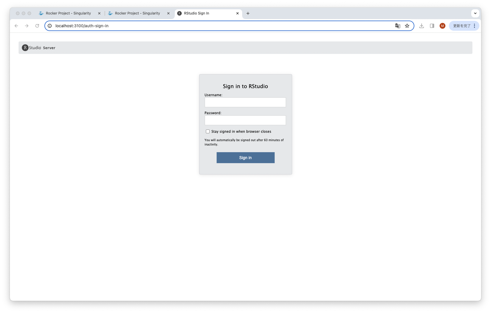

## RStudio　Server環境のユーザ環境での利用方法

RStudio ServerはWebサーバベースのRStudio環境(IDE)です。
ここでは、Rstudio serverの遺伝研スパコン内での環境起動方法について説明します。RStudio ServerはRStudio Desktopと異なり、
主にサーバ上で動作するサーバアプリケーションであり、RStudio Server全体をcondaで管理することは難しいです。この為、ここでは
Singularityコンテナを使用したRStudio Serverのログインノード上での利用環境構築手順について示します。

## Rocker Projectについて

[Rocker Project](https://rocker-project.org/)は、RStudio Serverの統合環境をコンテナとして提供しており、
以下のようなコンテナイメージをメンテナンス、配布してくれています。

|イメージ | 内容 |
|--------|------|
|r-ver | 安定版のRとソースビルドツール |
|rstudio | r-verにRStudioを追加 |
|tidyverse | RStudioにtidyverseとdevtoolsを追加 |
|verse|tidyverseに対してtexなどの文書作成パッケージを追加 |
|geospatial|verseに対して地理情報のライブラリを追加 |

[Rocker Project(RStudio, tidyverse, verse, geospatial)の記事](https://rocker-project.org/images/versioned/rstudio.html)

ただし、日本語対応はしていません。


ここではこの中のtidyverseイメージを利用して一般ユーザが利用可能なRStudio Server環境を作成する手順について示します。
本記事は、Rocker Projectの
[Singularity - Run RStudio Server containers by Singularity.](https://rocker-project.org/use/singularity.html)の
記事を参考に記述しています。手順としては
- Rocker Image(Dockeer Image)のSingularityへのインポート
- ログインノード上でのSingularityコンテナの起動とrserverの環境設定
- 遺伝研外からのRStudio Serverへの接続手段の設定(ssh ポートフォワード)

について説明していきます。

## Rocker Imageのインポート

Rocker Projectのイメージは、Dockerイメージで公開されていますが、以下の手順でSingularityのSIFイメージとして
遺伝研スパコンのログインノード上でインポートします。
インポートするコンテナのバージョンは個別に選択があると思いますので、以下のページを参照して、利用するバージョンを検討してください。

- [Rocker Projectで公開しているDockerファイルのリポジトリ](https://github.com/rocker-org/rocker-versioned2/tree/master/dockerfiles)

本記事ではtidyverseのバージョン4.3.2のイメージを取得する手順で作業しています。
```
yxxxx@at139:~$ singularity pull docker://rocker/tidyverse:4.3.2
INFO:    Converting OCI blobs to SIF format
INFO:    Starting build...
Getting image source signatures
Copying blob 29202e855b20 done   | 
Copying blob a998f010f689 done   | 
Copying blob 7399f890cfd2 done   | 
Copying blob 7de617cf658e done   | 
Copying blob fbf9b9f7ca08 done   | 
Copying blob a263a473d212 done   | 
Copying blob 28289462b4e5 done   | 
Copying blob 5a3aa1d8d631 done   | 
Copying blob 7f68ff0993bc done   | 
Copying config 5d0ac9d306 done   | 
Writing manifest to image destination
2024/02/27 08:49:19  info unpack layer: sha256:29202e855b2021a2d7f92800619ed5f5e8ac402e267cfbb3d29a791feb13c1ee
2024/02/27 08:49:22  info unpack layer: sha256:a263a473d2122c219c4d0988bc2c71d7f4f597e35e198887d6b43e0f0b941cb1
2024/02/27 08:49:22  info unpack layer: sha256:a998f010f6892dd4833a8fe8ed59604cd12d99e659afeb0ad7f12719e3e49cba
2024/02/27 08:49:36  info unpack layer: sha256:7399f890cfd26c7458f0e31b19d8eb3ff7fc2e903f7da6197f1fe38b944cb2c0
2024/02/27 08:49:36  info unpack layer: sha256:7de617cf658e8cc1d679d27349668a858bfb1cc3770af56085f5fa679262eaf3
2024/02/27 08:49:37  info unpack layer: sha256:fbf9b9f7ca08fae4f9367922267a4822e2434c777f9df00e7a8b296351fe2ec4
2024/02/27 08:50:00  info unpack layer: sha256:28289462b4e59939ad0606d1c61dd47e03b920fbd9c7a882b78e2b82ed7d69de
2024/02/27 08:50:00  info unpack layer: sha256:5a3aa1d8d63111815e1a09776f60274dd214c2dfc1547f751bd7631c5c87b205
2024/02/27 08:50:00  info unpack layer: sha256:7f68ff0993bc8d9fd0ecde58fd3fa4a76921c1a7a84e711dcfa4fd6101f43e5e
INFO:    Creating SIF file...
```
カレントディレクトリの下に、sifの拡張子がついたイメージファイルができていることを確認します。

```
yxxxx@at139:~$ ls -l *sif
-rwxr-xr-x 1 yxxxx xxxxx 800317440 Feb 27 08:50 tidyverse_4.3.2.sif
```


## ログインノード上でのSingularityコンテナの起動

ログインノード上でインポートしたSingularityイメージを以下の手順で起動します。

ホームディレクトリの配下のディレクトリのどこかにrunディレクトリと、var/libをマウントする為のディレクトリ
を作成します。また、DB設定ファイルを作成します。ここではDBとしてsqliteを利用しています。
```
yxxxx@at139:~/rstudio$ mkdir -p run var-lib-rstudio-server
yxxxx@at139:~/rstudio$ printf 'provider=sqlite\ndirectory=/var/lib/rstudio-server\n' > database.conf 
yxxxx@at139:~/rstudio$ ls
database.conf  run tidyverse_4.3.2.sif  var-lib-rstudio-server

```
以下の手順で、自分がqloginでログインしたインタラクティブノードのIPアドレスを特定しておきます。

```js
 yxxxx@at139:~/rstudio$ ip a |grep ib
8: ibp161s0: <BROADCAST,MULTICAST,UP,LOWER_UP> mtu 1500 qdisc mq state UP group default qlen 256
    link/infiniband 00:00:04:c1:fe:80:00:00:00:00:00:00:1c:34:da:03:00:64:6f:0c brd 00:ff:ff:ff:ff:12:40:1b:ff:ff:00:00:00:00:00:00:ff:ff:ff:ff
//highlight-next-line
    inet 172.19.aaa.bbb/20 brd 172.19.15.255 scope global ibp161s0
```
上記では、172.19.aaa.bbbをメモしておきます。

ログインノード上で、singularity execコマンドを以下のように投入します。この時、指定しているオプション
の意味は以下のようになります。また、バックグラウンド動作はしないのでプロンプトは返ってきません。RStudio 
Serverを動作させている間はウィンドウは占有されます。

- `PASSWORD='xxxxxx'` RStudio Serverの認証画面で利用するパスワードを記述します。
- `--bind` コンテナ内から参照させるホームディレクトリ上のディレクトリの対応を指定します。
   ここでは、コンテナ内の/runと/var/lib/rstudio-serverディレクトリと、設定ファイルの/etc/rstudio/database.confを対応付けています。

また、rserverのオプションとして指定しているのは以下になります。
- `--www-address` :ここでは、上記で確認したログインノードのIPアドレスを指定します。
- `--server-user` :ここでは、コンテナ内のサーバプロセスのユーザと、環境のユーザの対応を取ります。自分のユーザ名を指定します。
- `--auth-none=0` :ユーザ認証を有効にします。念のためのセキュリティとして設定します。
- `--auth-pam-helper-path=pam-helper` :auth-pam-helperを指定します。

```
PASSWORD='xxxxxx' singularity exec --bind run:/run,var-lib-rstudio-server:/var/lib/rstudio-server,database.conf:/etc/rstudio/database.conf  tidyverse_4.3.2.sif /usr/lib/rstudio-server/bin/rserver --auth-none=0 --auth-pam-helper-path=pam-helper --server-user=yxxxx --www-address=172.19.aaa.bbb
TTY detected. Printing informational message about logging configuration. Logging configuration loaded from '/etc/rstudio/logging.conf'. Logging to 'syslog'.
```
また、この時、以下のエラーメッセージが出力されて起動できない場合は、利用しようとしたTCPポートを同じログインノード上で利用しているユーザが既にいます。

```
2024-02-27T02:23:29.108062Z [rserver] ERROR system error 98 (Address already in use); OCCURRED AT rstudio::core::Error rstudio::core::http::initTcpIpAcceptor(rstudio::core::http::SocketAcceptorService<rstudio_boost::asio::ip::tcp>&, const string&, const string&) src/cpp/server/ServerInit.cpp:146; LOGGED FROM: int main(int, char* const*) src/cpp/server/ServerMain.cpp:766
```
この場合は、`--www-port`を追加で利用して、他のポートを利用してください。指定しようとしたポートを利用しているユーザがいないかは、

```
ss |grep 8787
tcp   ESTAB  0      0                                            172.19.xxx.xxx:8787       172.19.xxx.xxx:51900 
```
というように確認することができます。

また、RStudio serverはデフォルトで、60分でセッションタイムアウトとなります。それを無効にしたい場合は、

```
--auth-timeout-minutes=0 --auth-stay-signed-in-days=30
```
などとrserverのオプションを追加指定してください。

## sshポートフォワードの設定

sshのポートフォワードの為に、手元のPCでターミナルを開いて、以下のコマンドを実行します。手元のPCは、sshが利用可能なPCを想定しています。
```
yxxxx@xxxx ~ % ssh -l 遺伝研スパコンでの自分のユーザ名 -N gw.ddbj.nig.ac.jp -L 3100:上の手順で特定したIPアドレス:8787
```
3100と上記で指定しているのは、手元のPC(localhost)の3100番ポートを、リモートサーバ上の8787番ポートにポートフォワードすることを
意味します。この為、3100番は自分の手元のPCで利用していないポートであれば任意の番号を指定して構いません。8787は、rserverが起動する
時に`--www-port`で起動ポートを指定しなかった場合のデフォルトのポート番号になります。指定していない場合は、8787にポートフォワード
してください。

遺伝研スパコンのパスフレーズを入力します。
```
Enter passphrase for key '/Users/xxxxxx/.ssh/id_rsa': 
```
RStudio Serverに接続中はこの端末は置いたままにしておいてください。RStudio Serverの利用終了後には、Ctl+Cで停止することが可能です。

## RStudio Serverへの端末からの接続

次に端末上でブラウザを起動し、`http://localhost:上で指定したローカルポート番号(例では3100)` を指定して画面を開きます。認証画面が表示されます。



指定したユーザ名とパスワードを入力します。RStudio Serverへのログインが完了し画面が表示されます。


Web画面から利用してください。Singularityコンテナで本手順で起動したRStudio　Serverの環境はユーザのホームディレクトリに位置付けられているので、RStudio server上で作成したプロジェクト等はユーザのホームディレクトリ上に書き込まれます。

