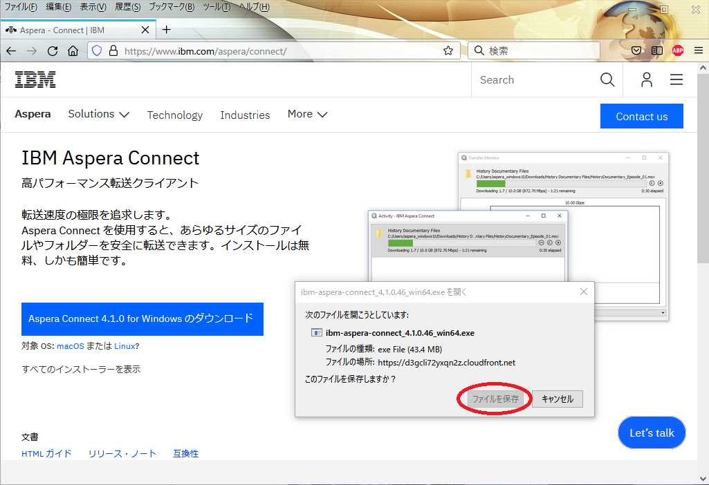
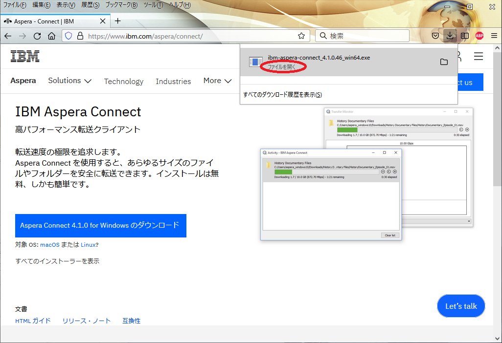

Asperaは大容量のファイル転送を効率的に行う商用ソフトウェアです。
特に遠距離との通信の際の転送速度の劣化が少ないことと、きちんとチューニングすれば理論帯域幅にかなり近い転送速度が実現できることが特徴です。
遺伝研スパコンでは合計帯域幅10GbpsのAsperaサーバーを導入し運用しています。

- asperaを同時に使用しているユーザーの合計で10Gbpsが上限です。(遺伝研全体で外向けの帯域は現在30Gbps）
- 数Gbpsの転送速度を実際に出すには、ローカルマシン側でもサーバやネットワーク機器のチューニングが必要です。
- Asperaを用いてデータ転送を行うには、ユーザー側の計算機にAsperaクライアントソフトウェアをインストールする必要があります。
また、データ転送に複数のポート(sshのポートの他に33001番ポート等)を用いるので大学・研究機関などのネットワーク設定でそのポートが空いている必要があります。


## Asperaクライアントソフトウェアのインストール


### インストール手順の概要

Asperaを利用するには無料のクライアントソフトウェアをインストールする必要があります。


クライアントソフトウェアにはWebインタフェイス版(aspera connect)とコマンドラインインタフェイス版(`ascp`)があり、
バージョン4以降が必要です。（Asperaサーバとクライアントのバージョンの組み合わせの関係により3.9.xはMacでは動作せず、Windows, Linuxではパスフレーズを指定していない秘密鍵・公開鍵では動作しません。）このバージョン4をインストールするためには以下の手順でインストールします。

コマンドライン版クライアント`ascp`はWebインタフェイス版のaspera connectをインストールすると一緒にインストールされます。（また、Aspera connectのWebブラウザプラグインをインストールしないとこれらクライアントソフトウェアはダウンロードできません。)

インストール手順の概要は以下のとおりです。

1. インストーラのダウンロード
2. インストーラの実行
3. `ascp`のパスの調整


### インストーラのダウンロード

Windows, Mac, Linuxとも同様の手順となります。


1, ウェブブラウザで https://www.ibm.com/aspera/connect/ を開き、「Aspera Connect のダウンロード」をクリックする。


2, 「アドオンのインストール」（Firefoxの場合）または「拡張機能のインストール」（Chromeの場合）をクリックする。


3, 「Add to Firefox」（Firefoxの場合）または「Chromeに追加」（Chromeの場合）をクリックしてIBM Aspera Connect アドオンをウェブブラウザにインストールする。


4, 改めてウェブブラウザで https://www.ibm.com/aspera/connect/ を開き、「Aspera Connect のダウンロード」をクリックするとインストーラがダウンロードできるようになる。





### インストーラの実行とパスの調整 (WindowsおよびMacの場合)

WindowsとMacの場合はダウンロードしたインストーラを実行すれば良い。




### インストーラの実行とパスの調整 (Linuxの場合)

Linuxの場合は上記の手順で
`ibm-aspera-connect_4.1.0.46-linux_x86_64.tar.gz`
のようなファイルがダウンロードされてくるので、解凍してbashで実行すれば良い。ユーザー権限でインストール可能である。

```
tar zxvf ibm-aspera-connect_4.1.0.46-linux_x86_64.tar.gz
bash ibm-aspera-connect_4.1.0.46-linux_x86_64.tar.gz
```
インストーラを実行すると、`$HOME/.aspera/connect/bin`の下に実行ファイルが展開されるのでここにパスを通す。

```
export PATH=$HOME/.aspera/connect/bin:$PATH
```


## コマンドライン版クライアントascpの使い方


### Asperaを用いたローカルマシンから遺伝研スパコンへのファイル転送（アップロード）

例えば以下のように指定します。

```
$ ascp -l 1G -Z 1500 -P 33001 -i ~/.ssh/DDBJ/id_rsa $HOME/test.txt youraccount@ascp.ddbj.nig.ac.jp:
```

上記の例で、各コマンドライン引数の意味は以下のとおりです。

- `-i` 秘密鍵ファイルのパスを指定します。（例では`~/.ssh/DDBJ/id_rsa`）
- `$HOME/test.txt` アップロードしたいファイルのパス。
- `youraccount@ascp.ddbj.nig.ac.jp:` アップロード先のパス

アップロード先のパスについて、`scp`と異なりユーザーのホームディレクトリを書いてはならないことに注意が必要です。

- `ascp.ddbj.nig.ac.jp:` ユーザーのホームディレクトリ(`/home/youraccount`)上にファイルがアップロードされます。
- `ascp.ddbj.nig.ac.jp:somedir/` ユーザーのホームディレクトリ下の指定したディレクトリ(`/home/youraccount/somedir/`)にファイルがアップロードされます。


### Asperaを用いた遺伝研スパコンからローカルマシンへのファイル転送（ダウンロード）

例えば以下のように指定します。

```
$ ascp -l 1G -Z 1500 -P 33001 -i ~/.ssh/DDBJ/id_rsa youraccount@ascp.ddbj.nig.ac.jp:somedir/test.txt $HOME/tmp
```

この例ではスパコン上の`/home/youraccount/somedir/test.txt`がローカルマシン上の`$HOME/tmp/test.txt`としてダウンロードされます。


### ascpのオプションの意味


基本的なオプションは以下の通りです。

<table>
<tr>
  <th width="150">オプション</th>
  <th>説明</th>
</tr>
<tr>
  <td>-T</td>
  <td>データの暗号化を行いません。転送速度は向上しますがセキュリティは低下します。</td>
</tr>
<tr>
  <td>-l </td>
  <td>データ転送速度の上限を指定します。"値"の部分に上限値を指定しますが、"10M"など、英字による単位指定ができます。本システムでは"10G"が上限で、10Mが本オプションを指定しない場合のデフォルト値です。</td>
</tr>
</table>


その他指定可能な詳細オプションについては、`ascp --help`の出力などを参照してください。

