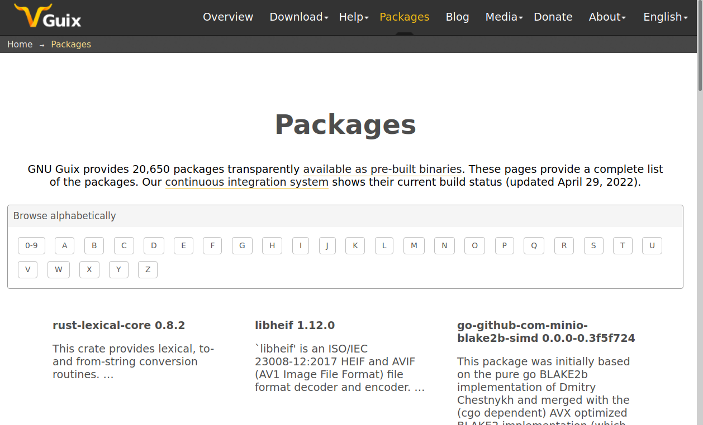

GNU Guix はユーザ権限で利用できるパッケージマネージャです。

パッケージはバイナリ形式で配布されているのでインストールが高速です。

参考資料:


- [GNU Guix Reference Manual](https://guix.gnu.org/manual/en/html_node/index.html) (公式マニュアル)
- [Guix packages](https://guix.gnu.org/en/packages/) (利用可能なパッケージの一覧)
- [Install the GNU Guix package manager (PLCnext Technology)](https://www.plcnext-community.net/makersblog/install-the-gnu-guix-package-manager/) (チュートリアル)
- [Reproducible Computation with Guix](https://guix.gnu.org/en/blog/2020/reproducible-computations-with-guix/) (設計思想)
- [Guix-HPC](https://hpc.guix.info/about/)
    - Guix-HPC is an effort to optimize GNU Guix for reproducible scientific workflows in high-performance computing (HPC).
- [guix-bioinformatics](https://github.com/genenetwork/guix-bioinformatics)
- https://guix.gnu.org/en/blog/2018/paper-on-reproducible-bioinformatics-pipelines-with-guix/


## Guix を利用するための準備

以下を`~/.bashrc`に書きます。

```
export GUIX_PROFILE="/home/your_account/.guix-profile"
source "$GUIX_PROFILE/etc/profile"
```

ロケールを UTF-8 にするには、`guix install glibc-utf8-locales`を実行し、
以下を`~/.bashrc`に書きます。

```
export GUIX_LOCPATH="$HOME/.guix-profile/lib/locale"
```

## Guix で利用可能なパッケージを表示する

`guix search`で、パッケージを検索できます。

```bash
name: gcc-toolchain
version: 9.3.0
outputs: out debug static
systems: x86_64-linux i686-linux
dependencies: binutils@2.34 gcc@9.3.0 glibc@2.31 ld-wrapper@0
location: gnu/packages/commencement.scm:3856:4
homepage: https://gcc.gnu.org/
license: GPL 3+
synopsis: Complete GCC tool chain for C/C++ development  
description: This package provides a complete GCC tool chain for C/C++ development to be installed in user profiles.  This
+ includes GCC, as well as libc (headers and binaries, plus debugging symbols in the `debug' output), and Binutils.  GCC is
+ the GNU Compiler Collection.
relevance: 13

name: gcc-toolchain
version: 8.4.0
outputs: out debug static
systems: x86_64-linux i686-linux
dependencies: binutils@2.34 gcc@8.4.0 glibc@2.31 ld-wrapper@0
location: gnu/packages/commencement.scm:3856:4
homepage: https://gcc.gnu.org/
license: GPL 3+
synopsis: Complete GCC tool chain for C/C++ development  

... 以下略 ...
```

- Guix packages ( https://guix.gnu.org/en/packages/ ) Web サイトに、Guix で利用可能なパッケージの一覧があります。



さらにバイオインフォマティックス関係では以下のサイトがあります。

- [guix-bioinformatics](https://github.com/genenetwork/guix-bioinformatics)
- https://guix.gnu.org/en/blog/2018/paper-on-reproducible-bioinformatics-pipelines-with-guix/


## パッケージをインストールする

`guix install`コマンドでパッケージをインストールします。


例えば gcc version 10 系をインストールするには以下のようにします。

```bash
guix install gcc-toolchain@10
```

gcc のバージョンを 8 系に変えたければ、単に`guix install`をやり直します。

```bash
guix install gcc-toolchain@8
```

これで使われる gcc のバージョンが切り替わります。
