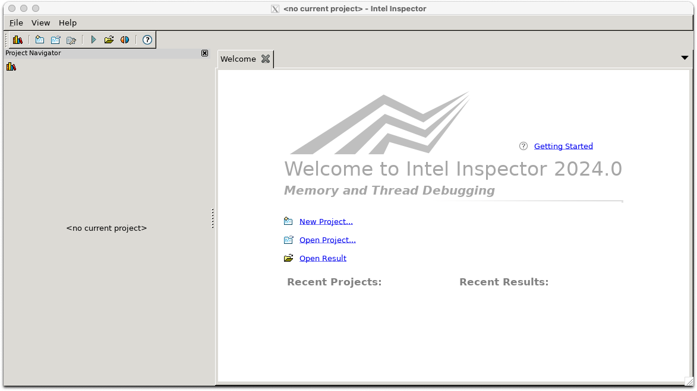

## インテルディストリビューションのGDB
通常のgdbと比較して、IntelのCPU,GPU,FPGA上のデバッグに対して追加機能をしたGDBです。

|コマンド|説明|
|-------|----|
|gdb-oneapi|oneapiのgdb|

- [Intelの製品ページ](https://www.intel.com/content/www/us/en/developer/tools/oneapi/distribution-for-gdb.html#gs.77dyc6)
- [IntelのGet Startedのサイト](https://www.intel.com/content/www/us/en/docs/distribution-for-gdb/get-started-guide-linux/2024-0/overview.html)


## Intel Inspector
メモリー／スレッドのデバッガーです。C,C++,Fortranアプリケーションのメモリーエラーとスレッド化エラーの検出を容易にします。

- [販売元の製品ページ](https://www.xlsoft.com/jp/products/intel/inspector/index.html)
- [インテルの製品ページ](https://www.intel.com/content/www/us/en/developer/tools/oneapi/inspector.html#gs.5a4vgi)
- [Inspectorのユーザガイド（英語）](https://www.intel.com/content/www/us/en/docs/inspector/user-guide-linux/2023-2/overview.html)
- [コマンドラインシンタックス](https://www.intel.com/content/www/us/en/docs/inspector/user-guide-linux/2023-2/command-syntax.html)

|コマンド|説明|
|------|----|
|inspxe-cl|インスペクタのCLI版|
|inspxe-gui|インスペクタのGUI版|


遺伝研スパコンでの利用方法としては、計算ノード上でバッチジョブとして実行して情報を収集し、収集結果のファイルをログインノード上で分析する。という形態の利用方法になります。

```
source /lustre7/software/intel_ubuntu/oneapi/inspector/2024.0/inspxe-vars.sh
inspxe-cl -collect mi1 -search-dir all=. -result-dir result_memory ./a.out  #メモリに関する調査
inspxe-cl -collect ti1 -search-dir all=. -result-dir result_thread ./a.out  #スレッド並列に関する調査
```
inspectorのGUI版をログインノード上で立ち上げます。inspectorはXアプリケーションであるので、画面の表示には手元のPCとログインノード間でsshトンネルを設定する必要があります。手順については、Advisorと同じですので当該箇所を参照してください。



先ほどの、inspexe-clの２手順で、result_memoryとresult_threadというディレクトリが作成されており、その下に拡張子が.inspexeのファイルがあるのでそれを、メニューのFile > Open> Resultで開いてください。以下のような画面が表示されます。(ここではあくまでサンプルとして実行しています。)


