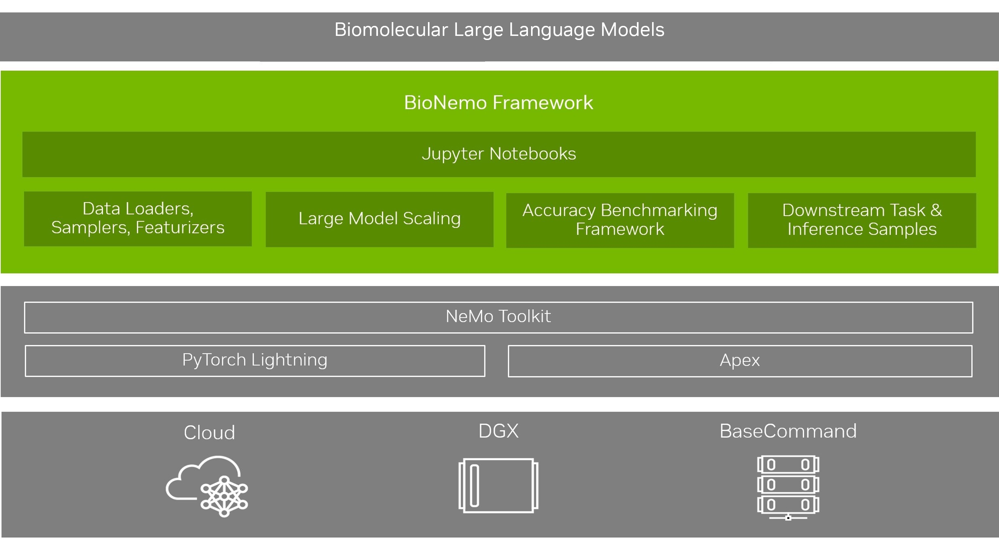
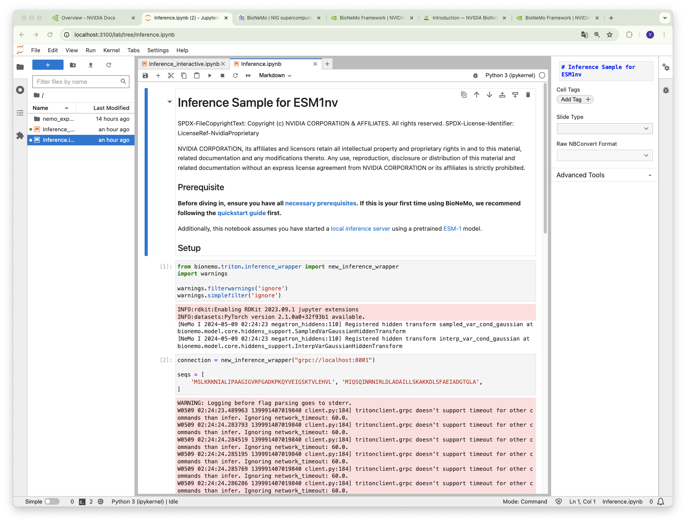

## BioNeMo/BioNeMoフレームワークとは

以下の記事は、NVIDIA社の以下の記事をもとに記述しています。

- [BioNeMo フレームワーク](https://docs.nvidia.com/bionemo-framework/latest/index.html)


BioNeMoは、事前トレーニングされたLLMを利用してユーザー指定の基準を満たす生体分子を生成することにより、ユーザーが生体分子モデルを構築できるようにしたソリューションです。BioNeMoフレームワークは、開発者がマルチノードジョブを設定してデプロイすることを支援するフレームワークです。DGX Cloud上で動作することがデフォルトではありますが、オンプレミスのGPUサーバ環境でも環境設定をすることでBioNeMoを利用可能です。




- [NVIDIA Apex](https://nvidia.github.io/apex/)：混合精度演算を行なって演算速度を上げるユーティリティ
- [PyTorch Lightning](https://lightning.ai/docs/pytorch/stable/):PyTorchをベースにしたモデルの訓練や開発を効率的に行うライブラリ


BioNeMoは、NeMoフレームワークに依存しています。BioNeMoフレームワークは、YAMLファイルによるハイパーパラメータの設定可能性やチェックポイント管理など、PyTorch Lightningをエンハンスして利用しています。

BioNeMoフレームワークの主要な特長は以下の通りです：

- NVIDIAのメガトロンフレームワークを使用した大規模トランスフォーマーモデルの開発とトレーニング。
- データ並列性、モデル並列性、混合精度を用いたマルチGPU、マルチノードトレーニングの簡単な設定。
- 調整済みのモデルのトレーニングレシピ
- モデルトレーニングプロセスを監視するためのTensorboardとWeights and Biasesによるロギング。

BioNeMoフレームワークに含まれるモデルは2024年3月末現在では以下のものになります。基本的にはタンパク質と低分子のためのモデルで、創薬、治療薬開発のためのソリューションと考えられます。

(2024/5月初旬時点で、一部のモデルは、NIMの区別になりダウンロードができなくなっています。)

|モデル| モダリティ(※)| 用途| NGCでトレーニング/変換されたチェックポイント|
|-----|---------|-----|--------------------------------------|
|OpenFold| タンパク質|タンパク質構造予測|BioNeMoによってファインチューニングされた公開チェックポイント|
|DiffDockスコアモデル|タンパク質 + 分子|リガンドのポーズ生成|BioNeMoフォーマットに変換された公開チェックポイント|
|DiffDock信頼モデル|タンパク質 + 分子|リガンドのポーズ生成|BioNeMoフォーマットに変換された公開チェックポイント|
|EquiDock DIPSモデル|タンパク質|タンパク質-タンパク質複合体形成|BioNeMoによってゼロから事前トレーニングされたチェックポイント|
|EquiDock DB5モデル|タンパク質|タンパク質-タンパク質複合体形成|BioNeMoによってゼロから事前トレーニングされたチェックポイント|
|ESM-2nv 650M|タンパク質|表現学習|BioNeMoフォーマットに変換された公開チェックポイント|
|ESM-2nv 3B|タンパク質|表現学習|BioNeMoフォーマットに変換された公開チェックポイント|
|ESM-1nv|タンパク質|表現学習|BioNeMoによってゼロから事前トレーニングされたチェックポイント|
|ProtT5nv|タンパク質|表現学習|BioNeMoによってゼロから事前トレーニングされたチェックポイント|
|MegaMolBART|低分子|表現学習 + 分子生成|BioNeMoによってゼロから事前トレーニングされたチェックポイント|
|MolMIM|低分子|表現学習 + 分子生成|	BioNeMoによってゼロから事前トレーニングされたチェックポイント|

 ※ モダリティ：医薬品の創薬基盤技術の方法・手段の分類

2024年5月現在、上記のモデルはNVIDIA NIMというサービス体系の中で推論サービスのAPIエンドポイントがクラウド上でNVIDIAのサービスとして提供されるようになったように見えます。現在bionemo frameworkコンテナでオンプレミス環境にダウンロードして利用可能となっているのは、`megamolbart,esm-1nv,esm-2nv,prott5nv`となっており、その他はNIM Micro Serviceということでアクセス登録を行わなければならない状況となっている為、本ページでは`megamolbart,esm-1nv,esm-2nv,prott5nv`を対象に説明します。今後状況が変動する可能性はありますがその点ご了承ください。遺伝研スパコン上にダウンロード可能なNGC上のコンテナとモデルの基本的な利用方法について以下に説明します。


## 遺伝研スパコンでの基本的な利用方法

NVIDIAの以下のページを参考に本項目は記載しています。

- [クイックスタートガイド](https://docs.nvidia.com/bionemo-framework/latest/quickstart-fw.html)

NGCにログインしてBioNeMoのコンテナをダウンロードする必要があるのでNGCにアカウントを持っていることを前提にします。
BioNemoは、NGCからフレームワークなどツール一式がパッケージングされたコンテナをダウンロードすることで利用可能です。
遺伝研スパコンではdockerが運用により利用できませんがSingularityを利用することでbionemoコンテナを利用することが可能です。基本的には以下の順序で処理を行います。

### コンテナの準備

以下のようにNGCからコンテナをpullします。その際にNGCのユーザとして`$oauthtoken`、API-keyをパスワードとして入力して下さい。
ダウンロードが完了するまでしばらく時間がかかります。
```
$ singularity pull --docker-login docker://nvcr.io/nvidia/clara/bionemo-framework:1.4
Enter Docker Username: $oauthtoken
Enter Docker Password: 
INFO:    Converting OCI blobs to SIF format
INFO:    Starting build...
(途中省略)
2024/05/13 12:59:49  info unpack layer: sha256:4f4fb700ef54461cfa02571ae0db9a0dc1e0cdb5577484a6d75e68dc38e8acc1
2024/05/13 12:59:49  info unpack layer: sha256:308054b89ae2baa5344edabedc55c2353429c9ae7008b16b23f8304d279f7293
INFO:    Creating SIF file...

```
以下のようにsifファイルが作られていることを確認して下さい。
```
$ ls -l bionemo-framework_1.4.sif 
-rwxr-xr-x 1 yxxxx-pg co-xxxx-pg 11168931840 May 13 13:01 bionemo-framework_1.4.sif
```

### 前処理ジョブの実行

sifファイルでコンテナを起動しても、コンテナ内でファイルシステム内に書き込みができないので、sandbox形式に変換します。

```
$ singularity build --sandbox bionemo1.4 ./bionemo-framework_1.4.sif  
INFO:    Starting build...
INFO:    Verifying bootstrap image bionemo-framework_1.4.sif
WARNING: integrity: signature not found for object group 1
WARNING: Bootstrap image could not be verified, but build will continue.
INFO:    Creating sandbox directory...
INFO:    Build complete: bionemo1.4

```
コンテナを起動して、前処理のジョブを実行します。
```
$ singularity run --nv --writable ./bionemo1.4/ bash
WARNING: nv files may not be bound with --writable
WARNING: Skipping mount /etc/localtime [binds]: /etc/localtime doesn't exist in container
WARNING: Skipping mount /bin/nvidia-smi [files]: /usr/bin/nvidia-smi doesn't exist in container
WARNING: Skipping mount /bin/nvidia-debugdump [files]: /usr/bin/nvidia-debugdump doesn't exist in container
WARNING: Skipping mount /bin/nvidia-persistenced [files]: /usr/bin/nvidia-persistenced doesn't exist in container
WARNING: Skipping mount /bin/nvidia-cuda-mps-control [files]: /usr/bin/nvidia-cuda-mps-control doesn't exist in container
WARNING: Skipping mount /bin/nvidia-cuda-mps-server [files]: /usr/bin/nvidia-cuda-mps-server doesn't exist in container
13:4: not a valid test operator: (
13:4: not a valid test operator: 545.23.06
```
ここではmegamolbartのサンプルのpythonスクリプトを利用します。

```
Singularity> cd /workspace/bionemo/examples/molecule/megamolbart/
Singularity> ls
conf  dataset  downstream  downstream_physchem.py  downstream_retro.py	nbs  pretrain.py  scripts
Singularity> python pretrain.py --config-path=conf --config-name=pretrain_xsmall_span_aug do_training=False model.data.links_file='${oc.env:BIONEMO_HOME}/examples/molecule/megamolbart/dataset/ZINC-downloader-sample.txt' model.data.dataset_path=$(pwd)/zinc_csv 
[NeMo I 2024-05-13 04:19:01 megatron_hiddens:110] Registered hidden transform sampled_var_cond_gaussian at bionemo.model.core.hiddens_support.SampledVarGaussianHiddenTransform
[NeMo I 2024-05-13 04:19:01 megatron_hiddens:110] Registered hidden transform interp_var_cond_gaussian at bionemo.model.core.hiddens_support.InterpVarGaussianHiddenTransform
[NeMo W 2024-05-13 04:19:01 nemo_logging:349] /usr/local/lib/python3.10/dist-packages/hydra/_internal/defaults_list.py:251: UserWarning: In 'pretrain_xsmall_span_aug': Defaults list is missing `_self_`. See https://hydra.cc/docs/1.2/upgrades/1.0_to_1.1/default_composition_order for more information
      warnings.warn(msg, UserWarning)
    
[NeMo W 2024-05-13 04:19:01 nemo_logging:349] /usr/local/lib/python3.10/dist-packages/hydra/_internal/hydra.py:119: UserWarning: Future Hydra versions will no longer change working directory at job runtime by default.
    See https://hydra.cc/docs/1.2/upgrades/1.1_to_1.2/changes_to_job_working_dir/ for more information.
      ret = run_job(
    
[NeMo I 2024-05-13 04:19:01 pretrain:25] 
    
    ************** Experiment configuration ***********
[NeMo I 2024-05-13 04:19:01 pretrain:26] 
    name: MegaMolBART
    do_training: false
    do_testing: false
    seed: 42
    restore_from_path: null
    trainer:

(途中省略)

[NeMo W 2024-05-13 04:19:01 exp_manager:611] There were no checkpoints found in checkpoint_dir or no checkpoint folder at checkpoint_dir :/workspace/bionemo/results/nemo_experiments/MegaMolBART/xsmall_span_aug_pretraining/checkpoints. Training from scratch.
[NeMo I 2024-05-13 04:19:01 exp_manager:394] Experiments will be logged at /workspace/bionemo/results/nemo_experiments/MegaMolBART/xsmall_span_aug_pretraining

```
wandbを利用するか否かの確認が出力されます。オプションなので利用しない場合は3を選択して下さい。ここでは2を選択してwandbにログを送付することを選択します。
```


[NeMo I 2024-05-13 04:19:01 exp_manager:835] TensorboardLogger has been set up
wandb: (1) Create a W&B account
wandb: (2) Use an existing W&B account
wandb: (3) Don't visualize my results
wandb: Enter your choice: 2
wandb: You chose 'Use an existing W&B account'
wandb: Logging into wandb.ai. (Learn how to deploy a W&B server locally: https://wandb.me/wandb-server)
wandb: You can find your API key in your browser here: https://wandb.ai/authorize
wandb: Paste an API key from your profile and hit enter, or press ctrl+c to quit: 
wandb: Appending key for api.wandb.ai to your netrc file: /home/yxxxx-pg/.netrc
wandb: wandb version 0.17.0 is available!  To upgrade, please run:
wandb:  $ pip install wandb --upgrade
wandb: Tracking run with wandb version 0.15.6
wandb: Run data is saved locally in /workspace/bionemo/results/nemo_experiments/MegaMolBART/xsmall_span_aug_pretraining/wandb/run-20240513_042147-hjmskf8x
wandb: Run `wandb offline` to turn off syncing.
wandb: Syncing run xsmall_span_aug_pretraining
wandb: ⭐️ View project at https://wandb.ai/yxxxxkat/xsmall_span_aug_pretraining
wandb: 🚀 View run at https://wandb.ai/yxxxxkat/xsmall_span_aug_pretraining/runs/hjmskf8x
[NeMo I 2024-05-13 04:21:48 exp_manager:850] WandBLogger has been set up
[NeMo W 2024-05-13 04:21:48 exp_manager:931] The checkpoint callback was told to monitor a validation value and trainer's max_steps was set to 2000000. Please ensure that max_steps will run for at least 1 epochs to ensure that checkpointing will not error out.
[NeMo I 2024-05-13 04:21:48 utils:306] 
    
    ************** Trainer configuration ***********
[NeMo I 2024-05-13 04:21:48 utils:307] 
    name: MegaMolBART
    do_training: false
    do_testing: false

（途中省略)

wandb: Waiting for W&B process to finish... (success).
wandb: 🚀 View run xsmall_span_aug_pretraining at: https://wandb.ai/yxxxxkat/xsmall_span_aug_pretraining/runs/hjmskf8x
wandb: Synced 5 W&B file(s), 0 media file(s), 0 artifact file(s) and 0 other file(s)
wandb: Find logs at: /workspace/bionemo/results/nemo_experiments/MegaMolBART/xsmall_span_aug_pretraining/wandb/run-20240513_042147-hjmskf8x/logs
Singularity> 

```
### トレーニングジョブの実行

次にトレーニングのジョブを実行します。トレーニングのジョブは長時間の実行が必要なので、NVIDIAサイトの例と異なりますがslurmのバッチジョブとして
ジョブスクリプトを記述してslurmに投入してみます。例として以下のように記述してみます。
ファイル、ディレクトリ等のパスは念の為、絶対パスで記述しています。
```
#!/bin/bash
#SBATCH -N 1
#SBATCH --cpus-per-task 8
#SBATCH --mem-per-cpu=8g
#SBATCH --gres=gpu:1
singularity exec --nv --writable /data1/yxxxx-pg/work2/bionemo1.4  python /workspace/bionemo/examples/molecule/megamolbart/pretrain.py \
	--config-path=/workspace/bionemo/examples/molecule/megamolbart/conf \
	--config-name=pretrain_xsmall_span_aug do_training=True \
    model.data.dataset_path=/workspace/bionemo/examples/molecule/megamolbart/zinc_csv \
    model.data.dataset.train=x000 model.data.dataset.val=x000 \
    model.data.dataset.test=x000 \
    exp_manager.exp_dir=/workspace/bionemo/examples/molecule/megamolbart/results
```

これをsbatchコマンドで投入します。
実行が開始されしばらくして確認すると、wandb上では以下のようにトレーニングがロギングされます。グラフの様子から学習がうまくいっているかを
判断することができます。（確認の為計算させてみると実際の計算時間としては1GPU利用で20時間程度かかったので、テストの為だけに実行して完了しようとするのは計算資源の節約のためお控えください。）


実行が完了すると以下のようなメッセージがslurmのログに出力されます。

```
[NeMo I 2024-05-13 21:09:23 pretrain:47] enc_dec_model.tokens_head.weight: torch.Size([640, 256])
[NeMo I 2024-05-13 21:09:23 pretrain:48] ***********************************************************
wandb: Waiting for W&B process to finish... (success).
wandb: | 1.057 MB of 1.057 MB uploaded (0.000 MB deduped)
wandb: Run history:
wandb:           consumed_samples ▁▁▁▁▂▂▂▂▂▃▃▃▃▃▃▄▄▄▄▄▅▅▅▅▅▅▆▆▆▆▆▇▇▇▇▇▇███
wandb:                      epoch ▁▁▁▁▁▁▁▁▁▁▁▁▁▁▁▁▁▁▁▁▁▁▁▁▁▁▁▁▁▁▁▁▁▁▁▁▁▁▁▁
wandb:                global_step ▁▁▁▁▂▂▂▂▂▃▃▃▃▃▃▄▄▄▄▄▅▅▅▅▅▅▆▆▆▆▆▇▇▇▇▇▇███
wandb:                  grad_norm ▂▃▃▁▄▃▂▂▄▁▄▃▃▄▄▄▄▃▃▄▆▄▃█▄▆▆▇▄▄▆▆▆▆▆▅▆█▆▆
wandb:                 loss_scale █▁▁██▁█▁██▁▁████████▁████▁▁▁▁█▁▁██▁▁▁▁▁▁
wandb:                         lr █▆▄▃▃▃▂▂▂▂▂▂▂▂▂▂▂▁▁▁▁▁▁▁▁▁▁▁▁▁▁▁▁▁▁▁▁▁▁▁
wandb:         reduced_train_loss ▃█▆▃▄▂▃▃▇▁▂▃▃▅▃▂▄▄▄▄▃▁▃▆▃▄▄▃▁▂▂▁▃▄▁▄▃▄▄▁
wandb: train_backward_timing in s ▂▄▂▂▂▂▂▂▂▁▂▂▂▂▂▁▂▂▁▁▂▁▁▂▂▂▂█▁▁▂▁▂▁▂▂▂▂▂▁
wandb:     train_step_timing in s ▄▂▅█▄▂▃▆▅▁▁▆▁▁▃▁▁▂▃▃▇▁▁▁▁▂▃▄▄▁▁▂▁▂▁▄▁▂▂▄
wandb:        trainer/global_step ▁▁▁▁▂▂▂▂▂▃▃▃▃▃▃▄▄▄▄▄▅▅▅▅▅▅▆▆▆▆▆▇▇▇▇▇▇███
wandb: 
wandb: Run summary:
wandb:           consumed_samples 64000000.0
wandb:                      epoch 0
wandb:                global_step 1999999.0
wandb:                  grad_norm 0.47732
wandb:                 loss_scale 262144.0
wandb:                         lr 4e-05
wandb:         reduced_train_loss 0.15221
wandb: train_backward_timing in s 4e-05
wandb:     train_step_timing in s 0.02442
wandb:        trainer/global_step 1999999
wandb: 
wandb: 🚀 View run xsmall_span_aug_pretraining at: https://wandb.ai/yxxxxkat/xsmall_span_aug_pretraining/runs/e2qk5d3b
wandb: Synced 5 W&B file(s), 0 media file(s), 0 artifact file(s) and 0 other file(s)
wandb: Find logs at: /workspace/bionemo/examples/molecule/megamolbart/results/wandb/run-20240513_045420-e2qk5d3b/logs
```
また、その他のジョブのログは、
```
コンテナのサンドボックスイメージの起点ディレクトリ/workspace/bionemo/examples/molecule/megamolbart/results
```
に出力されます。以下のようなファイルが出力されます。

- hparams.yaml トレーニングのハイパーパラメータ
- nemo_log_globalrank-0_localrank-0.txt　ログ
- nemo_error_log.txt　エラーログ

 ### NGCで公開されたコンテナを利用したjupyterlabでのBioNeMo利用方法

上記のモデルの中で、ESM-1nv,ESM-2nv,megamolbart,prott5nvについてbionemo framworkのコンテナがNGCカタログサイト上からダウンロード可能となっていて利用可能になっていますので、利用例をご紹介します。

[NGC Catalog上のbionemo frameworkのページ](https://catalog.ngc.nvidia.com/orgs/nvidia/teams/clara/containers/bionemo-framework)

上記のリンク先のページの右上端のGet Containerボタンを押した際に表示されるリンクからコンテナをダウンロードしてください。ダウンロードには
NGCアカウントが必要です。

ダウンロードの際、遺伝研スパコンではdockerが使えないので、singularityを利用して以下の手順で利用可能にしてくください。

まず、コンテナをpullします。
```
singularity pull --docker-login docker://nvcr.io/nvidia/clara/bionemo-framework:1.4
```
ユーザ名とパスワードが聞かれますが、NGCのAPI keyのアカウントなので、ユーザ名は`$oauthtoken`、パスワードはNGCで発行したAPI-keyを入力して下さい。コンテナのダウンロードが開始されます。

sifファイルが作成されたことを確認します。このコンテナイメージにはモデルファイル(拡張子.nemo)が含まれていない模様で、sifファイルですとコンテナ内はread-onlyであるので、sifファイルをsandbox形式に変換してwraitableにします。

```
singularity build --sandbox bionemo1.4 ./bionemo-framework_1.4.sif 
INFO:    Starting build...
INFO:    Verifying bootstrap image bionemo-framework_1.4.sif
WARNING: integrity: signature not found for object group 1
WARNING: Bootstrap image could not be verified, but build will continue.
INFO:    Creating sandbox directory...
INFO:    Build complete: bionemo1.4
```
次にコンテナを以下のコマンドで実行します。

```
(base) yxxxx@igt003:~$ singularity run --nv  --writable ./bionemo1.4 
WARNING: nv files may not be bound with --writable
WARNING: Skipping mount /etc/localtime [binds]: /etc/localtime doesn't exist in container
WARNING: Skipping mount /bin/nvidia-smi [files]: /usr/bin/nvidia-smi doesn't exist in container
WARNING: Skipping mount /bin/nvidia-debugdump [files]: /usr/bin/nvidia-debugdump doesn't exist in container
WARNING: Skipping mount /bin/nvidia-persistenced [files]: /usr/bin/nvidia-persistenced doesn't exist in container
WARNING: Skipping mount /bin/nvidia-cuda-mps-control [files]: /usr/bin/nvidia-cuda-mps-control doesn't exist in container
WARNING: Skipping mount /bin/nvidia-cuda-mps-server [files]: /usr/bin/nvidia-cuda-mps-server doesn't exist in container
13:4: not a valid test operator: (
13:4: not a valid test operator: 530.30.02
Invalid command. Docker container only takes the following commands currently.
1. esm-1nv
2. esm-2nv
3. megamolbart
4. prott5nv
5. bash
6. Any command to be executed.
----------------------------------------
esm-1nv:     launches the inference notebook service for ESM-1nv model
esm-2nv:     launches the inference notebook service for ESM-2nv model
megamolbart: launches the inference notebook service for MegaMolBART model
prott5nv:    launches the inference notebook service for ProtT5nv model
bash:        starts an interactive bash shell

Otherwise, one can provide a command to be executed inside the docker container.
Note that this command is executed and then the container will immediately exit.

```
bionemoのコンテナで、jupyterlabのサービスを実行する為には上記で出力された、`esm-1nv,esm-2nv,megamolbart,prott5nv`のいずれかを指定してコンテナを起動する必要があることがわかります。また、今後のNVIDIAの方針は不明ですが、コンテナ内に学習済みのモデルは最初からはコンテナ内部に配置されておらず、NGCから別途ダウンロードする必要が2024年5月現在ではあるようです。
NGCでesm-1nv,esm-2nv,megamolbart,prott5nvのモデルファイルをダウンロードして、それらを利用して下さい。配置のベースディレクトリは以下のようですが、設定により変わるので確認の上配置して下さい。
```
/workspace/bionemo/models/molecule/megamolbart/megamolbart.nemo (megamolbartの場合)
/workspace/bionemo/models/protein/esm1nv/esm1nv.nemo
/workspace/bionemo/models/protein/esm2nv/esm2nv_650M_converted.nemo
/workspace/bionemo/models/protein/prott5nv/prott5nv.nemo
```
jupyterlabは、計算ノードのポート8888で立ち上がっているのでポートフォワード設定を行い接続します。

```
yxxxx@xxxx ~ % ssh -l 遺伝研スパコンでの自分のユーザ名 -N gwa.ddbj.nig.ac.jp -L 3100:コンテナを立ち上げたホストのIPアドレス:8888
```
接続すると以下の画面が表示されます。通常のjupyterlabの操作方法と同じですので、それに従い利用して下さい。足りないモデルファイルなどは、前述のように補完してして利用して下さい。


