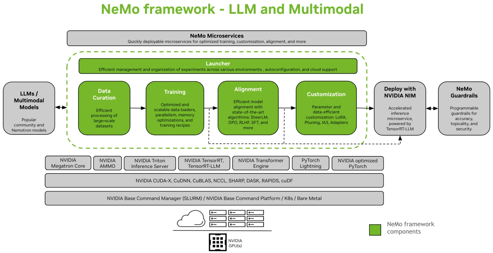

## AI Enterprise(NeMo利用環境)について

NVIDIA AI Enterpriseは、NVIDIAが開発するAI関連のツールキットをクラウド、オンプレミスなどの各種環境で実行する為にパッケージングしたNVIDIAのソリューションスイートです。

- [NVIDIA社のNVIDIA AI Enterpriseのトップページ](https://www.nvidia.com/ja-jp/data-center/products/ai-enterprise/)
- [NVIDIA AI Enterpriseのドキュメントサイト](https://docs.nvidia.com/ai-enterprise/index.html#overview)

遺伝研スパコンでは個人ゲノム解析区画の一部でAI Enterprise5.0を部分的に導入し、以下の様なことが可能となっています。


- 環境構築方法が難解な各種AIソフトウェア群（オープンソース）が一つの[NVIDIA NeMo](https://docs.nvidia.com/nemo-framework/user-guide/latest/overview.html)のコンテナイメージとして統合パッケージされており、このコンテナをダウンロードして遺伝研スパコン上で利用可能です。自分で一から環境構築することなく利用できます。

- [Hugging Face Hub](https://huggingface.co/)や[NGC Catalog](https://catalog.ngc.nvidia.com/?filters=&orderBy=weightPopularDESC&query=&page=&pageSize=)などで公開、条件付き公開されている大規模言語モデル(LLM)をダウンロード・変換して、遺伝研スパコン上で利用することが可能です。利用する為のツールは上記のコンテナの中にパッケージされています。ユーザが持つ個別データでオリジナルのLLMに対するファインチューニング(微調整)が必要なければオリジナルLLMを利用した推論機能をそのまま利用することが可能です。

- LLMに学習の為に与える各種コーパスのダウンロード、データの学習前準備、分散学習、ユーザがLLMに知識として反映したい個別データによるLLMのカスタマイズ・微調整、学習・微調整の結果の評価などに必要な各種ツール群(Pythonスクリプト)が利用可能です。上記のコンテナ内にパッケージされています。

- 複数台のGPUサーバを利用した大規模な分散学習を行う為のワークフローソフトウェア([NeMo Megatron Launcher](https://docs.nvidia.com/nemo-framework/user-guide/latest/launcherguide/index.html))が利用可能です。ワークフローソフトウェアと連携するジョブ管理システム(Slurm)の環境が遺伝研スパコン上では整備されており連携可能です。

- llama3などの人気のあるLLMモデルはNVIDIAが[NVIDIA NIM](https://docs.nvidia.com/nim/index.html)のコンテナ（マイクロサービス）としてパッケージングしてNGC Catalogから順次ダウンロード可能としています（最新機能でNVIDIAで現時点では順次開発中）。（遺伝研スパコン上での利用開始は次期システム稼働開始後の2025年度予定）

以上を利用することで、ユーザがLLMを利用する為に、複雑な環境を一から自分で構築、設定したり、利用の為に必要な各種スクリプトを各種フレームワークを利用して一から自力開発することなく、各種のLLMのモデルをカスタマイズし、カスタマイズしたLLMを最適化された推論器に配置利用することが可能となります。


## NVIDIA NeMo フレームワークを利用したLLM開発環境について

本サイトでは、以下のサイトの情報をもとに、NeMoでサポートされたGPT3,Llama2などのLLMのカスタマイズに関する機能に重点を置いて、遺伝研スパコン上での基本的な使い方について説明します。

-[NeMoユーザガイド](https://docs.nvidia.com/nemo-framework/user-guide/latest/playbooks/index.html)
-[NeMoクイックスタートガイド](https://github.com/NVIDIA/NeMo)

NVIDIA NeMoフレームワークは、大規模言語モデル(LLM)、マルチモーダル(MM)、および音声AI(ASRおよびText-to-speech)に取り組む研究者や開発者のために構築された生成AI用フレームワークです。ユーザーは提供されるフレームワークのAPIと、検証されたハイパーパラメータ設定、事前にトレーニングされたモデルのチェックポイントを活用することで、生成AIモデルを効率的にカスタマイズ、およびデプロイすることが可能になります。




NeMoはLLMのモデル利用に必要な各処理に対して以下のような機能を提供しています。

### データのキュレーション機能
自然言語処理(NLP),LLMの学習に必要なコーパスなどのデータをトレーニングに利用できる形にダウンロード、キュレーションを行う為のpythonスクリプト群が提供されます。一部([Nemo Curator](https://github.com/NVIDIA/NeMo-Curator))はすでに利用可能です。またドキュメントは順次作成中の様ですが以下が参照できます。
- [Data Curationのドキュメント](https://docs.nvidia.com/nemo-framework/user-guide/latest/datacuration/index.html)

NVIDIAサイト上ではNemo Curatorはアーリーアクセスプログラムの扱いになっており利用には申請が必要な形となっていてgithubの公開部分と一致しているのかは不明です。一般アクセス可能になった時点でご紹介します。

### モデルのトレーニング（学習）機能
各種のコミュニティベースのLLMのモデルに対してNVIDIA GPUを利用して学習（トレーニング）を行わせる為のツール群が提供されています。2024年５月現在、NeMoユーザガイドでは以下のLLMモデルへの対応が説明されています。更新が随時かかっているので最新情報についてはNVIDIAのユーザガイドを直接参照してください。

[NeMo overview](https://docs.nvidia.com/nemo-framework/user-guide/latest/overview.html)

|対応LLMモデル|PEFT|アラインメント|Hugging Faceとの間のモデルの変換機能|評価処理機能|
|--------|-----|--------|-------|-----|
|[Llama2,CodeLlama](https://docs.nvidia.com/nemo-framework/user-guide/latest/llms/llama/index.html)|yes|yes|双方向|yes|
|[Gemma,CodeGemma](https://docs.nvidia.com/nemo-framework/user-guide/latest/llms/gemma/index.html)|yes|yes|HF から Nemo|yes|
|[Baichuran2](https://docs.nvidia.com/nemo-framework/user-guide/latest/llms/baichuan2/index.html)|yes|yes|双方向|yes|
|[Falcon](https://docs.nvidia.com/nemo-framework/user-guide/latest/llms/falcon/index.html)|yes|yes|双方向|yes|
|[Mistral](https://docs.nvidia.com/nemo-framework/user-guide/latest/llms/mistral/index.html)|yes|yes|双方向|yes|
|[Mixtral](https://docs.nvidia.com/nemo-framework/user-guide/latest/llms/mixtral/index.html)|yes|yes|双方向|yes|
|[StarCoder2](https://docs.nvidia.com/nemo-framework/user-guide/latest/llms/starcoder2/index.html)|yes|yes|双方向|yes|
|[T5](https://docs.nvidia.com/nemo-framework/user-guide/latest/llms/t5/index.html)|yes|No|未対応|yes|
|[mT5](https://docs.nvidia.com/nemo-framework/user-guide/latest/llms/mt5/index.html)|yes|No|未対応|yes|
|[GPT](https://docs.nvidia.com/nemo-framework/user-guide/latest/llms/gpt/index.html)|yes|yes|未対応|yes|
|[BERT](https://docs.nvidia.com/nemo-framework/user-guide/latest/llms/bert/index.html)|yes|No|双方向|No|

また、これ以外にNVIDIAのLLMのNemotronの記述もあります。目的を明示した利用申請が個別に必要になり詳細確認できない為、参考にご紹介します。

- [参考：NVIDIA Nemotron-3 8B](https://developer.nvidia.com/nemotron-3-8b)


参考にモデルを再学習させる場合に必要となる計算量の目安を参考に示します(NVIDIAのサイトから引用）

GPUはH100を利用した実行例になります。GPU数と推定時間を見てください。最新情報については以下のNVIDIAのサイトを参照してください。
現行の遺伝研スパコンではGPUはV100(GPUメモリ16GB)を４基搭載したGPUサーバが利用可能です。現行システムでは下記の表以上の時間がかかることになります。その点留意ください。

- [performance benchmarks](https://docs.nvidia.com/nemo-framework/user-guide/latest/benchmarks.html#benchmark-results)

|Model |GPU数(H100) | GBS | MBS | Sequence Length |TP | PP| Tokens / sec / GPU | Model TFLOP / sec / GPU |トレーニングにかかる推定時間(日)(10T tokens, 1K GPUs)|
|---|---|---|---|---|---|---|---|---|---|
|GPT3-5B|	64	|2048|	4|	2048|	1	|1|	23574	|746	|5|
|GPT3-20B| 64|256|	2	|2048|	2	|1	|5528|	708|	20|
|LLAMA2-7B	|8|	128	|1	|4096|	1	|1	|16290	|751	|7|
|LLAMA2-13B|	16|	128	|1	|4096|	4|	1	|8317|	725	|14|

- GBS(Global Batch Size)：全体のバッチサイズ。分散トレーニングにおいてのすべてのGPUを通じて処理されるデータの合計サイズを指す。
- MBS(Micro Batch Size)：各GPUが一度に処理するデータの量を指します。
- TP(Tensor Parallelism) テンソルを重複しない部分に分割して複数のGPUに割り当てて並行処理する手法
- PP(Pipeline Parallelism)　ニューラルネットワークの連続したレイヤーを異なるGPUに割り当てて並行処理する手法


### モデルのカスタマイズ（ファインチューニング）、アラインメント機能
事前学習済みモデルをファインチューニング（ユーザの個別データを用いたLLMモデルの推論の微調整・カスタマイズ処理）するためのツール群、スクリプト群が提供されています。また各種手法に従ったアラインメント処理（LLMの出力を人間の意図や価値観に適合させる処理）のスクリプトを提供しています。ファインチューニングには複数の手法があり、利用できる計算資源、用意できるカスタマイズ用のデータ、必要な精度、LLMを適用する分野により選択することになる様です。参考のURLを以下に示します。

- [selecting-large-language-model-customization-techniques(ファインチューニング手法の選択についてのNVIDIAのブログ)](https://developer.nvidia.com/ja-jp/blog/selecting-large-language-model-customization-techniques/)

- 上記ブログより引用したカスタマイズ手法の比較


NeMoでのファインチューニング処理についてはNVIDIAの以下のページを参照してください。

- [Developper Quick Start](https://docs.nvidia.com/nemo-framework/user-guide/latest/sft_peft/quick_start.html#peftquickstart)

- [SFT and PEFT](https://docs.nvidia.com/nemo-framework/user-guide/latest/sft_peft/index.html)


NeMoフレームワークがサポートするSFT/PEFT手法の対応表の部分引用を以下に示します。（上記のURLのページから引用）

|  |GPT 3 |Nemotron | LLaMa 1/2 | Falcon    | Starcoder | Mistral   | Mixtral   | Gemma     | T5  |
|--|------|---------|-----------|-----------|-----------|-----------|-----------|-----------|------|
|SFT	|✅|✅|✅|✅|✅|✅|✅|✅|✅|
|LoRA	|✅|	✅|✅|✅|✅|✅|✅|✅|✅|
|P-tuning	|✅|✅|✅|✅|✅|✅|✅|✅|✅|
|Adapters (Canonical)|✅|✅|✅||✅|✅|✅|✅|✅|
|IA3	|✅|✅|✅||✅|✅||✅|✅|

NeMoでサポートされているPEFTの各手法(LoRA,P-tuning,Adapters,IA3)については以下も参照してください。

- [Supported PEFT method](https://docs.nvidia.com/nemo-framework/user-guide/latest/sft_peft/supported_methods.html#peft-supported-methods)

PEFT(LoRA)が、推論までの一通りの手順を確認できる良い例になると考えますので、遺伝研スパコン上でPEFTを実施した例を以下に示します。下記ページの中で準備作業となるAPI keyの取得方法などは本ページ内の詳細手順の説明部分で後述しています。

- [NeMoを利用したLlama2のPEFT(parameter-efficient fine-tuning)の実行例](/software/nemo/peft_tutorial01)
- [NeMoを利用したMistralのPEFT(parameter-efficient fine-tuning)の実行例](/software/nemo/peft_mistral_7b)

またLLM自体のファインチューニング以外の回答精度の向上技術であるRAG(Retrieval-Augumented Generation)については、[NVIDIA Retriever](https://www.nvidia.com/ja-jp/ai-data-science/products/nemo/)という形でソリューション化される方向の様ですが、2024年5月現在ではアーリーアクセスプログラムにはなっており、一般のNVIDIAのソリューションにはまだなっていない様なので説明を省略します。参考として以下のブログ記事のURLをご紹介します。（ただし、記事内のリンク先が公開はされていないものの様です。）

- [ブログ記事：NeMo Retriever を使って Embedding モデルを簡単デプロイ](https://developer.nvidia.com/ja-jp/blog/easily-deploy-embedding-models-with-nemo-retriever/)

### 学習、ファインチューニング、評価など各種ジョブのラウンチャー機能

上記のモデルのキュレーション、トレーニング、カスタマイズ、アラインメント機能を一連のワークフローとして実行する為のツールとして[NeMo Megatron Launcher](https://docs.nvidia.com/nemo-framework/user-guide/latest/launcherguide/launcherintro.html)というラウンチャー機能を提供しています。複数の事前定義されたコンフィグレーションファイルを調整することにより、各ステージの動作、対応モデルなどを変更することが可能です。基本的な設定、利用方法については本ページで後述します。

### 推論機能の最適化、推論器へのエクスポート機能

  NVIDIAの製品としては最適化された推論機能を提供する仕組みとしては[Tensor RT-LLM](https://nvidia.github.io/TensorRT-LLM/overview.html)および[Triton Inference Server](https://docs.nvidia.com/deeplearning/triton-inference-server/user-guide/docs/user_guide/performance_tuning.html)を利用可能とのアナウンスになっていました。しかし2024年5月現在、NeMo ユーザガイドで記載されている一部の手順がそのままでは確認の取れない手順になっており、問い合わせに対する開発元からの回答も現時点ではなく、状況不明な為、遺伝研では現時点では説明を一旦割愛します。この部分への問い合わせはご容赦ください。開発元の方針で予告なく状況が改善、更新される場合もありますので、本機能の最新状況についてはNVIDIAのオリジナルサイトのユーザガイドを参照してください。Triton Serverを利用する以外の、学習の評価機能としての推論機能は、NeMoフレームワークの中で利用可能です。

### その他

NeMoは、Megatron-LM、Pytorch Lightning、PytorchをベースとしたプログラミングToolkitの機能を持ちますが、Toolkitを利用したプログラミングについては汎用的かつ多岐に渡る大部な内容で開発も活発で更新も頻繁であるため本サイトでは説明を省略します。toolkitのプログラミング方法、各種ツールの詳細な使い方、リファレンスは以下のNVIDIAのサイトを参照してください。

- [NeMo Framework Toolkitについて](https://docs.nvidia.com/nemo-framework/user-guide/latest/nemotoolkit/starthere/intro.html)
- [Google Colab上の各種Tutorial](https://docs.nvidia.com/nemo-framework/user-guide/latest/nemotoolkit/starthere/tutorials.html)(googleのアカウント必要)

- [NVIDIA NeMo Framework Developer Docs](https://docs.nvidia.com/nemo-framework/user-guide/latest/nemotoolkit/index.html)

- [NeMo APIs](https://docs.nvidia.com/nemo-framework/user-guide/latest/nemotoolkit/core/core_index.html)


またNVIDIAにより提供される各種ツール、pythonスクリプトは使用方法が全てドキュメント化されているわけではなく、スクリプト自体もアジャイルに開発、エンハンス、追加変更されている模様の為、ドキュメントをアップした時点で本サイトの説明との齟齬がある場合があります。その点ご容赦ください。その他、NeMoの詳細、遺伝研の環境に由来しないエラーについては以下のサイトを参照して下さい。Q&Aなどもあります。

- [NeMo Issues(Github上)](https://github.com/NVIDIA/NeMo/issues)
- [NeMo Discussions(Github上)](https://github.com/NVIDIA/NeMo/discussions)

## 遺伝研スパコンでのNeMo利用環境と利用方法について

遺伝研スパコン内の個人ゲノム解析区画のGPUノード利用申請ベースでの利用が可能となっています。
現在利用可能なGPUサーバのハードウェア仕様については以下を参照して下さい。

- [Thin計算ノードType 2bのハードウェア仕様](http://localhost:3000/guides/hardware#thin-%E8%A8%88%E7%AE%97%E3%83%8E%E3%83%BC%E3%83%89-type-2b-hpe-apollo-6500-gen10-16-%E5%8F%B0)

尚、遺伝研では2024年度末にハードウェアの更新を予定しており、GPU計算資源を大幅拡充しLLM開発環境を整備する予定です。

ソフトウェアとしては以下のソフトウェアコンポーネントがコンテナとしてパッケージングされたものがNGCからダウンロード可能です。本ページはNeMo Framework 24.03.01(LLM用)を利用する前提で記載しています。24.03のコンテナに同梱されるソフトウェアコンポーネントは以下の通りです。

|ソフトウェアコンポーネント |バージョン|
|-------|---------|
|[Transformer Engine](https://github.com/NVIDIA/TransformerEngine) |1.3|
|[PyTorch](https://pytorch.org/docs/stable/index.html) | 2.2.0 |
|[NeMo](https://github.com/NVIDIA/NeMo)| 1.23.0 |
|[NeMo Aligner](https://github.com/NVIDIA/NeMo-Aligner)| 0.2.0|
|[NeMo Data Curator](https://github.com/NVIDIA/NeMo-Curator)|	0.1.0|
|[Megatron Core](https://github.com/NVIDIA/Megatron-LM) |	0.5.0|
|[PyTorch Lightning](https://github.com/Lightning-AI/pytorch-lightning)	| 2.0.7|
|[Hydra](https://github.com/facebookresearch/hydra)| 1.2.0 |

ソフトウェアの更新が頻繁にかかるので最新についてはNVIDIAのサイトをご参照ください。

[Software Component Versions](https://docs.nvidia.com/nemo-framework/user-guide/latest/softwarecomponentversions.html)

Nemo Megatron Launcherから利用するジョブ管理システムとしてはSlurmが遺伝研スパコンでは利用可能になっています。Slurmでコンテナをジョブとして実行可能にするために[enroot](https://github.com/NVIDIA/enroot),[pyxis](https://github.com/NVIDIA/pyxis)というNVIDIAが開発しているツールを付加した環境を利用可能としています。

### NeMo利用前の準備作業（NGCのユーザ登録、keyの生成）

NeMoフレームワークを利用するにはNVIDIAのNGC Catalogにアクセスして各種ツール、データをダウンロードする必要が有ります。ここではダウンロードに必要な各種キーについての取得方法の概略を説明します。NGCにユーザ登録して、APIキーを取得してください。

まず、以下のURLにアクセスします。

https://ngc.nvidia.com/


上記の画面の右端の'Welcome Guest'と表示されているメニューをクリックし、Sign Upしてユーザ登録をしてください。
ユーザ登録をしてログインすると、サインインした形で上記の画面が再表示されます。

NeMo Frameworkを利用する際に、NGCにアクセスする為のAPIキーが必要になります。以下のメニューから作成します。
右端のメニューからSetupを選択してください。以下の画面が表示されます。


API keyを生成します。'Generate API key'ボタンを押してください。以下の画面が表示されます。


その際、confirmationが表示されるので、confirmを押して、表示されるAPIkeyの文字列をコピーして保存してください。

取得したキーについては、Slurm(enroot)がコンテナをNGCから自動的にpullすることが可能とするために '$HOME/.config/enroot/.credentials'ファイル内に以下の様に書き込んでください。SlurmはNeMo Megatron Launcher(後述)から利用されます。

```
machine nvcr.io login $oauthtoken password <APIキーの文字列>
machine authn.nvidia.com login $oauthtoken password <APIキーの文字列>
```

### NeMo利用前の準備作業（Hugging Face Hubへのユーザ登録、アクセスキーの取得）

コミュニティのTransformersモデルやデータセットを入手する為にHugging Face HubへのSign upが必要です。
Hugging Face Hubとは機械学習プロジェクトが多数ホストされているサイトであり、ここからコミュニティベースのLLMの学習済みモデルや
学習の為のデータセットを入手することができます。

以下のサイトにアクセスして、画面右上のSign upボタンからサインアップを行って下さい。

- [Hugging Face](https://huggingface.co/)

利用するモデル、データセットによっては、モデル、データセット毎に利用登録をする必要があるものもあります。モデル、データセット毎の指示にしたがって下さい。


### NeMo利用前の準備作業（オプション：Weight & Biasesのユーザ登録、アクセスキーの取得）
NeMo Megatron Launcher(後述)では内部的にWeight & biases(以降wandb)環境をオプションの扱いですが使用可能です。実行状況の可視化などが不要であれば登録しなくてもNeMoの利用は可能です。wandbはAI/MLの実験管理、モデルレジストリ、レポート作成などの機能を持つSaaS型およびオンプレミス型の両方の対応が可能なMLOps環境です。

- wandb(SaaS)の画面例


非営利研究機関の研究者が個人で利用する場合は無料で利用できる模様ですが、弊研究所ではライセンス取扱の詳細については確認できていません。
詳細についてはご自身で確認、使用の選択をお願いします。

 - [wandbのライセンス解説ページ](https://www.wandb.jp/pricing)

自分が申し込みたいソリューションでサインアップを行なって下さい。また利用方法の詳細については、本サイトでは取り扱いませんので
wandbのドキュメントサイトをご参照ください。またオンプレミス型のwandbサーバのデプロイ方法は現状提供しておりません。

- [wandbのクイックスタートガイド](https://docs.wandb.ai/ja/quickstart)


## NeMoの利用方法

[NeMoユーザガイド](https://docs.nvidia.com/nemo-framework/user-guide/latest/getting-started.html)では、LLM開発をサポートする環境・方法として以下の二つが説明されています。

#### NeMo Megatron Launcherを使用しない方法

１〜2台程度のGPUノードを利用した比較的小規模の計算を行わせれば良い場合のジョブ投入方法になります。

#### NeMo Megatron Launhcerを使用する方法

数ノードから数十ノードのGPUノードを利用した大規模の計算を、事前に用意されたパラメータセットを利用しつつ調整、実行したい場合のワークフロージョブ投入方法になります。


以下にそれぞれについて説明します。

## NeMo Megatron Launcherを使わない方法

小規模なモデルの処理やGPUノード１台で処理できるような処理の場合の利用方法です。各種のスクリプト、フレームワークの機能を直接利用して処理を進めます。
こちらの実行方法については、以下のNVIDIAのページを参照してください。

- [GPT model training](https://docs.nvidia.com/nemo-framework/user-guide/latest/nemotoolkit/nlp/nemo_megatron/gpt/gpt_training.html)
- [NeMo Framework Single Node Pre-training](https://docs.nvidia.com/nemo-framework/user-guide/latest/playbooks/singlenodepretrain.html)

Megatron Launcherの前提環境準備の手間はありませんが、実行例の動作を調整したい場合、フレームワークのハイパーパラメータの意味を理解した上で直接調整する必要があります。上記の例について遺伝研スパコン上で動作させる手順について以下で説明して行きます。

上記の例のなかではdockerを利用していますが、遺伝研スパコンの場合セキュリティの観点からdockerの利用ができない設定になっていますので、以下のようにsingularityにdocker imageをインポートして環境を利用してください。`--docker-login`オプションをつけて、NGCにアクセスする為にユーザ名`$oauthtoken`を入力し、パスワードとしては保存しているNGC API keyを入力してください。

```
(base) yxxxx@igt003:~$ singularity pull --docker-login docker://nvcr.io/nvidia/nemo:24.03
Enter Docker Username: $oauthtoken
Enter Docker Password: 
INFO:    Converting OCI blobs to SIF format
INFO:    Starting build...
Getting image source signatures
Copying blob ce8cc979c12e done   | 
Copying blob ce8cc979c12e done   | 
Copying blob ce8cc979c12e done   | 
Copying blob ce8cc979c12e done   | 
Copying blob b4655ab72d66 done   | 
(以下省略)
```
pullが成功すると以下のようにsifファイルが作成されます。

```
$ ls -l nemo_24.03.sif 
-rwxr-xr-x 1 yxxx xxxxx 17007312896 May  6 12:22 nemo_24.03.sif
```
`--nv`オプションをつけてGPUを利用可能な形でコンテナを実行します。nvidia-smiコマンドなどでコンテナ内の環境からGPU環境が参照できていることを
確認してください。

```
yxxxx-pg@igt004:/data1/yxxxx-pg/work1$ singularity run --nv ./nemo_24.03.framework.sif 
13:4: not a valid test operator: (
13:4: not a valid test operator: 545.23.06

===================
== NeMo Megatron ==
===================

NVIDIA Release  (build 82611821)
Container image Copyright (c) 2024, NVIDIA CORPORATION & AFFILIATES. All rights reserved.
Copyright (c) 2014-2024 Facebook Inc.
Copyright (c) 2011-2014 Idiap Research Institute (Ronan Collobert)
Copyright (c) 2012-2014 Deepmind Technologies    (Koray Kavukcuoglu)
Copyright (c) 2011-2012 NEC Laboratories America (Koray Kavukcuoglu)
Copyright (c) 2011-2013 NYU                      (Clement Farabet)
Copyright (c) 2006-2010 NEC Laboratories America (Ronan Collobert, Leon Bottou, Iain Melvin, Jason Weston)
Copyright (c) 2006      Idiap Research Institute (Samy Bengio)
Copyright (c) 2001-2004 Idiap Research Institute (Ronan Collobert, Samy Bengio, Johnny Mariethoz)
Copyright (c) 2015      Google Inc.
Copyright (c) 2015      Yangqing Jia
Copyright (c) 2013-2016 The Caffe contributors
All rights reserved.

Various files include modifications (c) NVIDIA CORPORATION & AFFILIATES.  All rights reserved.

This container image and its contents are governed by the NVIDIA Deep Learning Container License.
By pulling and using the container, you accept the terms and conditions of this license:
https://developer.nvidia.com/ngc/nvidia-deep-learning-container-license

Singularity> nvidia-smi 
Mon May 13 08:29:39 2024       
+---------------------------------------------------------------------------------------+
| NVIDIA-SMI 545.23.06              Driver Version: 545.23.06    CUDA Version: 12.3     |
|-----------------------------------------+----------------------+----------------------+
| GPU  Name                 Persistence-M | Bus-Id        Disp.A | Volatile Uncorr. ECC |
| Fan  Temp   Perf          Pwr:Usage/Cap |         Memory-Usage | GPU-Util  Compute M. |
|                                         |                      |               MIG M. |
|=========================================+======================+======================|
|   0  Tesla V100-SXM2-16GB           Off | 00000000:15:00.0 Off |                    0 |
| N/A   53C    P0             209W / 300W |   6305MiB / 16384MiB |     93%      Default |
|                                         |                      |                  N/A |
+-----------------------------------------+----------------------+----------------------+
|   1  Tesla V100-SXM2-16GB           Off | 00000000:16:00.0 Off |                    0 |
| N/A   60C    P0             207W / 300W |   6305MiB / 16384MiB |     93%      Default |
|                                         |                      |                  N/A |
+-----------------------------------------+----------------------+----------------------+
|   2  Tesla V100-SXM2-16GB           Off | 00000000:3A:00.0 Off |                    0 |
| N/A   52C    P0             202W / 300W |   6341MiB / 16384MiB |     93%      Default |
|                                         |                      |                  N/A |
+-----------------------------------------+----------------------+----------------------+
|   3  Tesla V100-SXM2-16GB           Off | 00000000:3B:00.0 Off |                    0 |
| N/A   64C    P0             221W / 300W |   6353MiB / 16384MiB |     93%      Default |
|                                         |                      |                  N/A |
+-----------------------------------------+----------------------+----------------------+
                                                                                         
+---------------------------------------------------------------------------------------+
| Processes:                                                                            |
|  GPU   GI   CI        PID   Type   Process name                            GPU Memory |
|        ID   ID                                                             Usage      |
|=======================================================================================|
|    0   N/A  N/A    369553      C   /usr/bin/python                            6302MiB |
|    1   N/A  N/A    369554      C   /usr/bin/python                            6302MiB |
|    2   N/A  N/A    369555      C   /usr/bin/python                            6338MiB |
|    3   N/A  N/A    369556      C   /usr/bin/python                            6350MiB |
+---------------------------------------------------------------------------------------+
Singularity> 
```
また利用するスクリプトのディレクトリなどは/opt/NeMoの下に配置されているので確認してください。

### 必要なデータの準備作業


学習の為に必要なデータをダウンロードします。Wikipediaのデータです。しばらく時間がかかります。

```
wget https://dumps.wikimedia.org/enwiki/latest/enwiki-latest-pages-articles.xml.bz2
```

生データの形式を変換します。
```
pip install wikiextractor
python -m wikiextractor.WikiExtractor enwiki-latest-pages-articles.xml.bz2 --json
find text -name 'wiki_*' -exec cat {} \; > train_data.jsonl
```
以下のファイルをダウンロードします。例と同じで、Hugging FaceのTokenizerファイルを使う方法を利用しています。
```
wget https://s3.amazonaws.com/models.huggingface.co/bert/gpt2-vocab.json
wget https://s3.amazonaws.com/models.huggingface.co/bert/gpt2-merges.txt
```

以下のスクリプトをSingularityコンテナ環境内で実行します。
```
python3 /opt/NeMo/scripts/nlp_language_modeling/preprocess_data_for_megatron.py \
--input=train_data.jsonl \
--json-keys=text \
--tokenizer-library=megatron \
--vocab gpt2-vocab.json \
--dataset-impl mmap \
--tokenizer-type GPT2BPETokenizer \
--merge-file gpt2-merges.txt \
--output-prefix=hfbpe_gpt_training_data \
--append-eod \
--workers=32
```
しばらく待ちます。

### 1GPUを利用してトレーニングを実行する方法（例題のデフォルト）

次にトレーニングは時間がかかる処理なので、一回コンテナから抜けてslurmに対してバッチジョブとして投入します。sbatchから
singlarityコンテナを起動する処理をジョブスクリプトとして以下のように記述します。megatron_gpt_pretraining.pyスクリプトのパラメータ
は例から変えていません。

```js
#!/bin/bash
#SBATCH --job-name gpt3-test
#SBATCH -N 1
#SBATCH --cpus-per-task 8 
#SBATCH --mem-per-cpu 8G
#SBATCH --gres=gpu:1

date
singularity exec --nv /home/yxxxx-pg/nemo_24.03.sif /usr/bin/python3 /opt/NeMo/examples/nlp/language_modeling/megatron_gpt_pretraining.py  \
           --config-path=conf/ \
    --config-name=megatron_gpt_config \
    trainer.devices=1 \
    trainer.num_nodes=1 \
    trainer.max_epochs=null \
    trainer.max_steps=300000 \
    trainer.val_check_interval=300 \
    trainer.log_every_n_steps=50 \
    trainer.limit_val_batches=50 \
    trainer.limit_test_batches=50 \
    trainer.accumulate_grad_batches=1 \
    trainer.precision=16 \
    model.micro_batch_size=6 \
    model.global_batch_size=192 \
    model.tensor_model_parallel_size=1 \
    model.pipeline_model_parallel_size=1 \
    model.max_position_embeddings=1024 \
    model.encoder_seq_length=1024 \
    model.hidden_size=768 \
    model.ffn_hidden_size=3072 \
    model.num_layers=12 \
    model.num_attention_heads=12 \
    model.init_method_std=0.021 \
    model.hidden_dropout=0.1 \
    model.layernorm_epsilon=1e-5 \
    model.tokenizer.vocab_file=gpt2-vocab.json \
model.tokenizer.merge_file=gpt2-merges.txt \
    model.data.data_prefix=[1.0,hfbpe_gpt_training_data_text_document] \
    model.data.num_workers=1 \
    model.data.seq_length=1024 \
    model.data.splits_string=\'980,10,10\' \
    model.optim.name=fused_adam \
    model.optim.lr=6e-4 \
    model.optim.betas=[0.9,0.95] \
    model.optim.weight_decay=0.1 \
    model.optim.sched.name=CosineAnnealing \
    model.optim.sched.warmup_steps=750 \
    model.optim.sched.constant_steps=80000 \
    model.optim.sched.min_lr=6e-5 \
    exp_manager.resume_if_exists=True \
    exp_manager.resume_ignore_no_checkpoint=True \
    exp_manager.create_checkpoint_callback=True \
    exp_manager.checkpoint_callback_params.monitor=val_loss \
    exp_manager.checkpoint_callback_params.save_top_k=3 \
    exp_manager.checkpoint_callback_params.mode=min \
    exp_manager.checkpoint_callback_params.always_save_nemo=False
```
カレントディレクトリにデータ群があることを確認してsbatchでジョブを投入します。

```
$ squeue
             JOBID PARTITION     NAME     USER ST       TIME  NODES NODELIST(REASON)
              3300 parabrick gpt3-tes yxxxx-pg  R      16:07      1 igt015
```
slurmのジョブ出力(slurm-jobid.out)のファイルの出力の様子を`tail -f` などで確認します。
Epochが表示されれば、トレーニング段階にまでは到達したと確認できます。
```
Tue May  7 13:25:08 JST 2024
13:4: not a valid test operator: (
13:4: not a valid test operator: 530.30.02
[NeMo W 2024-05-07 13:26:13 nemo_logging:349] /usr/local/lib/python3.10/dist-packages/hydra/_internal/hydra.py:119: UserWarning: Future Hydra versions will no longer change working directory at job runtime by default.
    See https://hydra.cc/docs/next/upgrades/1.1_to_1.2/changes_to_job_working_dir/ for more information.
      ret = run_job(

[NeMo I 2024-05-07 13:26:13 megatron_gpt_pretraining:34]

    ************** Experiment configuration ***********
[NeMo I 2024-05-07 13:26:13 megatron_gpt_pretraining:35]
    name: megatron_gpt
    restore_from_path: null
    trainer:
      devices: 1
      num_nodes: 1
      accelerator: gpu
      precision: 16
      logger: false

(途中省略)
    
Epoch 0: :   0%|          | 6/300000 [00:17<237:34:56, v_num=1, reduced_train_loss=11.00, global_step=5.000, 
(以下省略)
```

srunでジョブが投入されたノードで`nvidia-smi`を実行してGPUが実際に利用されているかを確認します。

```
$ srun --jobid 3300 nvidia-smi 
Tue May  7 13:35:51 2024       
+---------------------------------------------------------------------------------------+
| NVIDIA-SMI 530.30.02              Driver Version: 530.30.02    CUDA Version: 12.1     |
|-----------------------------------------+----------------------+----------------------+
| GPU  Name                  Persistence-M| Bus-Id        Disp.A | Volatile Uncorr. ECC |
| Fan  Temp  Perf            Pwr:Usage/Cap|         Memory-Usage | GPU-Util  Compute M. |
|                                         |                      |               MIG M. |
|=========================================+======================+======================|
|   0  Tesla V100-SXM2-16GB            Off| 00000000:15:00.0 Off |                    0 |
| N/A   66C    P0              299W / 300W|  14695MiB / 16384MiB |    100%      Default |
|                                         |                      |                  N/A |
+-----------------------------------------+----------------------+----------------------+
|   1  Tesla V100-SXM2-16GB            Off| 00000000:16:00.0 Off |                    0 |
| N/A   46C    P0               40W / 300W|      0MiB / 16384MiB |      0%      Default |
|                                         |                      |                  N/A |
+-----------------------------------------+----------------------+----------------------+
|   2  Tesla V100-SXM2-16GB            Off| 00000000:3A:00.0 Off |                    0 |
| N/A   35C    P0               41W / 300W|      0MiB / 16384MiB |      0%      Default |
|                                         |                      |                  N/A |
+-----------------------------------------+----------------------+----------------------+
|   3  Tesla V100-SXM2-16GB            Off| 00000000:3B:00.0 Off |                    0 |
| N/A   39C    P0               38W / 300W|      0MiB / 16384MiB |      0%      Default |
|                                         |                      |                  N/A |
+-----------------------------------------+----------------------+----------------------+
                                                                                         
+---------------------------------------------------------------------------------------+
| Processes:                                                                            |
|  GPU   GI   CI        PID   Type   Process name                            GPU Memory |
|        ID   ID                                                             Usage      |
|=======================================================================================|
|    0   N/A  N/A   2482095      C   /usr/bin/python3                          14692MiB |
+---------------------------------------------------------------------------------------+
```
GPUにプロセスが投入されていることを確認します。

### 1ノード 4GPUを利用して分散トレーニングを行う方法
トレーニングとしては同じ処理ですが、時間短縮の為と複数のGPUでの並列処理の遺伝研スパコン上での例を示す為、同じトレーニングを1台4GPUで並列実行するジョブの投入の仕方を記述します。
以下のハイライトした部分について、例題の初期パラメータを変更して実行してください。
またpytorchでの分散学習についての以下の記述にtorchrunの使用方法の解説があります。またtorchrunを利用する際は、ノードをexclusive指定にして占有して下さい。
(同じノードに、後からtorchrunを使って実行するジョブが投入されるとエラーになる為)

- [torchrun (Elastic Launch)](https://pytorch.org/docs/stable/elastic/run.html)

```js
#!/bin/bash
//highlight-next-line
#SBATCH -N 1
#SBATCH --cpus-per-task 8
#SBATCH --mem-per-cpu=8g
#SBATCH --gres=gpu:4
//highlight-next-line
singularity exec --nv nemo_24.03.framework.sif torchrun --nproc-per-node=4 ./megatron_gpt_pretraining.py  \
    --config-path=conf/ \
    --config-name=megatron_gpt_config \
//highlight-next-line
    trainer.devices=4 \
    trainer.num_nodes=1 \
    trainer.max_epochs=null \
    trainer.max_steps=300000 \
    trainer.val_check_interval=300 \
    trainer.log_every_n_steps=50 \
    trainer.limit_val_batches=50 \
    trainer.limit_test_batches=50 \
    trainer.accumulate_grad_batches=1 \
    trainer.precision=16 \
    model.micro_batch_size=6 \
    model.global_batch_size=192 \
//highlight-next-line
    model.tensor_model_parallel_size=4 \
    model.pipeline_model_parallel_size=1 \
    model.max_position_embeddings=1024 \
    model.encoder_seq_length=1024 \
    model.hidden_size=768 \
    model.ffn_hidden_size=3072 \
    model.num_layers=12 \
    model.num_attention_heads=12 \
    model.init_method_std=0.021 \
    model.hidden_dropout=0.1 \
    model.layernorm_epsilon=1e-5 \
    model.tokenizer.vocab_file=gpt2-vocab.json \
model.tokenizer.merge_file=gpt2-merges.txt \
    model.data.data_prefix=[1.0,hfbpe_gpt_training_data_text_document] \
    model.data.num_workers=2 \
    model.data.seq_length=1024 \
    model.data.splits_string=\'980,10,10\' \
    model.optim.name=fused_adam \
    model.optim.lr=6e-4 \
    model.optim.betas=[0.9,0.95] \
    model.optim.weight_decay=0.1 \
    model.optim.sched.name=CosineAnnealing \
    model.optim.sched.warmup_steps=750 \
    model.optim.sched.constant_steps=80000 \
    model.optim.sched.min_lr=6e-5 \
    exp_manager.resume_if_exists=True \
    exp_manager.resume_ignore_no_checkpoint=True \
    exp_manager.create_checkpoint_callback=True \
    exp_manager.checkpoint_callback_params.monitor=val_loss \
    exp_manager.checkpoint_callback_params.save_top_k=3 \
    exp_manager.checkpoint_callback_params.mode=min \
    exp_manager.checkpoint_callback_params.always_save_nemo=False 
```

### 2ノード 8GPUを利用して分散トレーニングを行う方法

２ノードで分散学習を実施する場合も実行例として示します。初期設定に対して下のハイライト部分を適宜調整して
実行してください。ただし、現行遺伝研スパコン環境では計算資源の関係からこの規模以上の学習を実行することは推奨しません。
遺伝研ではより大規模な計算に対応可能なように2024年度末に計算資源の更新を予定しておりGPU計算環境の増強を予定しています。

基本的なパラメータ調整指針は以下の通りです。
- `micro_batch_size`は、GPUメモリの消費量に比例するので、nvidia-smiなどでGPUメモリの利用量を確認してメモリの60%から80%程度を利用するように数値を調整する。その時`micro_batch_size`の整数倍が`global_batch_size`になるようにする。
- `tensor_model_parallel_size`の整数倍がGPU数とノード数の積になるようにする。

また、slurmでジョブを起動していますが、投入されたノード上で並列起動したpythonスクリプトの中のpytorchの機能で同期（ランデブー）して並列計算を始める仕組みになっています。
torchrunで分散学習ジョブを投入する場合は、投入ノードを占有するようにして下さい。他のpytorchのジョブが同じノードで流れていた場合
互いに影響を受けてエラーとなる場合があります。

torchrunの使い方については、[torchrun(Elastic launch) ](https://pytorch.org/docs/stable/elastic/run.html)を参照して下さい。

以下のスクリプトの冒頭では、slurmによって割り当てられた計算ノードの中から１ノードを代表ノード（ヘッドノード）として切り出し
そのIPアドレスを引いて、torchrunのランデブーエンドポイントのパラメータに与えてやる処理を記述しています。

また、micro_batch_sizeは、GPUのV100がGPUメモリを16GB搭載しているGPUなので、その容量に収まりかつある程度は利用するように
調整した結果として32を指定しています。

```js
#!/bin/bash
//highlight-next-line
#SBATCH -N 2
#SBATCH --cpus-per-task 8
#SBATCH --mem-per-cpu=8g
#SBATCH --gres=gpu:4
#SBATCH --exclusive

echo DEBUG_SLURM_JOB_NODELIST: $SLURM_JOB_NODELIST
//highlight-start
nodes=( $(/opt/pkg/slurm/bin/scontrol show hostnames $SLURM_JOB_NODELIST ))
echo debug_host: $nodes
nodes_array=($nodes)
head_node=${nodes_array[0]}
head_node_ip=$(/opt/pkg/slurm/bin/srun --nodes=1 --ntasks=1 -w "$head_node" hostname --ip-address)
//highlight-end
echo debug_Node IP: $head_node_ip

//highlight-start
srun singularity exec --nv /data1/yxxxx-pg/work1/nemo_24.03.framework.sif torchrun \
	--nnodes=2 \
	--nproc-per-node=4 \
	--rdzv_id $RANDOM \
	--rdzv_backend c10d \
	--rdzv_endpoint $head_node_ip:29500 \
	/data1/yxxxx-pg/work1/megatron_gpt_pretraining.py  \
  //highlight-end
    --config-path=/data1/yxxxx-pg/work1/conf/ \
    --config-name=megatron_gpt_config \
    trainer.devices=4 \
//highlight-next-line
    trainer.num_nodes=2 \
    trainer.max_epochs=null \
    trainer.max_steps=300000 \
    trainer.val_check_interval=300 \
    trainer.log_every_n_steps=50 \
    trainer.limit_val_batches=50 \
    trainer.limit_test_batches=50 \
    trainer.accumulate_grad_batches=1 \
    trainer.precision=16 \
//highlight-start
    model.micro_batch_size=32 \
    model.global_batch_size=192 \
    model.tensor_model_parallel_size=8 \
//highlight-end
    model.pipeline_model_parallel_size=1 \
    model.max_position_embeddings=1024 \
    model.encoder_seq_length=1024 \
    model.hidden_size=768 \
    model.ffn_hidden_size=3072 \
    model.num_layers=12 \
    model.num_attention_heads=16 \
    model.init_method_std=0.021 \
    model.hidden_dropout=0.1 \
    model.layernorm_epsilon=1e-5 \
    model.tokenizer.vocab_file=/data1/yxxxx-pg/work1/gpt2-vocab.json \
    model.tokenizer.merge_file=/data1/yxxxx-pg/work1/gpt2-merges.txt \
    model.data.data_prefix=[1.0,/data1/yxxxx-pg/work1/hfbpe_gpt_training_data_text_document] \
    model.data.num_workers=2 \
    model.data.seq_length=1024 \
    model.data.splits_string=\'980,10,10\' \
    model.optim.name=fused_adam \
    model.optim.lr=6e-4 \
    model.optim.betas=[0.9,0.95] \
    model.optim.weight_decay=0.1 \
    model.optim.sched.name=CosineAnnealing \
    model.optim.sched.warmup_steps=750 \
    model.optim.sched.constant_steps=80000 \
    model.optim.sched.min_lr=6e-5 \
    exp_manager.resume_if_exists=True \
    exp_manager.resume_ignore_no_checkpoint=True \
    exp_manager.create_checkpoint_callback=True \
    exp_manager.checkpoint_callback_params.monitor=val_loss \
    exp_manager.checkpoint_callback_params.save_top_k=3 \
    exp_manager.checkpoint_callback_params.mode=min \
    exp_manager.checkpoint_callback_params.always_save_nemo=False 
```
ハイパーパラメータを変えていることにはなるので、損失関数の値の減少の仕方を見て、学習が収束しそうかどうかについては適宜判断してください。


その他、評価までの一通りを実施するMegatron Launcherを指定しない例として、PEFTファインチューニング例を以下に示します。参考にしてください。

- [NeMoを利用したLlama2のPEFT(parameter-efficient fine-tuning)の実行例](/software/nemo/peft_tutorial01)
- [NeMoを利用したMistralのPEFT(parameter-efficient fine-tuning)の実行例](/software/nemo/peft_mistral_7b)

##  NeMo Megatron Launcherを使う方法

中、大規模モデルの処理や、処理に数台〜数十台のGPUノードを必要とするようなワークフロー処理の為に利用します。NeMoフレームワークのパラメータを直接調整するのではなく、Launcherの設定を調整して利用することができます。学習データの取得、キュレーション処理、モデルのコンバージョン処理、学習、評価処理など、大規模な計算資源がが必要となるような処理を分散して実行する際に利用します。利用の為の基本的な環境設定方法については以下に示します。


## NeMo Megatron Launcherの環境設定（LLM用）

NeMo Megatron Launcherは、LLMの一連の処理をワークフローとして制御、処理する為のラウンチャーツールです。遺伝研スパコンではSlurm環境上でLauncherを利用可能とする設定を説明します。

### Launcher実行環境設定
Launcherは、NGCからダウンロード可能なコンテナに含まれているものを利用します。各種スクリプトはgithub上でも公開されていますが、コンテナ内の他のツールとの整合性が保証されているコンテナの中からLauncherツールを取り出して利用します。コンテナの中のものをローカルディレクトリにコピーするには以下の様にします。遺伝研スパコンのSlurmでは以下のコマンドラインで実施します。

```
srun -N 1 --mem-per-cpu=50g --container-mounts=コンテナ外のコピー先ディレクトリ:/workspace/mount_dir --container-image=nvcr.io/nvidia/nemo:24.03.framework bash -c "cp -r /opt/NeMo-Megatron-Launcher /workspace/mount_dir"
```
Slurmにはプラグインの[Pyxis](https://github.com/NVIDIA/pyxis)とこれと連携する[enroot](https://github.com/NVIDIA/enroot)が組み込んであり、srunコマンドなどでのコンテナ起動オプションがサポートされています（ただし、コンテナの初回起動時にはコンテナのpullに時間がかかるので留意ください）。
以上は、NeMo frameworkのコンテナ(nvcr.io/nvidia/nemo:24.03.framework)の`/opt/NeMo-Megatoron-Launcher`ディレクトリ内を、コンテナ外のディレクトリにコピーすることを指定しています。

以下のようなディレクトリ構造がコピー先ディレクトリに作成されていることを確認して下さい。

```
$ ls
Dockerfile  README.md          csp_tools  img               requirements.txt
LICENSE     auto_configurator  examples   launcher_scripts  setup.cfg
```
個別のpython環境を作成している場合、スクリプトの実行に必要なpythonモジュールは以下の様にインストールしてください。

```
pip install -r requirements.txt
```

requirements.txt内に記載されているモジュールは以下のものです。

```
best_download>=0.0.6
dask
huggingface_hub>=0.13.0
hydra-core>=1.2.0,<1.3
img2dataset
omegaconf>=2.2,<2.3
pynvml==11.4.1
pytablewriter==0.58.0
requests==2.26.0
tqdm==4.62.3
zstandard==0.15.2
```
または、condaを利用する場合は以下のようにして下さい。
```
conda install --file requirements.txt
```

ツール一式をコンテナからコピーできたら、以下の様にlauncherの実行環境を設定していきます。

スクリプト群をコピーしたディレクトリの、launcher_scriptsディレクトリ内は

```
__init__.py  conf  data  main.py  multirun  nemo_launcher  results  results.bk  tests
```
となっていますが、その中のconfディレクトリの下に設定ファイル群が配置されています。`conf/config.yaml`ファイルが
大元の設定ファイルとなっています。パイプラインの各ステージの各モデルの設定ファイルは、

```
conf/ステージ名/モデルタイプ/モデル名.yaml
```
というディレクトリ構造で配置されています。例えば、`conf`ディレクトリの下は、

```
adapter_learning  conversion          data_preparation  external_conversion  ia3_learning     rlhf_ppo     training
cluster           conversion_hf2nemo  evaluation        fine_tuning          peft             rlhf_rm
config.yaml       data_curation       export            fw_inference         prompt_learning  steerlm_reg
```
と対応しているステージ名のディレクトリ群が存在します。その中のtrainingディレクトリの中には、
```
baichuan2  clip        falcon  instruct_pix2pix  mixtral   nerf   stable_diffusion  tp_overlap
bert       controlnet  gpt3    llama             mt5       neva   starcoder2        vit
chatglm    dreambooth  imagen  mistral           nemotron  retro  t5
```
と、NeMo frameworkが対応しているモデルのトレーニングのディレクトリ群が存在するという構造になっています。


NeMo Launcherでは、まずconfig.yamlでフレームワーク全体の基本動作を設定します。ファイルの中に複数のセクションがあり、そこに設定を記述して実行させたいパイプライン処理を定義します。

defaultsセクションでは、パイプラインの各ステージの処理のデフォルト動作を設定をしています。また、このセクションでclusterをbcmに設定することで、ジョブの投入先をslurm（遺伝研スパコン環境）と指定することができます。

```js
defaults:
  - _self_
  //highlight-next-line
  - cluster: bcm  # Set to bcm for BCM and BCP clusters. Set to k8s for a k8s cluster.
  - data_curation: common_crawl/curate_common_crawl
  - data_preparation: gpt3/download_gpt3_pile #steerlm/steerlm_data_prep1 or steerlm/steerlm_data_prep2_reg
  - training: gpt3/5b
  - conversion: gpt3/convert_gpt3
  - conversion_hf2nemo: hf_llama2/convert_llama2_nemo
  - fw_inference: null
  - external_conversion: null
  - fine_tuning: null
  - peft: null
  - prompt_learning: null
  - adapter_learning: null
  - ia3_learning: null
  - evaluation: gpt3/evaluate_all
  - export: gpt3/export_gpt3
  - rlhf_rm: gpt3/2b_rm
  - rlhf_ppo: gpt3/2b_ppo
  - steerlm_reg : ac_sft/gpt_sft # either rw_sft/training_rm or ac_sft/gpt_sft
  - override hydra/job_logging: stdout
```


stagesセクションで各ステージをパイプライン処理のなかで実行するか否かをコメントをつけるか外すかで指定します。
```js
stages:
  #- data_preparation
  #- training
//highlight-next-line
  - conversion
  #- conversion_hf2nemo
  #- prompt_learning
  #- adapter_learning
  #- peft
  #- ia3_learning
  #- evaluation
  #- export
  #- steerlm_reg

cluster_type: bcm  # bcm, bcp, or k8s. If bcm or k8s, it must match - cluster above.
//highlight-next-line
launcher_scripts_path: (例)ホームディレクトリ/NeMo/launcher_scripts  # Path to NeMo Megatron Launch scripts, should ends with /launcher_scripts
data_dir: ${launcher_scripts_path}/data  # Location to store and read the data.
base_results_dir: ${launcher_scripts_path}/results  # Location to store the results, checkpoints and logs.
container_mounts: # List of additional paths to mount to container. They will be mounted to same path.
  - null
//highlight-next-line
container: nvcr.io/nvidia/nemo:24.03.framework

//highlight-next-line
wandb_api_key_file: null  # File where the w&B api key is stored. Key must be on the first line.

```
例えば上記のように`- conversion`の先頭のコメントアウトが外れていれば、conversion処理のみが起動されることになります。複数の処理のコメントアウトを外して複数のステージ処理を実行することが可能です。また、以下の設定をしてください。

- cluster_typeがbcmとなっていることを確認して下さい。bcmとすることでslurmにジョブを投入する設定をしたことになります。
- launcher_scripts_pathを設定して下さい。設定しない場合は、処理の起動時にコマンドラインオプションとして指定が必要になります。
- containerが`nvcr.io/nvidia/nemo:24.01.01.framework`になっていますが、LLMの処理を実施する場合は、24.03.frameworkに書き換えて下さい。
- wandb_api_key_fileにwandbのキーファイルのパスを書けば、wandbを利用したパイプライン処理の解析が可能になります。


以下の設定は、CPU側のコアの使い方を指定するセクションです。遺伝研スパコンではデフォルトの以下のままとしてください。
```js
# GPU Mapping
numa_mapping:
  enable: True  # Set to False to disable all mapping (performance will suffer).
  mode: unique_contiguous  # One of: all, single, single_unique, unique_interleaved or unique_contiguous.
  scope: node  # Either node or socket.
  cores: all_logical  # Either all_logical or single_logical.
  balanced: True  # Whether to assing an equal number of physical cores to each process.
  min_cores: 1  # Minimum number of physical cores per process.
  max_cores: 8  # Maximum number of physical cores per process. Can be null to use all available cores.
```

`conf/cluster/bcm.yaml`の内容は以下のようになっています。このファイルでは、クラスタタイプをbcmとしているクラスタのパラメタを指定しています。
```js
partition: null
account: null
exclusive: True
gpus_per_task: null
//highlight-next-line
gpus_per_node: 4
//highlight-next-line
mem: 50
job_name_prefix: 'nemo-megatron-'
srun_args:
  - "--no-container-mount-home"
```
gpu_per_nodeの数値がデフォルトで8になっていますが、遺伝研スパコンでは1ノードあたりのGPU数が4なので4と書き換えて下さい。メモリ量はNeMoのコンテナを起動するために50（単位はGBになります）と書き換えてください。partition,accountについては遺伝研スパコンの設定では特に設定する必要はありません。

### 各LLMモデルのワークフロー処理について
以上の設定を行った上で以下の設定を実施することで、各LLMのパイプラインを実行することができます。
#### デフォルト設定で利用可能な設定(GPTモデル)

```
stages:
  - data_preparation
  - training
  - conversion
  - evaluation
  - export
```

#### デフォルト設定で利用可能な設定(T5モデル)

```
# default values:
cluster: bcm  # Leave it as bcm even if using bcp. It will be ignored for bcp.
data_preparation: t5/download_t5_pile
training: t5/220m
conversion: t5/convert_t5
fine_tuning: t5/squad
evaluation: t5/squad
export: t5/export_t5

stages:
  - data_preparation
  - training
  - conversion
  - fine_tuning
  - prompt_learning
  - evaluation
  - export
```
#### デフォルト設定で利用可能な設定(mT5モデル)
```
# default values:
cluster: bcm  # Leave it as bcm even if using bcp. It will be ignored for bcp.
data_preparation: mt5/download_mc4
training: mt5/390m
conversion: mt5/convert_mt5
fine_tuning: mt5/xquad
evaluation: mt5/xquad
export: mt5/export_mt5

stages:
  - data_preparation
  - training
  - conversion
  - fine_tuning
  - prompt_learning
  - evaluation
  - export
```
#### デフォルト設定で利用可能な設定(BERTモデル)
```
# default values:
cluster: bcm  # Leave it as bcm even if using bcp. It will be ignored for bcp.
data_preparation: bert/download_bert_pile
training: bert/4b

stages:
  - data_preparation
  - training
```

## 各ステージ毎の処理・設定・操作概要

NeMo Megatron Launcherでの各ステージの処理毎の設定概要、注意事項について説明します。

### 学習・訓練に必要なデータの準備

NeMo Launcherでは、事前学習に必要なコーパス、学習データセットをダウンロードする為のステージとしてdata_preparation
ステージがあります。

'conf/config.yaml'ファイルの中のstages部分を以下のようにコメントアウトを外す編集をして下さい。
また、defaultsセクションのdata_preparationを自分が利用したいモデルの処理に書き換えてください。

```
stages:
  - data_preparation
```
data_preparationディレクトリの下
```
$ ls
baichuan2  chatglm     falcon          generic  llama    mixtral  multimodal  t5
bert       code_llama  fid_evaluation  gpt3     mistral  mt5      steerlm
```
ディレクトリの下に処理を規定する設定ファイルがあります。
```
download_gpt3_pile.yaml
```
細かく処理を変更する為にはこれらを編集します。
```js
run:
  name: download_gpt3_pile
  results_dir: ${base_results_dir}/${.name}
  time_limit: "4:00:00"
  dependency: "singleton"
  node_array_size: 30
  array: ${..file_numbers}
  bcp_preproc_npernode: 2 # 2 should be safe to use and x2 times faster.

dataset: pile
//highlight-next-line
download_the_pile: True  # Whether to download the pile dataset from the internet.
the_pile_url: "https://huggingface.co/datasets/monology/pile-uncopyrighted/resolve/main/train/"  # Source URL to download The Pile dataset from.
file_numbers: "0-29"  # The pile dataset consists of 30 files (0-29), choose which ones to download.
preprocess_data: True  # True to preprocess the data from a jsonl file, False otherwise.
download_vocab_url: "https://huggingface.co/gpt2/resolve/main/vocab.json"  # URL to download the vocab from.
download_merges_url: "https://huggingface.co/gpt2/resolve/main/merges.txt"  # URL to download the merges from.
vocab_save_dir: ${data_dir}/bpe
merges_save_dir: ${data_dir}/bpe
tokenizer_type: GPT2BPETokenizer
rm_downloaded: True # Extract script will remove downloaded zst after extraction
rm_extracted: True # Preprocess script will remove extracted files after preproc.
```
パイプライン処理を実行するには、以下の様にプログラムを起動して下さい。
```
python3 main.py
```
だだし、大規模なコーパスをユーザ単位で利用の為にその都度ダウンロードするとリソースを無駄にしますので
ダウンロードの要否について判断の上、実行には注意してください。

:::caution
また、大規模コーパスのThe Pileについては、2024年4月時点で、hugging face hubからダウンロードができなく
なっているようであり、上記のスクリプトではThe Pileはダウンロードできないようです。
```
The Pile has been removed from the servers at The Eye for reasons unknown, making it impossible to download.
I've posted a backup of the Pile here if you still wish to use it with HF datasets.
```
また、NVIDIAでもThe Pileは利用できなくなったものとして他のコーパスを利用するようにツールを変更しようとしているようですが、いつ改修されるかは未定です。

https://docs.nvidia.com/nemo-framework/user-guide/latest/llms/llama/dataprep.html

:::

また、データのキュレーション処理の為のツール、pythonスクリプトについては以下のNVIDIAのページを参照してください。（一部工事中の模様）

- [NVIDIAドキュメントサイトのData Curationの事例ガイド](https://docs.nvidia.com/nemo-framework/user-guide/latest/datacuration/index.html)

- [NeMo Curatorのgithub上のサイト](https://github.com/NVIDIA/NeMo-Curator)

### 事前学習済みモデルのコンバージョン処理

Nemoフレームワークで処理可能とする為、各種のコミュニティのモデルフォーマットをnemoの形式に変換する必要があります。
以下のように設定していきます。

NeMo Megatron Launcherの中では`conf/conversion`ディレクトリの下にモデルフォーマットのコンバージョン処理がyaml形式で
記述されています。
```
baichuan2  clip        dreambooth  imagen            llama    mixtral  neva              starcoder2  vit
chatglm    controlnet  gpt3        instruct_pix2pix  mistral  mt5      stable_diffusion  t5
```
例えば、mt5のコンバージョン処理は以下のようになっています。
```
run:
  name: convert_${conversion.run.model_train_name}
  nodes: ${divide_ceil:${conversion.model.model_parallel_size}, 8} # 8 gpus per node
  time_limit: "2:00:00"
  dependency: "singleton"
  ntasks_per_node: ${divide_ceil:${conversion.model.model_parallel_size}, ${.nodes}}
  convert_name: convert_nemo
  model_train_name: mt5_390m
  train_dir: ${base_results_dir}/${.model_train_name}
  results_dir: ${.train_dir}/${.convert_name}
  nemo_file_name: megatron_mt5.nemo # name of nemo checkpoint; must be .nemo file
  pack_nemo_file: True # true to compress as a .nemo file, false to write files under nemo_file_name as a directory

model:
  model_type: t5 # gpt or t5, use t5 for mt5 as well
  checkpoint_folder: ${conversion.run.train_dir}/results/checkpoints
  checkpoint_name: latest # latest OR name pattern of a checkpoint (e.g. megatron_gpt-*last.ckpt)
  hparams_file: ${conversion.run.train_dir}/results/hparams.yaml
  tensor_model_parallel_size: 1 # 1 for 170m and 390m, 2 for 3b
  pipeline_model_parallel_size: 1
  pipeline_model_parallel_split_rank: ${divide_floor:${.pipeline_model_parallel_size}, 2}
  model_parallel_size: ${multiply:${.tensor_model_parallel_size}, ${.pipeline_model_parallel_size}}
  vocab_file: null
  merge_file: null
  tokenizer_model: ${data_dir}/mc4/bpe/mt5_tokenizer.model

```
Launcherでの利用では、config.yamlのdefaultsセクションのconversionの箇所を利用したいモデル用に書き換えます。

```js
defaults:
  - _self_
  - cluster: bcm  # Set to bcm for BCM and BCP clusters. Set to k8s for a k8s cluster.
  - data_curation: common_crawl/curate_common_crawl
  - data_preparation: mt5/download_mc4 #steerlm/steerlm_data_prep1 or steerlm/steerlm_data_prep2_reg
  - training: mt5/390m
  //highlight-next-line
  - conversion: mt5/convert_mt5
  - conversion_hf2nemo: hf_llama2/convert_llama2_nemo
  - fw_inference: null

```

以下のNVIDIAのnemoフォーマットと各種基盤モデルのコミュニティフォーマットの変換ツールのページを参照してください。

- [Community Model Converter User Guide](https://docs.nvidia.com/nemo-framework/user-guide/latest/nemotoolkit/ckpt_converters/user_guide.html)


### 調整済み設定でのトレーニング処理

NeMoでは対応モデルで各種パラメータが調整済みの設定がありこれを用いてトレーニングを行うことができます。
NeMoのデフォルトパラメータ設定は、H100/A100が8基搭載されたGPUノードをリファレンスにしていますが、遺伝研スパコンのGPUノードの構成はこれと異なる為、ハイパーパラメータを遺伝研スパコンの環境に合わせて調整する必要があります。設定では１ノードあたりのGPU数は4にしてください。
GPU関係で調整しなければならないパラメータの関係は基本的には以下の計算式で表されます。

```
GBS=(MBS * ngpus * nnodes * accumulate_grad_batches) /(TP * PP)
```

数式内の記号説明

|記号|ハイパーパラメータ名|説明・備考|
|--|--------|---|
|GBS|model.global_batch_size|全体のバッチサイズ。分散トレーニングにおいてのすべてのGPUを通じて処理されるデータの合計サイズを指す。|
|MBS|model.micro_bacth_size|各GPUが一度に処理するデータの量を指す。|
|TP|model.tensor_model_parallel_size|tensor parallel数。[pallallelism](https://docs.nvidia.com/nemo-framework/user-guide/latest/nemotoolkit/features/parallelisms.html)参照|
|PP|model.pipeline_model_parallel_size|pipeline parallel数。[pallallelism](https://docs.nvidia.com/nemo-framework/user-guide/latest/nemotoolkit/features/parallelisms.html)参照|
|ngpus|trainer.devices|1ノードあたりのGPU数|
|nnodes|trainer.num_nodes|計算に利用するGPU計算ノード数|
|accumulate_grad_batches|trainer.accumulate_grad_batches|蓄積させて処理させるバッチ数。精度に関係する。|

上記の数式が成り立つようにに数値を調整して下さい。また、GPUの総数はTPとPPの積の整数倍である必要があります。PPについてはパラメータが大規模になる場合にだけ１より大きくすることを検討して下さい。また、V100のGPUメモリ容量は16GBで、A100/H100と比べると小さいので、GPUのメモリ溢れが起きる場合は、nvidia-smiなどでメモリの利用量を確認しつつメモリの60〜80%程度を消費する程度にMBSを調整して下さい。

現行の遺伝研構成ではMegatron Launcherを利用した規模の学習を行うと、かなりの計算資源を利用しつつ望む結果が得られない可能性もある為、例示については省略します。代わりの参考として以下に学習のために必要となる計算量の目安を示します(NVIDIAのサイトから引用。GPUはH100を利用した例)。

|Model |GPU数 | GBS | MBS | Sequence Length |TP | PP| Tokens / sec / GPU | Model TFLOP / sec / GPU |トレーニングにかかる推定時間(日)(10T tokens, 1K GPUs)|
|---|---|---|---|---|---|---|---|---|---|
|GPT3-5B|	64	|2048|	4|	2048|	1	|1|	23574	|746	|5|
|GPT3-20B| 64|256|	2	|2048|	2	|1	|5528|	708|	20|
|LLAMA2-7B	|8|	128	|1	|4096|	1	|1	|16290	|751	|7|
|LLAMA2-13B|	16|	128	|1	|4096|	4|	1	|8317|	725	|14|
|Nemotron-8B	|8	|32|	2	|4096	|2	|1	|11538|	593	|10|
|Nemotron-22B	|16|	32	|2	|4096	|1	|4	|3828|	499	|30|

用語
- GBS(Global Batch Size)：全体のバッチサイズ。分散トレーニングにおいてのすべてのGPUを通じて処理されるデータの合計サイズを指す。
- MBS(Micro Batch Size)：各GPUが一度に処理するデータの量を指します。
- TP(Tensor Parallelism)：モデルの層を複数のGPUに分割して処理する手法
- PP(Pipeline Parallelism)：ニューラルネットワークの連続したレイヤーを異なるGPUに割り当てて並行処理する手法

### 各種ファインチューニング・アラインメント処理


各種コミュニティモデルでのファインチューニングの実行例については以下のサイトを参照してください。

- [SFT and PEFT Examples](https://docs.nvidia.com/nemo-framework/user-guide/latest/sft_peft/examples.html)

また以下のようなスクリプトが公開されています。スクリプトとしての詳細なドキュメントは見当たりませんが、ワークフローではこれらを内部的に利用しています。参考に示します。

- [NeMo NLP/LLM Collection](https://github.com/NVIDIA/NeMo/tree/main/examples/nlp/language_modeling)


モデル共通の設定としては`conf/config.yaml`の中のdefaultsセクションでpeftの処理を利用したいモデル向けに記述することです。

```
defaults:
  - peft: モデル名/squad

stages:
  - peft
```
以上の設定をしてパイプラインを実行するには以下の様にコマンドを投入して処理を起動します。

```
$ python3 ./main.py 
/home/yxxxx-pg/.local/lib/python3.10/site-packages/requests/__init__.py:102: RequestsDependencyWarning: urllib3 (2.2.1) or chardet (5.2.0)/charset_normalizer (2.0.6) doesn't match a supported version!
  warnings.warn("urllib3 ({}) or chardet ({})/charset_normalizer ({}) doesn't match a supported "
Skipped downloading SQuAD v1.1. Already exists.
Skipped downloading SQuAD xquad. Already exists.
Job nemo-megatron-squad_llama2_7b submission file created at '/home/yxxxx-pg/llama/NeMo-Megatron-Launcher/launcher_scripts/results/llama2_7b/peft_squad_llama2_7b/nemo-megatron-squad_llama2_7b_submission.sh'
Job nemo-megatron-squad_llama2_7b submitted with Job ID xxx
```
またpeft処理の中身を調整するには`conf/peft/モデル名/squad.yaml`ファイルの内容を調整します。

```
run:
  name: 処理名
  time_limit: "04:00:00"
  dependency: "singleton"
  convert_name: convert_nemo
  model_train_name: モデル名
  convert_dir: ${base_results_dir}/${peft.run.model_train_name}/${peft.run.convert_name}
  task_name: "squad"
  results_dir: ${base_results_dir}/${.model_train_name}/peft_${.task_name}
```
使用するノード数とGPU数を設定します。
```
trainer:
  num_nodes: 1
  devices: 4
```
またnemoフォーマットに変換したチェックポイントファイルのパスを指定します。
```
model:
  restore_from_path: ${peft.run.convert_dir}/results/megatron_モデル名.nemo
```

遺伝研スパコンの設定に合わせた
Megatron Launcherを使用したファインチューニング実行例について例を以下に示します。

- [NeMo Megatron Launcherを利用したPEFTの実行例](/software/nemo/peft_llama2_launcher01)


NVIDIAのサイトに記載のある各種ファインチューニング手法をLLMに適用した際の計算量・計算時間の目安の表については以下のURLを参照ください。
フルの再学習よりは計算量は抑えられますが、膨大な計算時間が必要になる処理ですので、実行前に詳細な検討をお願いします。

- [参考：performance benchmark](https://docs.nvidia.com/nemo-framework/user-guide/latest/benchmarks.html)


各種アラインメント手法に従った実施事例についての解説があります。単体ノード上、slurmでの大規模演算例が記載されています。

- [Model AlignmentについてのNVIDIAのドキュメンテーションサイトのページ](https://docs.nvidia.com/nemo-framework/user-guide/latest/modelalignment/index.html)


アラインメント処理に関してのPytorch,Pytorch Lightning,Megatron core,NeMoなどのを利用したpythonのサンプルコードが掲載されています。

- [NeMo Alignerのgithub上のサイト](https://github.com/NVIDIA/NeMo-Aligner?tab=readme-ov-file)

NeMo Alignerの開発者がサブミットした概要論文です。

- [NeMo Alignerのarxivにsubmitされた論文(2024/5/2)](https://arxiv.org/abs/2405.01481)


### チューニング・カスタマイズしたモデルの評価処理

NVIDIAでは、Megatron Launcherの中で実行可能な各モデルでの評価処理機能を提供しています。
詳細については、以下のリンクから各モデルの評価処理のページを辿ってその手順にしたがって下さい。

- [Large Language Models](https://docs.nvidia.com/nemo-framework/user-guide/latest/llms/)

例としてllama2での設定例について示します。

llama2については`conf/evaluation`ディレクトリ中には`llama`と`peft_llama`の２つのディレクトリがあり、前者が再学習用、後者かPEFT用になると思われます。それぞれの場合について説明します。（ただし、再学習版の方は実際に再試していません。その点ご了承ください）

#### 再学習の場合

config.yamlの中で以下のように設定してください。

- llama2

```
defaults:
  - evaluation: llama/evaluate_all.yaml

stages:
  - evaluation
```
またリファレンスハードウェアがH100の8GPUサーバ構成であり、現行遺伝研構成(V100 4GPU)で動作させる為、evaluate_all.yamlファイルの以下のハイライト部分について
変更を加えて下さい。

- evaluate_all.yaml
```js
run:
  name: ${.eval_name}_${.model_train_name}
  //highlight-next-line
  time_limit: "100:00:00"
  dependency: "singleton"
  //highlight-next-line
  nodes: ${divide_ceil:${evaluation.model.model_parallel_size}, 4} # 4 gpus per node
  ntasks_per_node: ${divide_ceil:${evaluation.model.model_parallel_size}, ${.nodes}}
  eval_name: eval_all
  model_train_name: llama2_7b
  train_dir: ${base_results_dir}/${.model_train_name}
  tasks: all_tasks  # supported: lambada, boolq, race, piqa, hellaswag, winogrande, wikitext2, wikitext103 OR all_tasks
  results_dir: ${base_results_dir}/${.model_train_name}/${.eval_name}

model:
  model_type: nemo-llama
  nemo_model: null # run eval with a .nemo file, produced when converted interleaved checkpoints
//highlight-next-line
  checkpoint_folder: ${evaluation.run.train_dir}/results/checkpoints
  #checkpoint_name: latest # latest OR name pattern of a checkpoint (e.g. megatron_gpt-*last.ckpt)
//highlight-next-line
  hparams_file: ${evaluation.run.train_dir}/results/hparams.yaml
//highlight-next-line
  tensor_model_parallel_size: 4
  pipeline_model_parallel_size: 1
  model_parallel_size: ${multiply:${.tensor_model_parallel_size}, ${.pipeline_model_parallel_size}}
  precision: bf16 # must match training precision - 32, 16 or bf16
  eval_batch_size: 4
  #tokenizer_model: ${data_dir}/llama/llama_tokenizer.model 

```
time_limitを変更しているのは、計算時間がデフォルト設定を超えてしまう可能性がある為に念の為変更しています。
nodesは、1台あたりのGPU数を遺伝研スパコンに合わせています。tensor_model_parallel_sizeは学習時と同じ数値に合わせて下さい。今回の場合は4にします。checkpoint_folder,hparams_fileはデフォルトではコメントアウトされていますがコメントアウトを外して、それぞれ前のステージで生成されたファイル群が存在するディレクトリまたはファイル位置を指定します。

#### PEFTの場合

PEFTの場合の評価処理の設定例については、実際に動作させた内容を以下のファインチューニング例の中で解説しています。前出のこちらを参照して下さい。

- [NeMo Megatron Launcherを利用したPEFTの実行例](/software/nemo/peft_llama2_launcher01)


### モデルのエクスポート処理・推論器への配置(注意：2024年5月時点でのユーザガイドの手順は確認できていません。)

NeMoのcheckpointファイルをTensorRT-LLMで利用可能な形式にエクスポートします。

推論性能を最適化したい、運用機能として利用したいなどの場合は、Triton Inference Serverを利用することがドキュメント上推奨されています。
遺伝研ではNeMoユーザガイドの手順の実行が確認できず、詳細については以下のオリジナルサイトの記述の更新状況を直接ご確認ください。予告なく状況が改善、更新される場合もありますので、本機能の最新状況についてはNVIDIAのオリジナルサイトのユーザガイドを参照してください。Triton Serverを利用する以外の、学習の評価機能としての推論機能は、NeMoフレームワークの中で利用可能です。

- [Deploying the NeMo Models in the NeMo Framework Inference Container](https://docs.nvidia.com/nemo-framework/user-guide/latest/deployingthenemoframeworkmodel.html)

- [TensorRT-LLM](https://github.com/NVIDIA/TensorRT-LLM/tree/release/0.5.0?tab=readme-ov-file)
- [クイックスタートガイド](https://docs.nvidia.com/deeplearning/triton-inference-server/user-guide/docs/getting_started/quickstart.html)


