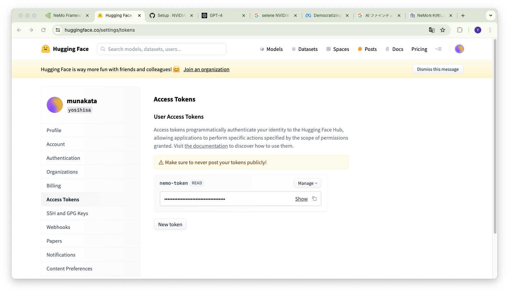

ここではNeMoフレームワーク内のツールを利用してのPEFT(parameter-efficient fine-tuning)の実行例について説明します。
以下の説明は、NVIDIAの以下のページの内容を、遺伝研スパコン環境で動作させる例としてご説明します。

[NeMo Framework PEFT with Mistral-7B](https://docs.nvidia.com/nemo-framework/user-guide/latest/playbooks/mistralpeft.html)

詳細についてはオリジナルのページを参照してください。

## 事前準備

モデルのダウンロードの際にhugging faceにログインする必要がある為、アカウントを作成して、Access Tokenを作成しておきます。
作成したトークンをコピーしておきます。

- アクセストークン画面例



作成したトークンを利用して、ログインしておきます。
```
Singularity> huggingface-cli login 

    _|    _|  _|    _|    _|_|_|    _|_|_|  _|_|_|  _|      _|    _|_|_|      _|_|_|_|    _|_|      _|_|_|  _|_|_|_|
    _|    _|  _|    _|  _|        _|          _|    _|_|    _|  _|            _|        _|    _|  _|        _|
    _|_|_|_|  _|    _|  _|  _|_|  _|  _|_|    _|    _|  _|  _|  _|  _|_|      _|_|_|    _|_|_|_|  _|        _|_|_|
    _|    _|  _|    _|  _|    _|  _|    _|    _|    _|    _|_|  _|    _|      _|        _|    _|  _|        _|
    _|    _|    _|_|      _|_|_|    _|_|_|  _|_|_|  _|      _|    _|_|_|      _|        _|    _|    _|_|_|  _|_|_|_|

    A token is already saved on your machine. Run `huggingface-cli whoami` to get more information or `huggingface-cli logout` if you want to log out.
    Setting a new token will erase the existing one.
    To login, `huggingface_hub` requires a token generated from https://huggingface.co/settings/tokens .
Enter your token (input will not be visible): 
Add token as git credential? (Y/n) n
Token is valid (permission: read).
Your token has been saved to /home/yxxxx-pg/.cache/huggingface/token
Login successful
Singularity> 
```
以下のpythonスクリプトを利用して、Mistral-7b-hfのモデルをhugging face hubよりダウンロードします。

```python
from huggingface_hub import snapshot_download
snapshot_download(repo_id="mistralai/Mistral-7B-v0.1",
local_dir="mistral-7B-hf", local_dir_use_symlinks=False)
```
ネットワークの帯域にもよりますが、一定時間要します。
```
$ python3 download.py 
model.safetensors.index.json: 100%|██████████████████████████████████████████████| 25.1k/25.1k [00:00<00:00, 1.27MB/s]
.gitattributes: 100%|████████████████████████████████████████████████████████████| 1.52k/1.52k [00:00<00:00, 25.0MB/s]
generation_config.json: 100%|████████████████████████████████████████████████████████| 116/116 [00:00<00:00, 1.73MB/s]
README.md: 100%|█████████████████████████████████████████████████████████████████| 1.39k/1.39k [00:00<00:00, 24.6MB/s]
config.json: 100%|███████████████████████████████████████████████████████████████████| 571/571 [00:00<00:00, 10.7MB/s]
special_tokens_map.json: 100%|█████████████████████████████████████████████████████| 72.0/72.0 [00:00<00:00, 1.24MB/s]
tokenizer.model: 100%|█████████████████████████████████████████████████████████████| 493k/493k [00:00<00:00, 2.60MB/s]
pytorch_model.bin.index.json: 100%|███████████████████████████████████████████████| 23.9k/23.9k [00:00<00:00, 759kB/s]
tokenizer_config.json: 100%|█████████████████████████████████████████████████████████| 967/967 [00:00<00:00, 15.8MB/s]
tokenizer.json: 100%|████████████████████████████████████████████████████████████| 1.80M/1.80M [00:01<00:00, 1.64MB/s]
pytorch_model.bin.index.json:   0%|                                                       | 0.00/23.9k [00:00<?, ?B/s]
model-00002-of-00002.safetensors:  53%|██████████████████████▍                   | 2.42G/4.54G [14:21<13:51, 2.55MB/s]
pytorch_model-00001-of-00002.bin:  25%|██████████▌                               | 2.51G/9.94G [14:19<33:59, 3.65MB/s]
pytorch_model-00002-of-00002.bin:  46%|███████████████████▍                      | 2.34G/5.06G [14:19<18:03, 2.52MB/s]
model-00001-of-00002.safetensors:  26%|██████████▊                               | 2.57G/9.94G [14:20<40:14, 3.05MB/s]

```
以下のファイルがダウンロードできたことを確認します。
```
-rw-rw-r-- 1 1001 1001       1392 Apr 29 12:38 README.md
-rw-rw-r-- 1 1001 1001        571 Apr 29 12:38 config.json
-rw-rw-r-- 1 1001 1001        116 Apr 29 12:38 generation_config.json
-rw-rw-r-- 1 1001 1001 9942981696 Apr 29 13:21 model-00001-of-00002.safetensors
-rw-rw-r-- 1 1001 1001 4540516344 Apr 29 13:05 model-00002-of-00002.safetensors
-rw-rw-r-- 1 1001 1001      25125 Apr 29 12:38 model.safetensors.index.json
-rw-rw-r-- 1 1001 1001 9943028044 Apr 29 13:20 pytorch_model-00001-of-00002.bin
-rw-rw-r-- 1 1001 1001 5064823659 Apr 29 13:08 pytorch_model-00002-of-00002.bin
-rw-rw-r-- 1 1001 1001      23950 Apr 29 12:38 pytorch_model.bin.index.json
-rw-rw-r-- 1 1001 1001         72 Apr 29 12:38 special_tokens_map.json
-rw-rw-r-- 1 1001 1001    1795303 Apr 29 12:38 tokenizer.json
-rw-rw-r-- 1 1001 1001     493443 Apr 29 12:38 tokenizer.model
-rw-rw-r-- 1 1001 1001        967 Apr 29 12:38 tokenizer_config.json
```
以下のコマンドで、nemoフォーマットに変換します。
以下のpythonスクリプトを起動して、memoフォーマットにモデルを変換します。convert_mistral_7b_hf_to_nemo.pyは、Hugging Faceのフォーマットからnemoフォーマットに変換する為のNVIDIA提供のスクリプトです。

```
Singularity> python3 /opt/NeMo/scripts/checkpoint_converters/convert_mistral_7b_hf_to_nemo.py --input_name_or_path=./mistral-7B-hf/ --output_path=mistral.nemo
[NeMo I 2024-06-07 15:41:33 convert_mistral_7b_hf_to_nemo:148] loading checkpoint ./mistral-7B-hf/
Loading checkpoint shards: 100%|████████████████████████████████████████████████████████| 2/2 [01:06<00:00, 33.07s/it]
[NeMo I 2024-06-07 15:42:40 convert_mistral_7b_hf_to_nemo:152] loaded checkpoint ./mistral-7B-hf/

(省略)

Initializing distributed: GLOBAL_RANK: 0, MEMBER: 1/1
----------------------------------------------------------------------------------------------------
distributed_backend=gloo
All distributed processes registered. Starting with 1 processes
----------------------------------------------------------------------------------------------------

[NeMo I 2024-06-07 15:46:40 convert_mistral_7b_hf_to_nemo:333] NeMo model saved to: mistral.nemo

```
`mistral.nemo`ファイルが作成されたことを確認します。

## データの準備

ファインチューニングの為のデータセットを準備します。この例ではpubmedQAのデータを利用します。

```
git clone https://github.com/pubmedqa/pubmedqa.git
cd pubmedqa
cd preprocess
python3 split_dataset.py pqal
```
split_dataset.pyを実行後、以下のように10個のディレクトリが作成され、その中にトレーニング/バリデーションのデータセットが作成されていることを確認します。
```

$ cd ../..
$ ls pubmedqa/data/
ori_pqal.json
pqal_fold0
pqal_fold1
pqal_fold2
pqal_fold3
pqal_fold4
pqal_fold5
pqal_fold6
pqal_fold7
pqal_fold8
pqal_fold9
test_ground_truth.json
test_set.json
```
次に、train/validのPubMedQAデータセットをJSONLフォーマットファイルに変換する以下のスクリプトを実行します。
NeMoでPEFTを実行する為に必要な処理です。以下のスクリプトを`preprocess_to_jsonl.py`と名前をつけて、pubmedqaのデータをダウンロードしたディレクトリ内に保存して下さい。
```python
import json
def read_jsonl (fname):
    obj = []
    with open(fname, 'rt') as f:
        st = f.readline()
        while st:
            obj.append(json.loads(st))
            st = f.readline()
    return obj
def write_jsonl(fname, json_objs):
    with open(fname, 'wt') as f:
        for o in json_objs:
            f.write(json.dumps(o)+"\n")
def form_question(obj):
    st = ""
    st += f"QUESTION:{obj['QUESTION']}\n"
    st += "CONTEXT: "
    for i, label in enumerate(obj['LABELS']):
        st += f"{obj['CONTEXTS'][i]}\n"
    st += f"TARGET: the answer to the question given the context is (yes|no|maybe): "
    return st
def convert_to_jsonl(data_path, output_path):
    data = json.load(open(data_path, 'rt'))
    json_objs = []
    for k in data.keys():
        obj = data[k]
        prompt = form_question(obj)
        completion = obj['reasoning_required_pred']
        json_objs.append({"input": prompt, "output": completion})
    write_jsonl(output_path, json_objs)
    return json_objs
def main():
    test_json_objs = convert_to_jsonl("data/test_set.json", "pubmedqa_test.jsonl")
    train_json_objs = convert_to_jsonl("data/pqal_fold0/train_set.json", "pubmedqa_train.jsonl")
    dev_json_objs = convert_to_jsonl("data/pqal_fold0/dev_set.json", "pubmedqa_val.jsonl")
    return test_json_objs, train_json_objs, dev_json_objs
if __name__ == "__main__":
    main()
```
スクリプトを実行すると、以下の様に、`pubmedqa_train.jsonl`,`pubmedqa_val.jsonl`,`pubmedqa_test.jsonl`が当該ディレクトリに作成されていることを確認します。訓練用、評価用、テスト用のデータセットに分けています。
```
$ ls pubmedqa/
data
evaluation.py
exp
get_human_performance.py
LICENSE
nemo_preprocess.py
preprocess
pubmedqa_test.jsonl
pubmedqa_train.jsonl
pubmedqa_val.jsonl
README.md
```
NeMo Frameworkでは`megatron_gpt_finetuning_config.yaml`ファイルがPEFTを実施するときのコンフィギュレーションファイルとして参照されます。以下の環境変数を設定して下さい。

```
MODEL="Mistral-7B-7b.nemoファイルのパス"
TRAIN_DS="[pubmedqa/pubmedqa_train.jsonlファイルのパス]"
VALID_DS="[pubmedqa/pubmedqa_val.jsonlファイルのパス]"
TEST_DS="[pubmedqa/pubmedqa_test.jsonlファイルのパス]"
TEST_NAMES="[pubmedqa]"
SCHEME="lora"
```
また訓練データセットとどの確率でどのデータセットからデータをサンプリングするかを指定します。但しこの例ではデータセットが１つであり、サンプリング確率は、以下の様に記述します。
```
CONCAT_SAMPLING_PROBS="[1.0]"
```
以下のスクリプトを実行します。遺伝研スパコンのGPUノードは、1台あたり4基のGPUを有しているので、nproc_per_node,trainer.devicesなどを4にしています。
この時modelのtensor parallel sizeを4として１ノード内のGPU数に一致させています。
```js
#!/bin/bash
#SBATCH -N 1
#SBATCH --cpus-per-task 1
#SBATCH --mem-per-cpu=32g
#SBATCH --gres=gpu:4
export MODEL="/home/yxxxx-pg/ex02/mistral.nemo"
export TRAIN_DS="[/home/yxxxx-pg/ex02/pubmedqa/pubmedqa_train.jsonl]"
export VALID_DS="[/home/yxxxx-pg/ex02/pubmedqa/pubmedqa_val.jsonl]"
export TEST_DS="[/home/yxxxx-pg/ex02/pubmedqa/pubmedqa_test.jsonlファイルのパス]"
export TEST_NAMES="[pubmedqa]"
export SCHEME="lora" 
export CONCAT_SAMPLING_PROBS="[1.0]"
singularity exec --nv /home/yxxxx-pg/nemo_24.03.sif torchrun --nproc_per_node=4 \
/opt/NeMo/examples/nlp/language_modeling/tuning/megatron_gpt_finetuning.py \
    trainer.devices=4 \
    trainer.num_nodes=1 \
    trainer.precision=bf16 \
    trainer.val_check_interval=20 \
    trainer.max_steps=50 \
    model.megatron_amp_O2=True \
    ++model.mcore_gpt=True \
    model.tensor_model_parallel_size=4 \
    model.pipeline_model_parallel_size=1 \
    model.micro_batch_size=1 \
    model.global_batch_size=32 \
    model.optim.lr=1e-4 \
    model.restore_from_path=${MODEL} \
    model.data.train_ds.num_workers=0 \
    model.data.validation_ds.num_workers=0 \
    model.data.train_ds.file_names=${TRAIN_DS} \
    model.data.train_ds.concat_sampling_probabilities=[1.0] \
    model.data.validation_ds.file_names=${VALID_DS} \
    model.peft.peft_scheme=${SCHEME} \
    model.peft.lora_tuning.target_modules=[attention_qkv] \
    exp_manager.checkpoint_callback_params.mode=min

```
ファインチューニングの評価の為に推論を以下のスクリプトで実行させて評価します。
megatron_gpt_generate.pyは、推論を実行してPEFT/SFTモデルの評価を行うスクリプトです。
```
#!/bin/bash
#SBATCH -N 1
#SBATCH --cpus-per-task 1
#SBATCH --mem-per-cpu=32g
#SBATCH --gres=gpu:4
export MODEL="/home/yxxxx-pg/ex02/mistral.nemo"
export PATH_TO_TRAINED_MODEL="/home/yxxxx-pg/ex02/nemo_experiments/megatron_gpt_peft_lora_tuning/checkpoints/megatron_gpt_peft_lora_tuning.nemo"
export TEST_DS="[/home/yxxxx-pg/ex02/pubmedqa/pubmedqa_test.jsonl]"
export TEST_NAMES="[pubmedqa]"
export OUTPUT_PREFIX="/home/yxxxx-pg/ex02/results/peft_results"
export TP_SIZE=4
export PP_SIZE=1
singularity exec --nv /home/yxxxx-pg/nemo_24.03.sif python3 \
/opt/NeMo/examples/nlp/language_modeling/tuning/megatron_gpt_generate.py \
    model.restore_from_path=${MODEL} \
    model.peft.restore_from_path=${PATH_TO_TRAINED_MODEL} \
    trainer.devices=4 \
    model.tensor_model_parallel_size=4 \
    model.pipeline_model_parallel_size=1 \
    model.data.test_ds.file_names=${TEST_DS} \
    model.data.test_ds.names=${TEST_NAMES} \
    model.global_batch_size=32 \
    model.micro_batch_size=4 \
    model.data.test_ds.tokens_to_generate=20 \
    inference.greedy=True \
    model.data.test_ds.output_file_path_prefix=${OUTPUT_PREFIX} \
    model.data.test_ds.write_predictions_to_file=True \

```
実施後に以下のようなテスト結果のサマリが表示されます。

```
[NeMo W 2024-06-07 21:56:29 nemo_logging:349] /usr/local/lib/python3.10/dist-packages/pytorch_lightning/trainer/connectors/logger_connector/result.py:441: It is recommended to use `self.log('test_loss', ..., sync_dist=True)` when logging on epoch level in distributed setting to accumulate the metric across devices.
    
Testing DataLoader 0: 100%|██████████| 500/500 [08:06<00:00,  1.03it/s]
┏━━━━━━━━━━━━━━━━━━━━━━━━━━━┳━━━━━━━━━━━━━━━━━━━━━━━━━━━┓
┃        Test metric        ┃       DataLoader 0        ┃
┡━━━━━━━━━━━━━━━━━━━━━━━━━━━╇━━━━━━━━━━━━━━━━━━━━━━━━━━━┩
│         test_loss         │    0.4355733096599579     │
│    test_loss_pubmedqa     │    0.4355733096599579     │
│         val_loss          │    0.4355733096599579     │
└───────────────────────────┴───────────────────────────┘
```
```
{"input": "QUESTION:Are there mental health differences between francophone and non-francophone populations in manitoba?\nCONTEXT: Francophones may experience poorer health due to social status, cultural differences in lifestyle and attitudes, and language barriers to health care. Our study sought to compare mental health indicators between Francophones and non-Francophones living in the province of Manitoba.\nTwo populations were used: one from administrative datasets housed at the Manitoba Centre for Health Policy and the other from representative survey samples. The administrative datasets contained data from physician billings, hospitalizations, prescription drug use, education, and social services use, and surveys included indicators on language variables and on self-rated health.\nOutside urban areas, Francophones had lower rates of diagnosed substance use disorder (rate ratio [RR] = 0.80; 95% CI 0.68 to 0.95) and of suicide and suicide attempts (RR = 0.59; 95% CI 0.43 to 0.79), compared with non-Francophones, but no differences were found between the groups across the province in rates of diagnosed mood disorders, anxiety disorders, dementia, or any mental disorders after adjusting for age, sex, and geographic area. When surveyed, Francophones were less likely than non-Francophones to report that their mental health was excellent, very good, or good (66.9%, compared with 74.2%).\nTARGET: the answer to the question given the context is (yes|no|maybe):", "pred": "no", "label": "no"}
{"input": "QUESTION:Outcome Feedback within Emergency Medicine Training Programs: An Opportunity to Apply the Theory of Deliberate Practice?\nCONTEXT: Outcome feedback is the process of learning patient outcomes after their care within the emergency department. We conducted a national survey of Canadian Royal College emergency medicine (EM) residents and program directors to determine the extent to which active outcome feedback and follow-up occurred. We also compared the perceived educational value of outcome feedback between residents and program directors.\nWe distributed surveys to all Royal College-accredited adult and pediatric EM training programs using a modified Dillman method. We analyzed the data using student's t-test for continuous variables and Fisher's exact test for categorical variables.\nWe received 210 completed surveys from 260 eligible residents (80.8%) and 21 of 24 program directors (87.5%) (overall 81.3%). Mandatory active outcome feedback was not present in any EM training program for admitted or discharged patients (0/21). Follow-up was performed electively by 89.4% of residents for patients admitted to the hospital, and by 44.2% of residents for patients discharged home. A majority of residents (76.9%) believed that patient follow-up should be mandatory compared to 42.9% of program directors (p=0.002). The perceived educational value of outcome feedback was 5.8/7 for residents and 5.1/7 for program directors (difference 0.7; p=0.002) based on a seven-point Likert scale (1=not important; 7=very important).\nTARGET: the answer to the question given the context is (yes|no|maybe):", "pred": "no", "label": "yes"}
```


