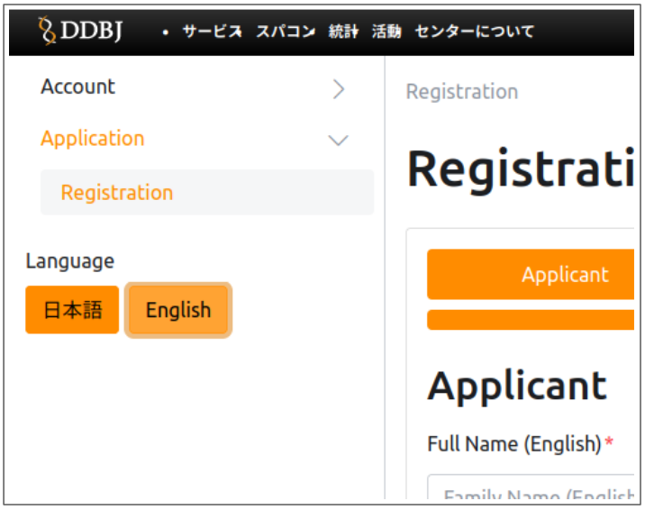
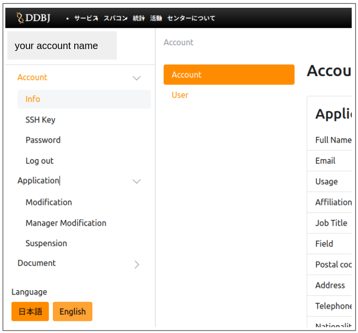

- The URL for the NIG supercomputer account application form `=>` [Registration](/application/registration)
- The URL for application instructions `=>` [Account Application and Change of Application Details](/application/registration)/

<!-- truncate -->

<table>
<tr>
<td valign="top">

initial screen

</td>
<td valign="top">

The first screen after login

</td>
</tr>
</table>

- The NIG supercomputer account Application has been made more simple.
- SSH public key registration is now available on the account application form.
  - In the previous two-step procedure, users received an account registration certificate about one week after applying for new use, and then had to register their SSH public key after logging in by themselves.
  - From now on, however, SSH public key registration can be done when you fill out the account application form.
- Renewal at the end of the year has beem made more simple.
  - It is no longer necessary to manually enter all the items one by one, and the article information can be obtained and automatically entered by simply entering the PubMedID.

### Note

- Please login from `gw2.ddbj.nig.ac.jp` immediately after setting up your public key etc.
  - We are currently in the process of migrating to a account application system. Therefore, public key registrations to the new gateway `gw2.ddbj.nig.ac.jp` will be reflected immediately, but it will take about one day for the settings to be reflected in the old gateway `gw.ddbj.nig.ac.jp`. The system will be modified at the next scheduled maintenance in December so that the old gateway will also reflect the setting immediately.
- The `sc2.ddbj.nig.ac.jp` server has been closed.

