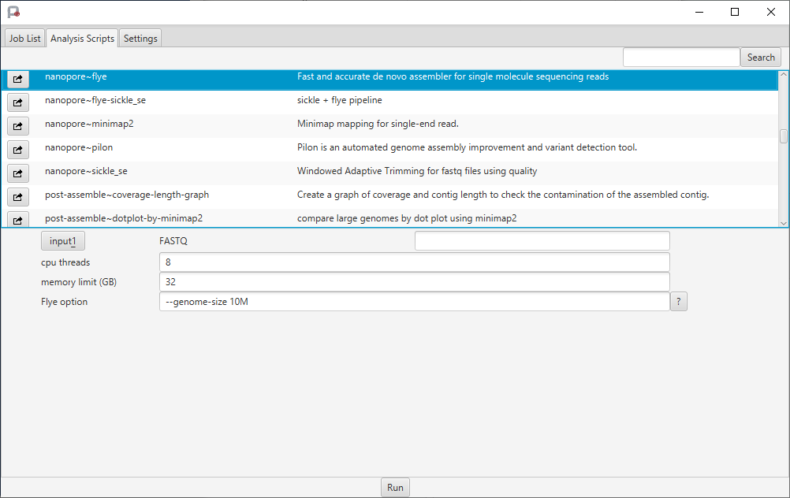

---

## PortablePipeline

5 June 2025

The NGS analysis pipeline tool PortablePipeline has been updated to support the the next-generation supercomputer (the NIG supercomputer 2025) by Professor Kazutoshi Yoshitake of the Laboratory of Aquatic Molecular Biology and Biotechnology, Aquatic Bioscience, Graduate school of Agricultural and Life Sciences, The Univresity of Tokyo.

For usage instructions and details on how to run the tool, refer to [the PortablePipeline page on github](https://github.com/c2997108/OpenPortablePipeline/blob/master/README_jp.md).

For the version of PortablePipeline compatible with the previous supercomputer (the NIG supercomputer 2019), see [the PortablePipeline section on the NIG supercomputer advanced guides](/advanced_guides/topics/advanced_guide_2020-2022/#portablepipeline).

<table>
<tr>
<td width="400">

</td>
<td valign="top">
"PortablePipeline is a software tool that enables GUI-based NGS analysis on local computers, remote servers, or supercomputers, with client support for Windows, macOS, and Linux.
On standalone Windows systems, it runs via WSL and Docker; on macOS, via Homebrew and Docker; and on Linux servers with Grid Engine, it supports SGE for distributed job execution on platforms such as the Shirogane and the NIG supercomputers.
Additionally, analysis scripts written according to the software’s specifications can be easily executed from CUI." (Referenced from the PortablePipeline page on GitHub)
</td>
</tr>
</table>
