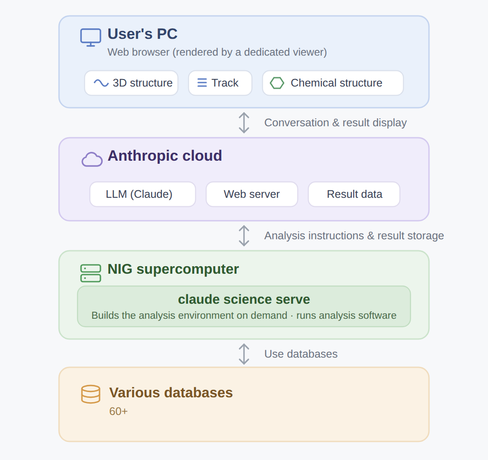
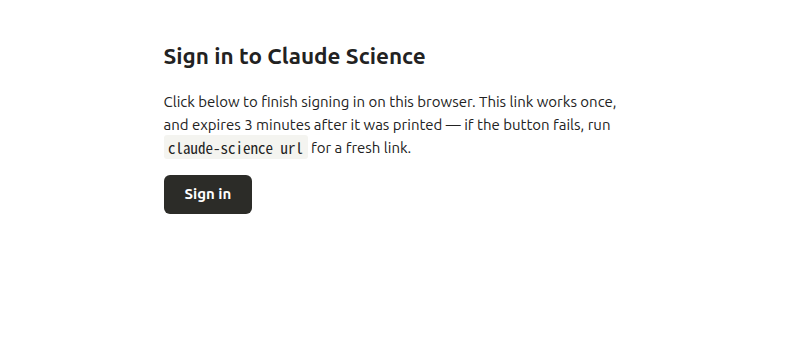
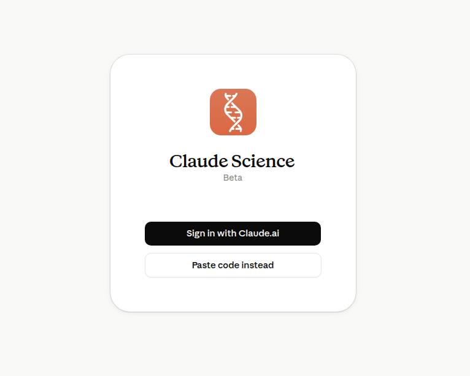
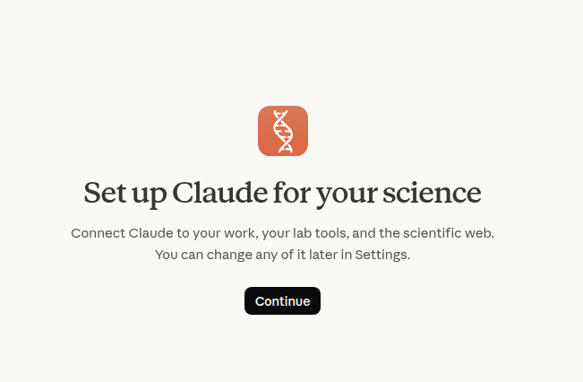
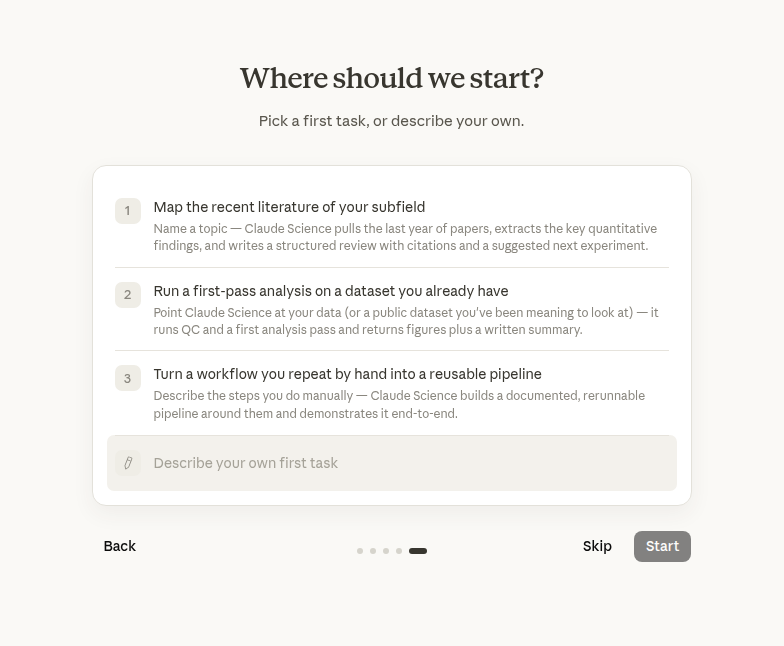

## What is Claude Science

Claude Science is an AI agent that advances research and data analysis semi-autonomously.
When a user tells it, in plain language, "I want to run this kind of analysis," Claude Science itself writes code, runs it, looks at the results, and decides the next step — carrying out this multi-stage work.

Claude Science is designed to be usable across every stage of research: literature review, data analysis, figure creation, and manuscript writing (the official description says "designed with every stage of research in mind").


:::info
Use requires a paid Anthropic Claude plan.
:::

<a href="https://www.youtube.com/watch?v=idtMsa_1yNk">

</a>


Official documentation
- Overview: https://claude.com/docs/claude-science/overview
- Getting started: https://claude.com/docs/claude-science/get-started
- Download / product page (with a biology worked example): https://claude.com/product/claude-science
- Announcement blog (with real-world researcher use cases): https://www.anthropic.com/news/claude-science-ai-workbench
- Claude for Life Sciences: https://www.anthropic.com/news/claude-for-life-sciences
- Official (remote compute clusters): https://claude.com/docs/claude-science/remote-compute-clusters

## System configuration

The core of Claude Science is the claude science serve program.
This is a program intended to be installed on, and run on, the user's PC.

The claude science serve program builds an analysis environment on demand on the user's PC, downloads data from databases and so on, runs the analysis on the PC, sends the results to the Anthropic cloud, and displays them in the web browser on the user's PC.

This analysis work can be externalized, for example by connecting to an external computer over SSH.
This document explains how to run large-scale analyses using the NIG supercomputer.

:::caution
Data will be transferred to the Anthropic cloud.
Caution is required if you are assuming analysis in a closed environment, such as with personal genome data.
:::



Claude Science comes bundled with connectors to the major life-science databases (enable them under `Settings > Connectors and Skills`).
As of July 2026, the available databases, connectors, and skills are as follows.

**Connect to the scientific web**
- NCBI / NIH: PubMed, Entrez, NIH
- Genomics & biology: Ensembl, Reactome, KEGG, gnomAD, GTEx, ENCODE
- Proteomics: UniProt, STRING, EBI, Foldseek, RCSB PDB, Protein Atlas
- Literature & citations: Semantic Scholar, arXiv, bioRxiv, Crossref, DOI, OpenAlex
- Clinical & pharma: FDA, ClinicalTrials, Open Targets, COSMIC, ClinGen, CIViC

**Connectors provided by Anthropic:** BioMart, bioRxiv, Cancer Models, CellGuide, ChEMBL, Chemistry, Clinical Genomics, Clinical Trials, Drug Regulatory, Expression, Genes & Ontologies, Genomes, Human Genetics, Ketcher Chemistry, Literature Graph, Omics Archives, Protein Annotation, PubMed, Regulation, Research Resources, RNA, Structures & Interactions, Variants, ZINC

**Externally provided (directory) connectors:** AdisInsight, Biomni Lab, BioRender, Boltz API, Consensus, Cortellis Regulatory Intelligence, EDEN by Basecamp Research, Elicit, Helix GenoSphere, Inductive Bio, LatchBio, Medidata, Open Targets, Owkin, Scholar Gateway, Scite, Synapse.org, Synthesize Bio


## Installation procedure

### 1. Install Claude Science on the user's PC

Claude Science runs on macOS or Linux.

On Windows, it runs with the same procedure as Linux by using WSL2 (Ubuntu 24.04 or later).
- https://claude.com/docs/claude-science/run-on-windows-wsl


On Linux, install the dependency packages first (`bubblewrap` 0.8.0 or later and `socat`. Unprivileged user namespaces must be enabled. Not required on macOS).

```bash
# Run on the user's PC (Linux). Install the dependency packages
sudo apt update && sudo apt install -y bubblewrap socat
```

Run the following to install Claude Science.

```bash
# Run on the user's PC
curl -fsSL https://claude.ai/install-claude-science.sh | bash
```

`claude-science` is installed under `~/.local/bin`. So that it is available in both the current shell and future shells, add it to `PATH`.

```bash
# Run on the user's PC
echo 'export PATH="$HOME/.local/bin:$PATH"' >> ~/.bashrc
source ~/.bashrc
```

### 2. Launch claude science serve on the user's PC and sign in

Running the following starts serve and automatically opens a sign-in tab in your default web browser.

```bash
# Run on the user's PC. This command keeps running in the foreground (exit with Ctrl-C)
claude-science serve --port 43000
```

Sign in to your Claude account in the tab that opens.





Following the on-screen guidance brings you to the setup screen.



If the browser does not open automatically, run the following in another terminal and open the displayed link.

```bash
# Run on the user's PC (another terminal)
claude-science url
```

Once you reach the setup screen, follow the on-screen guidance and enter the required items in order.




Eventually you reach a screen like the following.


## Making the NIG supercomputer usable from Claude Science

### 1. Edit `~/.ssh/config` on the user's PC so you can log in directly to the interactive node without a password

To register it as an SSH compute host, you need to configure things so that you can log in to the interactive node with a single command from the user's PC (without explicitly logging in to the gateway node).

Write the following in `~/.ssh/config` on the user's PC.

```sshconfig
# Write in ~/.ssh/config on the user's PC
Host nig-gw
  HostName gw.ddbj.nig.ac.jp                 # NIG supercomputer gateway node
  User youraccount
  IdentityFile ~/.ssh/<private key for the NIG supercomputer>
  IdentitiesOnly yes

Host nig-a003
  HostName a003                              # NIG supercomputer interactive node
  User youraccount
  IdentityFile ~/.ssh/<private key for the NIG supercomputer>
  IdentitiesOnly yes
  ProxyJump nig-gw                           # automatically hop through gw
```

If the private key has a passphrase, you need to load it into `ssh-agent` in advance (because serve connects non-interactively). Run the following and confirm that you can log in to the interactive node with `ssh nig-a003`.

```bash
# Run on the user's PC
ssh-add ~/.ssh/<private key for the NIG supercomputer>
ssh nig-a003
```

### 2. Register the NIG supercomputer's interactive node with claude science as an SSH compute host

In the Claude Science Web UI, open `Settings > Compute > SSH hosts > Add SSH host` and select the alias `nig-a003` from `~/.ssh/config`.


- When you add it, a read-only probe runs and detects CPU, memory, GPU, whether `sbatch` is present, partitions, and so on (nothing is installed on the a003 side).


On the host detail page, set **Scratch root** to a path on the shared file system. Intermediate data and the like are written here.
For example, you can write something like `/home/youraccount/claude-scratch`.


You can leave Details blank.


### 3. Configure the skill for the NIG supercomputer in claude science

This skill https://github.com/nig-sc/claude-science-skills teaches Claude's LLM how to use the NIG supercomputer.

Clicking `the gear at the bottom left > Settings > Skills > Import from Github button` brings up the following screen.


In the GitHub import field, write this:

```
nig-sc/claude-science-skills
```

That is all you need (owner/repo format). This is the repository you pushed earlier; it contains two skill directories, nig-general-analysis/ and nig-personal-genome/, directly under the root, so this single line imports both.


## Stopping and uninstalling


### 1. Stop the claude science serve process

#### Check the status

```
# Run on the user's PC
$ claude-science status
{
  "running": true,
  "pid": 2533288,
  "version": "0.1.16-dev.20260707.t155726.shaf2472db",
  "port": 43000,
  "started_at": "2026-07-08T07:40:26.387Z",
  "health": {
    "flavor": "release",
    "channel": "public",
    "uptime_ms": 4187589,
    "active_frames": 1,
    "active_conversations": 1,
    "require_token": true,
    "fell_back_from": null,
    "url_host": "localhost"
  }
}
```

#### Stop

```
# Run on the user's PC
$ claude-science stop
Daemon stopped (pid 2533288).
```

#### Confirm it stopped

Confirm that the port number you were using is no longer shown.
You can check the port number with the `claude-science status` above.

```
# Run on the user's PC. Only the numbers in use within the specified port range are shown.
ss -tlnp 'sport >= :43000 and sport <= :43100'
```

### 2. Uninstall claude science serve

```
# Run on the user's PC
# Remove the program itself
rm ~/.local/bin/claude-science

# Remove the data and the conda environment
rm -rf ~/.claude-science
```
