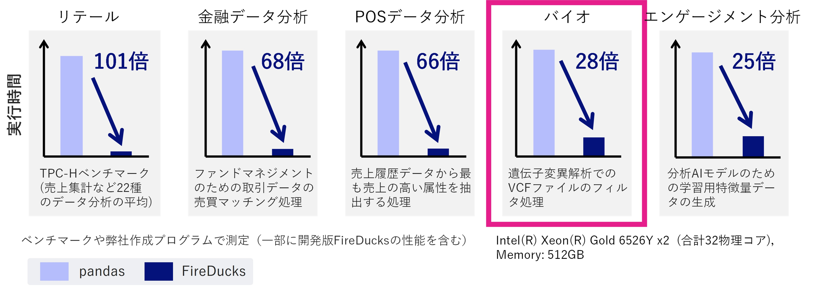

# FireDucks Enterprise

## Overview

FireDucks is a pandas-compatible high-performance dataframe library developed by NEC. The NIG Supercomputer System provides free access to the Enterprise edition of FireDucks, which includes enhancements tailored for bioinformatics use.

## What is FireDucks?

FireDucks accelerates data processing through runtime optimization and parallel execution. Because it provides a pandas-compatible API, you can achieve **speed improvements without changing your code** — simply switch the library. In the bioinformatics domain, FireDucks can accelerate operations such as filtering VCF files.

### Example speed improvements over pandas

*Performance figures are for the CPU edition of FireDucks Enterprise. Actual performance varies depending on your program and environment.*

## How to install

On the NIG Supercomputer System, you can install FireDucks into your own Python virtual environment using the pip command.

Please read and agree to the [End User License Agreement](./FireDucks_EULA_nigsc.pdf) before proceeding to the [installation instructions](./Install).

*FireDucks Enterprise also has a GPU-enabled edition, but this trial provides the CPU edition. Please contact us if you require the GPU-enabled edition.*

## Free usage period

Free use of FireDucks Enterprise on the NIG Supercomputer System is planned through March 31, 2027. If you wish to continue using it after the free usage period ends, a separate license agreement will be required. Please contact us for details.

If you wish to use FireDucks free of charge outside the NIG Supercomputer System, please contact us as well.

## Survey

We are conducting a survey on the use of FireDucks Enterprise. We would appreciate your participation after trying it out. Please respond after you have used it for a while, as the survey focuses on your impressions of the software. Your responses will be used to improve FireDucks going forward.

[Survey form](https://forms.office.com/r/tZYFxkKACP)

## Contact

For questions about using FireDucks, please contact the NEC FireDucks team.

NEC Computing Division, FireDucks Team: contact@fireducks.jp.nec.com
