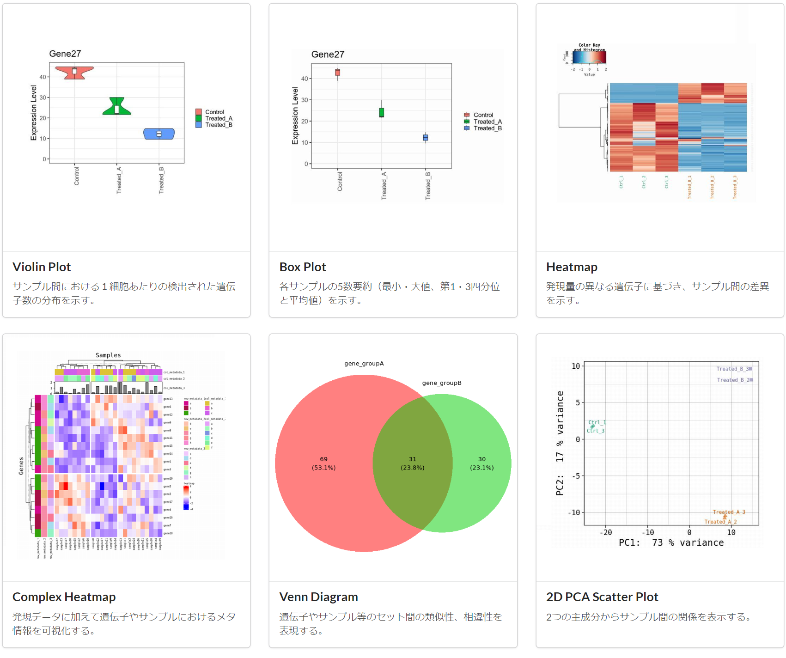

:::caution

This service will end on 31 October 2025 (Friday).

For more information, please refer to the information below.
- [" Notice of Discontinuation of Rhelixa Graphing Tool (RIAS Visualisation) by October 2025 "](/blog/2025-09-29-news_Rhelixa-rias-visualisation-end-october-2025)

:::

An omics data graphing tool Visualization has been provided by Rhelixa Corporation (CTO: Ryu Nakaki), which has a comprehensive collaboration agreement with the National Institute of Genetics, and is available for free trial for NIG supercomputer users.

## Overview of Visualization

By using Visualization, omics data such as RNA-seq data can be easily graphed without complicated settings or programming. In addition to grasping the overall trend of the data, you can also visualise signal trends focusing on specific factors (e.g. genes).

You can freely use the created graphs in your papers and research publications.

There are 15 types of graphs that can be created, as follows:
- Violin Plot 
- Box Plot
- Heatmap
- Complex Heatmap
- Venn Diagram 
- 2D PCA Scatter Plot
- 3D PCA Scatter Plot
- Hierarchical Clustering
- Linear Regression
- Rotatable Scatter Plot
- Correlation Matrix
- Volcano Plot
- MA Plot
- Chord Diagram
- Network Analysis

## Manual

[&#x1f517;Visualization User Manual](https://notepm.jp/sharing/e653b342-8932-42c3-b504-25d12361eb9c)

## How to trial Visualization

Any user of the NIG supercomputer system can trial Visualization for free. If you would like to continue using Virtualization after the trial, contact Rhelixa Inc.

## Apply for a trial (Creating an account)

Apply via [&#x1f517;this link](https://form.jotform.com/232914192808460).

## Getting started

After creating an account, [&#x1f517;sign in here](https://rias.rhelixa.com/users/sign_in).

After signing in, click on 'RIAS' and then on 'Visualization'.

## Contact Rhelixa

[&#x1f517;Click here to contact us.](https://form.jotform.com/231092619050449)

## About Rhelixa Co., Ltd.

|Company Name            |Rhelixa Co., Ltd.                                        |
|------------------------|---------------------------------------------------------|
|Date of Establishment   |February 2015                                            |
|Head Office             |KDX Ginza East Building 5F, 3-7-2 Irifune, Chuo-ku, Tokyo|
|Representative          |Ryu Nakaki                                               |
|Main Business Activities|Consulting services for genomics and epigenetics research and business development using epigenomic data. |
