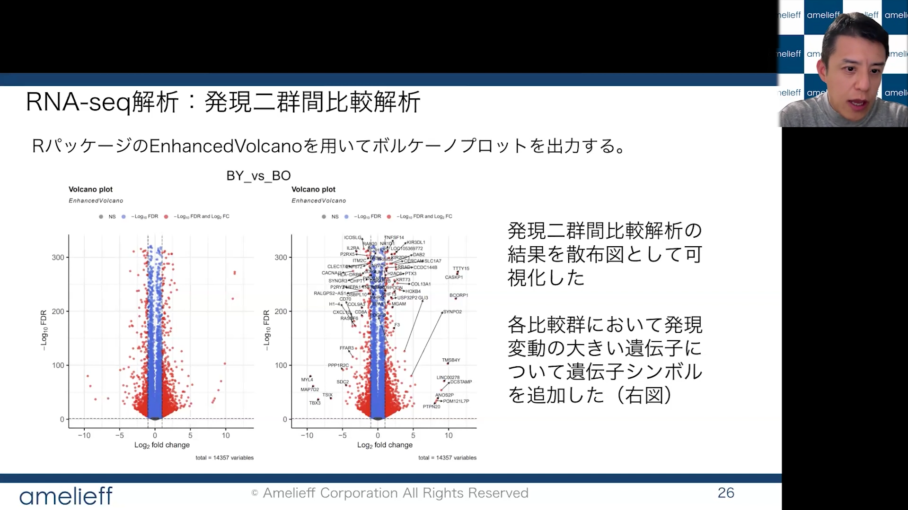
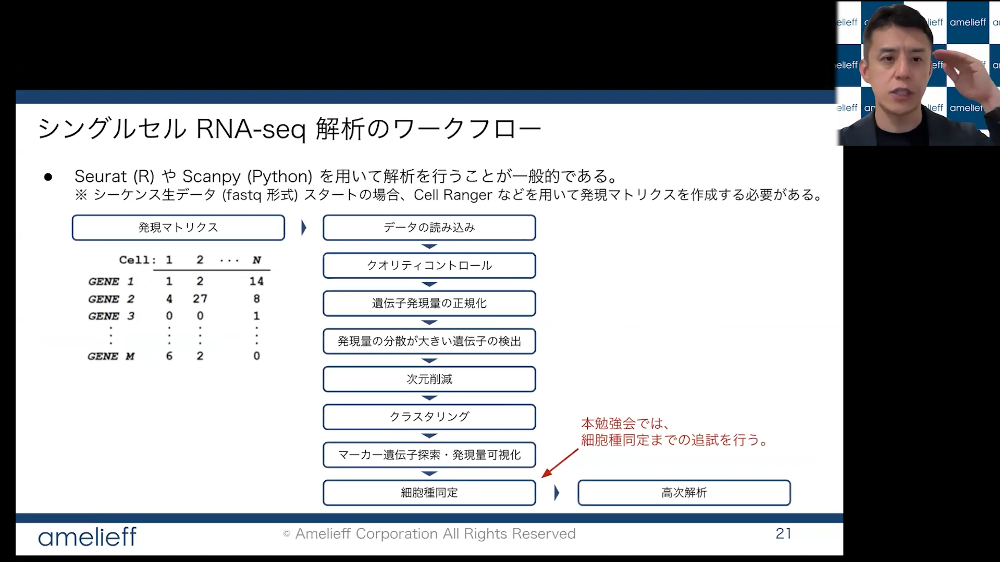

In recent years, there has been a growing demand among researchers to analyze their own sequence data hands-on, with a genuine understanding of the methods involved. At the same time, selecting the right analytical approach for each researcher's specific goals and data, setting up the analysis environment, and getting it running stably present no small barriers.

Against this backdrop, bioinformatics training workshops are held at various institutions across Japan, including the Advanced Genome Support (PAGS) project organized and promoted by NIG.

:::info Advanced Genome Support Project (PAGS)

■ Past workshop materials (videos and slides) — PAGS official website  
https://www.genome-sci.jp/bioinformatic  
[Related]  
■ NBDC Data Analysis Workshop (AJACS) video materials — DBCLS Togo TV  
https://togotv.dbcls.jp/ajacs_text.html

:::

However, participation is sometimes limited, and the demo environment used during a workshop often differs from the actual analysis environment each researcher uses in their own work. Participants also vary widely in skill level, making it difficult to provide individualized support.

With these challenges in mind, under the collaboration of Dr. Osamu Ogasawara, Head of the DDBJ Systems Administration Division at NIG and a research support collaborator for the PAGS project (NIG hub), efforts are ongoing to improve the analysis environment on the NIG Supercomputer and to enhance the information available to users. In parallel, we are progressively compiling information resources from organizations with relevant expertise — resources that are accessible to beginners and useful to PAGS and NIG Supercomputer users alike.

Last year, we introduced convenient tools from academic sources. This year, as a new example of a company supporting academic research, we introduce Amelieff Inc.

## Introducing Amelieff Inc.'s "BI Practical Lab" — a resource for making the most of the NIG Supercomputer

As the volume of data in life science research continues to grow explosively, the use of supercomputers as large-scale computational resources has become indispensable. For those of you performing bioinformatics analyses on the supercomputer, we would like to introduce a free learning site that can help you develop your analytical skills and troubleshoot day-to-day issues.

### ① "Bioinformatics Practical Lab (BI Practical Lab)" — for solving problems faced by supercomputer users

In practice, many of the errors and stalls that occur during supercomputer-based analyses are caused not by bugs in the analysis tools themselves, but by insufficient foundational knowledge of Linux commands, data input/output, and similar basics. Building up these fundamentals through self-study, however, takes considerable time.

This is where the free membership-based video streaming site "BI Practical Lab (https://amelieff.jp/online/)" provided by Amelieff Inc. can help. On this site, Amelieff's engineers and analysts — all professionals in bioinformatics — carefully explain the pitfalls that beginners commonly encounter. The content is structured so that you can quickly grasp the "tricks of the trade" from a professional perspective, minimizing time spent struggling alone and helping you move through your analyses smoothly. All video content on the site is completely free and available on demand.

### ② The essence of 100+ "Bioinformatics Study Sessions" — now available as videos

Since its founding in 2009, Amelieff Inc. has consistently confronted the challenge of a shortage of bioinformatics talent, continuously hosting free study sessions and supporting the development of a wide range of people from beginners to working professionals. Through both its analysis support business and its bioinformatics outreach activities, the company has consistently helped researchers overcome the stress of infrastructure setup and operational barriers, working toward a state of "independence" in which researchers can freely conduct their own analyses.

The company's commitment to helping researchers make effective use of limited resources and accelerate their research aligns with our institute's direction as a collaborative research institution dedicated to enhancing the research environment. We hope you will take advantage of these publicly available resources as one means of acquiring efficient analysis skills.

**③ Start here — three recommended videos**

After registering with BI Practical Lab, here are three videos we recommend watching as a first step toward smoother analyses.

* **Essentials of setting up a lab analysis environment** — Ideal for those who want to step up from a personal laptop and prepare a system for full-scale data analysis. Covers a practical comparison of the pros and cons of on-premises, supercomputer, and cloud environments, as well as the causes of very common issues in Linux server operation such as "system slowdowns due to memory exhaustion" and "library not found errors," along with concrete solutions using commands such as `htop`, `kill`, and `find`.

[https://amelieff.jp/online/cat\_system/video\_bisg78/](https://amelieff.jp/online/cat_system/video_bisg78/)

* **NGS case study course (RNA-seq analysis)** — A video for those who want to incorporate RNA-seq using next-generation sequencers into their research. Covers the full workflow: quality checking with FastQC, mapping with STAR, and expression quantification with featureCounts (R package) on Linux, followed by principal component analysis, two-group comparison, and pathway/GO analysis in R. Uses real public data and explains how to interpret the biological meaning of the results.

[https://amelieff.jp/online/cat\_transcriptome/video\_csrna/](https://amelieff.jp/online/cat_transcriptome/video_csrna/)

* **Introduction to bioinformatics for paper writing** — Useful for those who want to retrieve public data from databases such as SRA and GEO and apply it to their own research. Provides tips for reproducing and verifying the bioinformatics analyses described in the Methods section of published papers. Uses single-cell RNA-seq analysis as an example, walking through data loading, quality control, dimensionality reduction (UMAP), and cell type identification using the Seurat package, with concrete examples throughout.

[https://amelieff.jp/online/cat\_general/video\_bisg95/](https://amelieff.jp/online/cat_general/video_bisg95/)

**[Register here]** Registration takes just 30 seconds! Register for "BI Practical Lab" now and put it to use in your daily research and analysis. 👉 [https://amelieff.jp/online/](https://amelieff.jp/online/)
