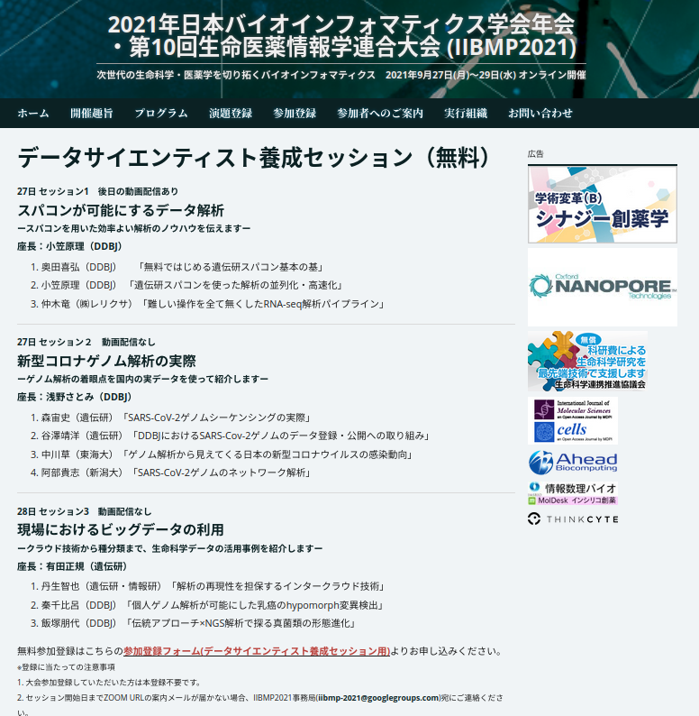
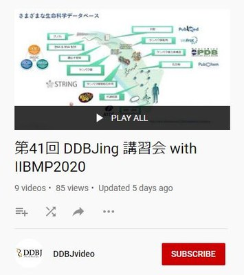

<table>
<tr>
<td width="400">

</td>
<td>

2021年日本バイオインフォマティックス学会年会　第10回生命医薬情報学連合大会 (IIBMP2021) 9月27日 データサイエンティスト養成セッション

  <table>
  <tr>
  <td>9/27（月）13:30〜15:00</td> 
  <td>
    スパコンが可能にするデータ解析　〜スパコンを用いた効率よい解析のノウハウを伝えます〜
     
  座長：小笠原理（国立遺伝学研究所）
  </td>
  </tr>
  
  <tr>
  <td>9/27（月）15:15〜16:45</td>
  <td>
　新型コロナゲノム解析の実際　〜ゲノム解析の着眼点を国内の実データを使って紹介します〜
   
  座長：浅野さとみ（国立遺伝学研究所）
  </td>
  </tr>
  
  <tr>
  <td>9/28（火）8:45〜10:15</td>
  <td>
  現場におけるビッグデータの利用　〜クラウド技術から主分類まで、生命科学データの活用事例を紹介します〜
   
  座長：有田正規（国立遺伝学研究所）
  </td>
  </tr>
  </table>

</td>
</tr>
</table>

---
<table>
<tr>
<td width="400">

</td>
<td>

2020年日本バイオインフォマティックス学会年会　第９回生命医薬情報学連合大会 (IIBMP2020) 9月2日 スポンサードセッション: データサイエンティスト養成セッションの[講演内容をYoutubeから公開しています](https://www.youtube.com/playlist?list=PL_dbAF_dbOEpcBhGhyv9Wvl2XU9MnmFUD)。

  <table>
  <tr>
  <td>9/2（水）9:15〜10:45</td> 
  <td>
    <a href="https://www.jsbi.org/iibmp2020/program/sponsor.html#sp4">
    データサイエンティスト養成セッション：初級者向けバイオインフォマティクス
    </a> 
  座長：小笠原理（国立遺伝学研究所）
  </td>
  </tr>
  
  <tr>
  <td>9/2（水）13:00〜14:30</td>
  <td>
  <a href="https://www.jsbi.org/iibmp2020/program/sponsor.html#sp5">
  データサイエンティスト養成セッション：実践的次世代シークエンス解析
  </a> 
  座長：中村保一（国立遺伝学研究所）
  </td>
  </tr>
  
  <tr>
  <td>9/2（水）14:45〜16:15</td>
  <td>
  <a href="https://www.jsbi.org/iibmp2020/program/sponsor.html#sp6">
  データサイエンティスト養成セッション：実践的オミックス解析
  </a> 
  座長：有田正規（国立遺伝学研究所）
  </td>
  </tr>
  </table>

</td>
</tr>
</table>
