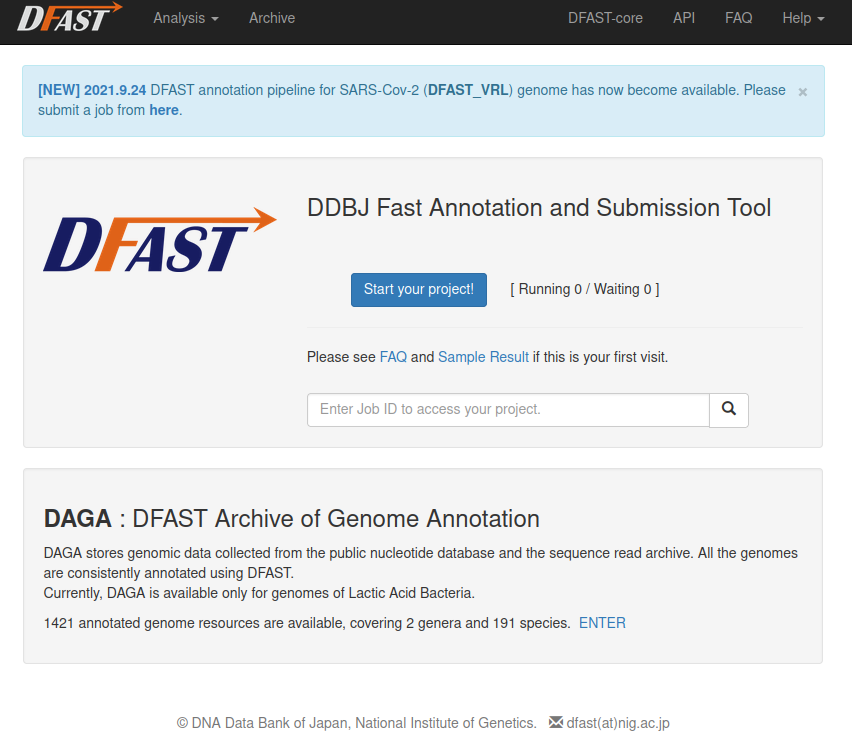

---
## PortablePipeline

2022.05.10

東京大学大学院農学生命科学研究科水圏生物科学専攻水圏生物工学研究室の吉武和敏先生により、NGS解析パイプラインについて、PortablePipelineというツールが開発されました。

ツールの実行手順等は、<a href="https://www.suikou.fs.a.u-tokyo.ac.jp/blog/2022/04/28/%e9%81%ba%e4%bc%9d%e7%a0%94%e3%81%ae%e3%82%b9%e3%83%91%e3%82%b3%e3%83%b3%e3%81%a7%e6%89%8b%e8%bb%bd%e3%81%abngs%e8%a7%a3%e6%9e%90%e3%82%92%e5%ae%9f%e8%a1%8c%e3%81%99%e3%82%8b%e6%89%8b%e9%a0%86/">水圏生物工学研究室のページ</a>をご参照ください。

<table>
<tr>
<td width="400">

</td>
<td valign="top">
「WindowsやMacから遺伝研のスパコンにお手軽にNGS解析ジョブを投げるツールとしてPortablePipelineを開発しました。当研究室で使用頻度の高い解析パイプラインが実行できます。解析サーバとしてはpython3とdockerもしくはsingularityがインストールされていればスパコンでなくても実行できます。」（水圏生物工学研究室のページより）
</td>
</tr>
</table>

---

## DFAST

2021.10.02

DFASTは原核生物ゲノムの自動アノテーションツールです。DDBJへのゲノム塩基配列登録用のファイルを生成することもできます。ファイルをアップロードするだけで利用可能なウェブ版 https://dfast.ddbj.nig.ac.jp とコマンド操作で実行するスタンドアローン版があります。

<table>
<tr>
<td width="400">

</td>
<td valign="top">
スタンドアローン版をスパコンで実行する場合、<a href="https://github.com/nigyta/dfast_core/">https://github.com/nigyta/dfast_core/ </a>からソースコードを取得してインストールする方法 (Python 3.6以降 + Biopythonが必要) とスパコンで提供されているsingularityコンテナを利用する方法 (参考: <a href="https://qiita.com/nigyta/items/e1de21f6ece65d69ec1d">https://qiita.com/nigyta/items/e1de21f6ece65d69ec1d</a>) があります。
</td>
</tr>
</table>

---

## Rhelixa RNAseqパイプライン

2020.09.08

国立遺伝学研究所と包括連携協定を結ぶ[株式会社Rhelixa](https://www.rhelixa.com/)（代表取締役：仲木 竜）より、RNA-seq解析パイプラインが提供され、スーパーコンピュータシステムに実装されました。

本パイプラインは、RNA-seqアプリケーションにより得られた単一サンプルのシーケンスリードデータを参照ゲノムにマッピングし、遺伝子領域ごとに集計し、全遺伝子の発現量を計算するものです。

<table>
<tr>
<td width="400">

</td>
<td valign="top">
Rhelixa RNAseqパイプラインはSingularityコンテナイメージとしての形で遺伝研スパコン上にインストールされています。
Singularityコンテナイメージの遺伝研スパコン外での利用はできません。
利用方法は下記リンクをご参照ください。 
 

- [Rhelixa RNAseqパイプラインの紹介](/advanced_guides/Rhelixa_RNAseq)
- [Rhelixa RNAseqパイプライン 利用マニュアル](/advanced_guides/Rhelixa_RNAseq_manual)

</td>
</tr>
</table>

