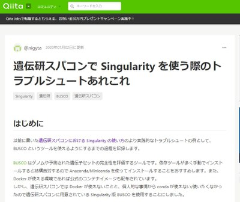

<table>
<tr>
<td width="400">

</td>
<td>

  @nigytaさん

- [遺伝研スパコンでJupyter Notebookを利用する方法 (Qiita 2020.04.20)](https://qiita.com/nigyta/items/6cb321735dba0a6215b2)
- [遺伝研スパコンでSingularityとかcwlを使う上でのtips (Qiita 2020.07.02)](https://qiita.com/nigyta/items/8de4412e590dad7bf2f8)
- [続）遺伝研スパコンでSingularityとかcwlを使う上でのtips (Qiita 2020.03.11)](https://qiita.com/nigyta/items/e62e8a307918f42baed2)
- [遺伝研スパコンでSingularityを使う際のトラブルシュートあれこれ (Qiita 2020.07.02)](https://qiita.com/nigyta/items/bf37787be6153bdbaed1)

</td>
</tr>
</table>
