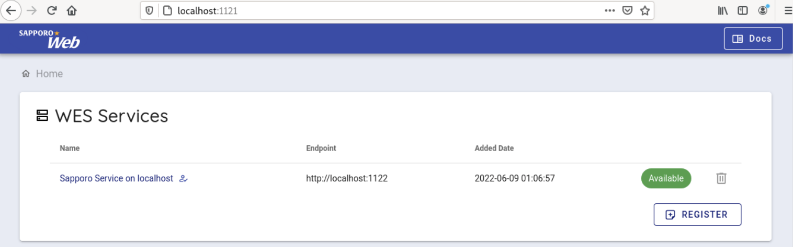
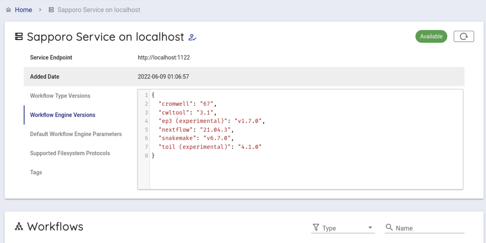
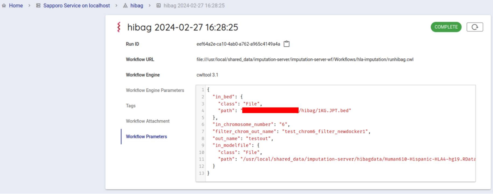

## Connecting to NIG Guacamole desktop environment

You need to sign in to NIG Guacamole desktop environment via VPN first.

Next, please launch the terminal from the "Activities" in the Guacamole desktop environment.

We will work in Firefox in the Guacamole desktop opened above, or in a terminal within that desktop.

## Procedures for using this system

This system executes HLA Genotype Imputation workflows using [HIBAG](https://bioconductor.org/packages/release/bioc/html/HIBAG.html) in the following steps.

1. Prepare test data
2. Generate a configuration file for HLA Genotype Imputation Workflow
3. Execute the HLA Genotype Imputation Workflow

## 1. Prepare test data

To proceed with the tutorial, download the test input data and copy it to the personal genome analysis section of the NIG supercomputer.
The required data for input to this workflow are PLINK bed, bim, and fam files.

### Preparation of PLINK bed, bim, and fam files

Access [Test data for Imputation Server HIBAG Workflow](https://zenodo.org/records/10579034).
You can find the following three files.

- `1KG.JPT.bim`
- `1KG.JPT.fam`
- `1KG.JPT.bed`

Download all `1KG.JPT.bim`, `1KG.JPT.fam`, and `1KG.JPT.bed` files.


### Copy it to personal genome analysis section of the NIG supercomputer

Copy the test data just downloaded.

Next, use the following command to copy the test data that you have just downloaded.
(Please place all PLINK files in the same directory.)

In the following example, the test data you want to copy are in the download folder, and the copy destination is the home directory of your account in the personal genome analysis section of the NIG supercomputer.

```
scp -i secret_key_file ~/Downloads/1KG.JPT.bim (your_account_name)@gwa.ddbj.nig.ac.jp:~/
scp -i secret_key_file ~/Downloads/1KG.JPT.fam (your_account_name)@gwa.ddbj.nig.ac.jp:~/
scp -i secret_key_file ~/Downloads/1KG.JPT.bed (your_account_name)@gwa.ddbj.nig.ac.jp:~/
```

Test data is now prepared.

## 2. Generate a configuration file for the HLA Genotype Imputation Workflow

Open the following address via Firefox.

```
http://localhost:5000/hibag
```

When you actually access it, you will see the following screen.


Configure the following items.

- Path to the PLINK bed file
- Selection of the HIBAG model provided by this system
- Prefix name for the file(s) output by this workflow

For "Path to the PLINK bed file," specify the full path to the bed file to be parsed.
Here, the file that you uploaded is used.
The specific full path will be like `/home/youraccountname/1KG.JPT.bed`.

Next, select options for the HIBAG model.
You can choose for the following three.

1. Genotyping platform
2. Resolution
3. Ancestry

Finally, input the prefix name for the file(s) output by this workflow.

An input example is shown in the image below.


Here, after entering the path to the bed file input,

- Select `Illumina HumanOmni2.5 (based on HumanOmini2.5-8v1_C` from the dropdown list under `--Select a genotyping platform--`
- Select `Two-field (4-digit) resolution` from the dropdown list under `--Select a resolution--`
- Select `Asian` from the dropdown list under `-Select an ancestry--`

Then, input `1KG.JPT.hibag` into `Output file name prefix`.
(Note: You cannot include a path in `Output file name prefix`. Including `/` will cause an error.)

After specifying the parameters, press the "Set up job" button.
The generated parameters are displayed at the bottom of the screen.
Use this in sapporo-web.


## 3. Execute the HLA Genotype Imputation Workflow

Open the following address via Firefox.

```
http://localhost:1121
```

When accessed, the following screen is displayed.



Select 'Sapporo Service on localhost', which is available by default.

When clicked, you can see the following screen.



Scroll down a little to use the backend workflows and select 'hibag' from the Workflows item and click it.


Select `cwltool 3.1` from the Workflow Engine item of Compose Run.


In Workflow Parameters, enter the parameters generated by `imputationserver-web-ui`.
In this case, delete the `{}` written from the beginning and enter the generated parameters.


Press the `EXECUTE` button at the bottom to run the workflow. The status of the job will be `RUNNING`.


If the workflow is started successfully, the workflow will be run by cwltool.

If successfully completed, the status will change to `COMPLETE` (in about 10 minutes).



You can get the result file from your browser. Click on `Outputs` in the Run log to list the result files.

When you click on the file you want to download, a dialogue appears. By default, the file is downloaded under `~/Downloads`.

## Get results

After running the Imputation Workflow, you can get the follows from your web browser.

You can copy the following command to your local computer.

Open a terminal.

When executed, the file will be downloaded to the directory where you are currently executing the command.

`scp (your_account_name)@gwa.ddbj.nig.ac.jp:~/Downloads/(filename_you_want_to_download) .`

- `(your_account_name)` is the account you use to log in to the Personal Genome Analysis environment.
- For `(filename_you_want_to_download)`, specify the name of the file you want to download.
 
You can also download the file directly from the results directory of sapporo-service.

Search `Run ID`. The `Run ID` is displayed on the right of `Run ID`. You can copy the `Run ID`(runid) by clicking on the icon on the right.


All files are in first two characters /`runid`/outputs/ of the installed directory /sapporo-service/run/`runid`.

If the `runid` is `eef64a2e-ca10-4ab0-a762-a965c4149a4a`, the first two characters are `ee`.

When you copy with the `scp` command, enter the following. A directory called `outputs` will be created in your computer,
and the analysis results will be copied from the personal genome analysis section to your computer.

```
scp -i [your private key file] -r ([your account name])@gwa.ddbj.nig.ac.jp:~/sapporo-install/sapporo-service/run/ee/eef64a2e-ca10-4ab0-a762-a965c4149a4a/ outputs outputs
```

When you are finished, close the browser tab displaying Guacamole.
