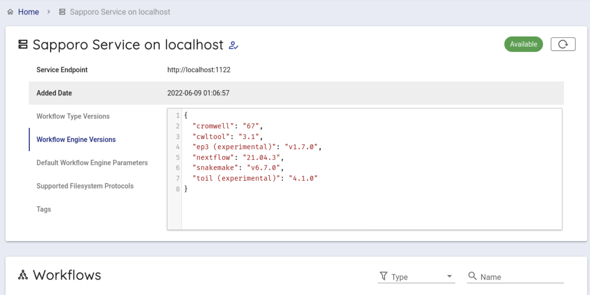
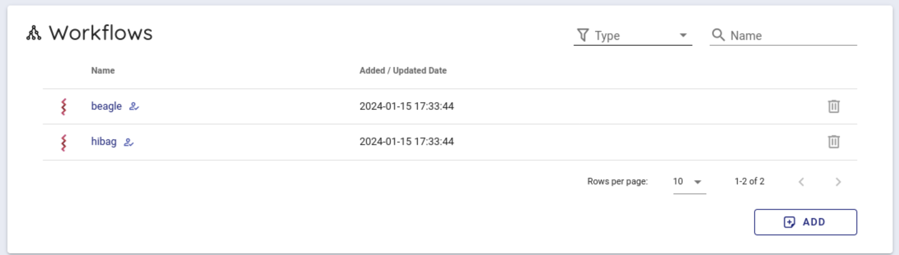
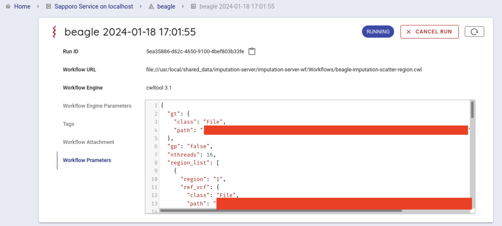
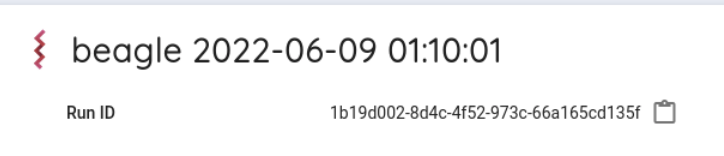

## Procedures for using this system

This system executes workflows in the following steps.

1. Prepare restricted release data
2. Generate a configuration file for the Imputation Workflow
3. Execute the Imputation Workflow


## 1. Prepare restricted release data

We proceed with the tutorial on the assumption that there is already restricted release data in the personal genome analysis division of the NIG supercomputer.

### Notes on file names for restricted release data

File names containing `+` may cause problems in subsequent processing, so should be changed by `_` or similar.

#### Extract and prepare restricted release data

By following the steps below, extract the file, create the config file and check that the config file has been created correctly.

Extract the file

```
tar zxvf <the file name of the restricted release data.tar.gz>
```

Create the config file

```
cd <Directory in which restricted release data is extracted>
./generate-default-conofig-file.sh $(pwd)
```

Check that the config file has been created correctly

```
ls -l default.config.yaml
```

This file will be entered in the next UI as `Reference panel config file` in the UI.

## 2. Generate a configuration file for the Imputation Workflow

Access the following address via guacamole on the NIG supercomputer.

```text
http://localhost:5000
```

When you actually access it, you will see the following screen.


Configure the following items.

- Target VCF file
- Reference panel preset config or other
- Output genotype probability
- Number of threads


For the target VCF file, specify the full path of the VCF file (\*.vcf.gz file) to be parsed.
Here, the file that you uploaded is used.
The specific full path will be `/home/username/restricted release data/datavcf.gz`.

Select the 'Reference panel preset config or'.
By default, you can choose for the following four.

- GRCh37.1KGP
- GRCh37.1KGP-EAS
- GRCh38.1KGP
- GRCh38.1KGP-EAS

For more information on each of them, see [&#x1f517;<u>Types of Reference Panels available</u>](https://sc.ddbj.nig.ac.jp/en/advanced_guides/imputation_server/#available-reference-panel-types).

If you want to use other than the above as a Reference Panel, select 'other' and specify the one you want to use for the Reference panel config file.

This time, select other and specify Reference panel config file.

Select 'Output genotyhpe probability'.
You can select the following two types. By default, false is selected.

- false
- true

For 'Number of threads', specify the number of threads for the job when running the workflow.

By default, 16 is specified.

After specifying the parameters, press the Set up job button.
The generated parameters are displayed at the bottom of the screen. Use this in sapporo-web.


## 3. Execute the Imputation Workflow

Via guacamole, access the following address.

```text
http://localhost:1121
```

When accessed, the following screen is displayed.


Select 'Sapporo Service on localhost', which is available by default.

When clicked, you can see the following screen.



Scroll down a little to use the backend workflows and select 'beagle' from the Workflows item and click it.



Select `cwltool 3.1` from the Workflow Engine item of Compose Run.


In Workflow Parameters, enter the parameters generated by imputationserver-web-uio.
In this case, delete the `{}` written from the beginning and enter the generated parameters.


Press the Execute button at the bottom to run the workflow.
The status of the job will be Running.



If the workflow is started successfully, the workflow will be run by cwltool.

If successfully completed, `COMPLETE`.


You can get the result file from your browser.
Click on Outputs in the Run log to list the result files.

When you click on the file you want to download, a dialogue appears. By default, the file is downloaded under `~/downloads`.


### Get results

After running the Imputation Workflow, you can get the follows from your web browser.

You can copy the following commands to your computer.

Open a terminal.

When executed, the file will be downloaded to the directory where you are currently executing the command.

```console
scp ([your account name])@gwa.ddbj.nig.ac.jp:~/download/([filename you want to download]) .
```

- `(your account name)` is the account you use to login to the Personal Genome Analysis environment
- For `(file name you want to download)`, specify the name of the file you want to download.

You can also download the file directly from the results directory of sapporo-service.

Search `Run ID`.
The `Run ID` is displayed on the right of `Run ID`.
You can copy the `Run ID`(runid) by clicking on the icon on the right.



All files are in first two characters /`runid`/outputs/ of the installed directory /sapporo-service/run/`runid`.

If `runid` is `1b19d002-8d4c-4f52-973c-66a165cd135f`, the first two characters are `1b`.

When you copy with the scp command, enter the following.
A directory called `outputs` will be created in your computer, and the analysis results will be copied from the Personal Genome Analysis division to your computer.

```
scp -i [your private key file] -r ([your account name])@gwa.ddbj.nig.ac.jp:~/sapporo-install/sapporo-service/run/1b/1b19d002-8d4c-4f52-973c-66a165cd135f/ outputs outputs
```

