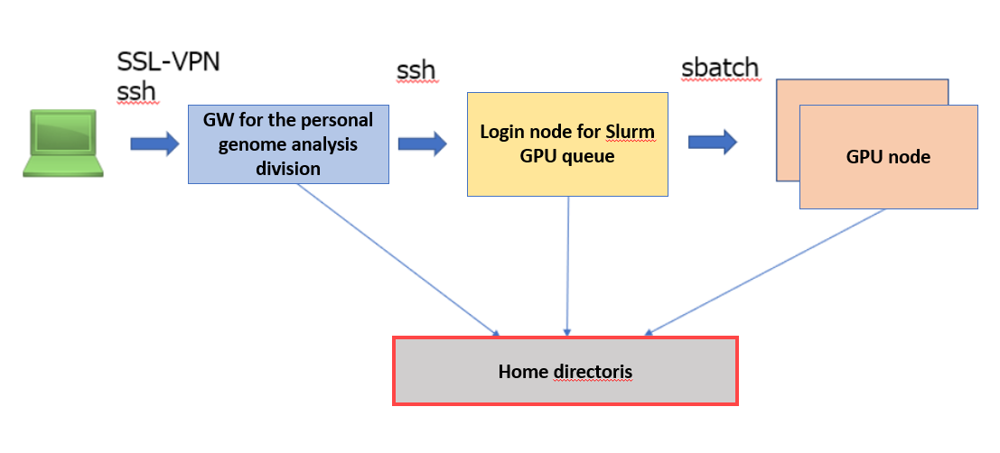

## System Overview

NVIDIA Clara Parabricks is a genome analysis pipeline which is compatible with GATK.
It is possible to significantly reduce the processing time compared to using the official implementation of GATK by using GPU.

References

- [&#x1f517;<u>NVIDIA Clara Parabricks Official website</u>](https://www.nvidia.com/ja-jp/clara/genomics/)
    - [&#x1f517;<u>Clara Parabricks Documentation</u>](https://docs.nvidia.com/clara/)

Parabricks are installed and provided on GPU nodes managed under the Slurm resource scheduler in the personal genome analysis division of the NIG supercomputer, and jobs can be submitted using the advance reservations of the Slurm resource scheduler.

- The login node for the Slurm GPU queue is shared with other users. If you do not want to share the login node, submit with the normal procedure to rent a compute node in the personal genome analysis division and contact us to install Slurm on it.
- When using Parabricks, it is assumed that all GPUs (4 GPUs) of the GPU node are used, so that no other user's job can be on the same GPU node at the same time.

## Use Procedure Overview

Here is the procedure for using Parabricks in the Personal Genome Analysis division of the NIG supercompute.

1. Preparation for use
    1. apply for use of the Personal Genome Analysis division. [<u>Refer here for how to apply for use. </u>](/personal_genome_division/pg_application)
    2. submit the usage plan table.
    3. specify your advance reservation setting.
2. Log in and submit jobs: log in to the Slurm login node and submit jobs to the worker node (GPU node).

## How to fill in the usage plan table when using Parabricks

Prepare and submit a usage plan table as described on the page [<u>"Submission of Your Usage Plan"</u>](/application/resource_extension).

The following is how to fill in the unadjusted trial balance for the priority use of GPU nodes in the Personal Genome Analysis division.

- Service: select 'Priority use of computing nodes_Personal genome analysis division'.
- Type: select 'Thin (Intel/NVIDIA GPU) (1 unit = 1GPU 4CPU cores 48GB memory).
- Specify the usage in units of 4.

For the start and end dates, enter the dates set using the advance reservation command.
You may not be able to make a reservation on the desired dates during busy times, so replace your usage plan table with the reserved start and end dates when the reservation has been made.

## How to specity the advance reservation

The basic procedure is the same as the advance reservation for Grid Engine in the general analysis division. (See [<u>Instruction for using Advance Reservation Service</u>](/general_analysis_division/advance_reservation/#instruction-for-using-advance-reservation-service)).

- The instruction for the advance reservation command by using Slurm is currently being developed, so contact us to reserve slots.

## How to login to a Slurm login node

Coming soon.

## How to submit a job

Coming soon.
