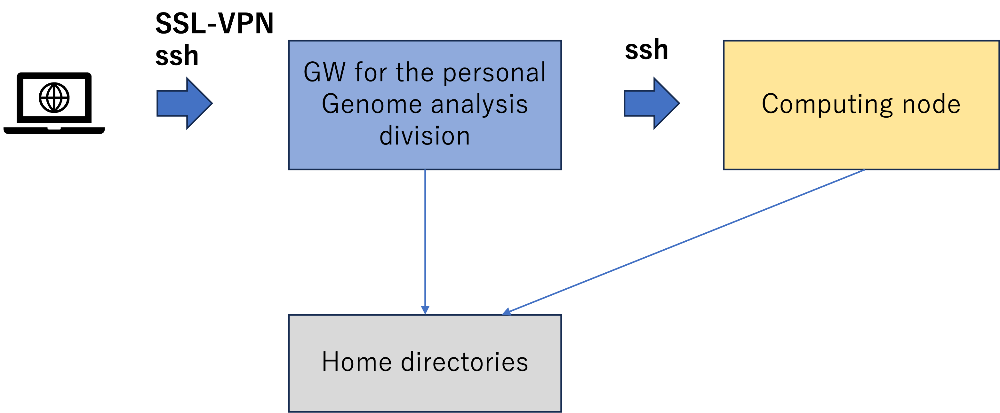

## System Overview

Sentieon is a bioinformatics tool that provides fast genomic data analysis, allowing fast joint calls on CPU-based systems.


### References

- [&#x1f517;<u>Sentieon Official website</u>](https://support.sentieon.com/manual/)


### Flow of using Sentieon



- You can connect to the Sentieon license server from the personal genome analysis division of the NIG supercomputer.
- Sentieon can be run by configuring the license server and other settings from the personal genome analysis division.

## How to run Sentieon

### Log in to the execution environment
- Connect to SSL-VPN.
- Log in to the GW for the personal genome analysis division by ssh.
- Log in to computing node by ssh　※Describes the specified computation node.
```
ssh <the computation node name>
```

### Export the server address
- Export the specified Sentieon license server address as environment variable.
```
export SENTIEON_LICENSE=<the Sentieon license server address>
```

### Download Sentieon binary files
- Check [Sentieon release notes](https://support.sentieon.com/manual/appendix/releasenotes/?highlight=aws), download the latest version, and unzip.
```
curl https://s3.amazonaws.com/sentieon-release/software/sentieon-genomics-202308.tar.gz -o sentieon-genomics-202308.tar.gz

tar -zxvf sentieon-genomics-202308.tar.gz
```

### Set the Sentieon installation directory
- Set the path to the unzipped Sentieon binary file.
```
SENTIEON_INSTALL_DIR=/path/to/sentieon-genomics-202308
```

### Installing jemalloc
- The Sentieon Official website recommends the use of jemalloc.
- Install according to [INSTALL.md](https://github.com/jemalloc/jemalloc/blob/dev/INSTALL.md).
- See [using-jemalloc-to-optimize-memory-allocation](https://support.sentieon.com/appnotes/jemalloc/#using-jemalloc-to-optimize-memory-allocation) for details.

### Execution of Sentieon command
- Execute the Sentieon command as follows（Example: `sentieon driver` help）
```
$SENTIEON_INSTALL_DIR/bin/sentieon driver -h
Usage: /home/path/to/sentieon-genomics-202308/libexec/driver [options] --algo <algo_name> [algo_options]

Options:
  -r, --reference       Reference file (FASTA)
  -i, --input           Read sequence input file (BAM/CRAM)
  -q, --qual_cal        Base quality calibration table
  -t, --thread_count    Number of threads
      --interval        Interval string or file (BED/Picard)
      --interval_padding
                        Amount to pad all intervals
      --skip_no_coor    Skip unmapped reads
      --temp_dir        Directory for temporary files
      --cram_read_options
                        CRAM read options
      --version         Display version string
  -h, --help            Display help information
      --read_filter     Read filter name and params

For algo or other help information, type
  driver --help algo
  driver --help cram_read_options
  driver --help cram_write_options
  driver --help read_filter
  driver --help read_flag_bits
```
