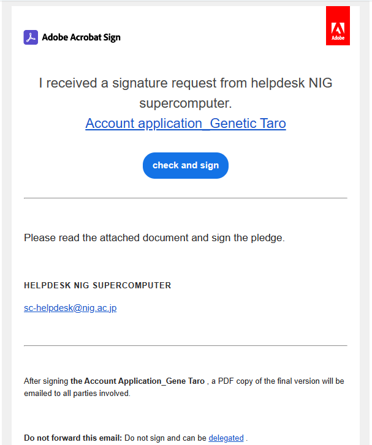
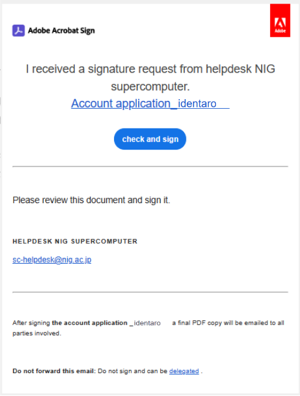

The helpdesk of the NIG Supercomputer() will send an email to the responsible person and the applicant regarding the signing of the pledge.

<table>
<tr>
<td width="400" valign="top">

The responsible person

</td>
<td width="400" valign="top">

The applicant

</td>
</tr>

<tr>
<td width="400" valign="top">

You will receive an email with a electronic signature request.

</td>
<td width="400" valign="top">

After the responsible person has completed the electronic signature, you will receive an email with a electronic signature request. 

</td>
</tr>

<tr>
<td width="400" valign="top">

When you open the email, the screen shown below is displayed.

</td>
<td width="400" valign="top">

When you open the email, the screen shown below is displayed.
 
</td>
</tr>

<tr>
<td width="400" valign="top">

</td>
<td width="400" valign="top">

</td>
</tr>
</table>

If you are unable to electrically sign the pledge because you are using a mailer that can only receive text format, refer to [FAQ "How to sign the pledge"](/guides/FAQ/faq_application/faq_agreement_signing/).

## 1. First, the responsible person signs the Pledge PDF form.

The responsible person should click 'Review(or check) and sign'.

When clicked, the following PDF will be displayed.

Scroll down the screen to display the pledge form PDF.

Enter the required information within the yellow field on the pledge form.

- Enter the name of the applicant.

- Name of the responsible person's institution e.g.: xx University, degree, department, Major

Click 'Click here to sign'. A pop-up will open.

Choose from four easy options.
  1. 'Type': type your name
  2. 'Drow': draw with a mouse
  3. 'Image': upload an image
  4. 'Mobile': sign with your finger or stylus on a touch screen

Sign in one of the ways and click 'Apply'. The following screen will then appear.

Click 'Click to sign' to confirm the electronic signature.

The 'You have successfully sign the ...' screen appears. Close the screen.

If you would like to keep the signed Pledge PDF, click 'Download a copy'.

The responsible person's electronic signature and reply to the Pledge PDF has been completed.

At this time, Adobe Acrobat Sign will not automatically send an email to the responsible person informing that the pledge PDF has been signed. After the applicant's electronic signature has been completed, you will receive it.

## 2. Next, the applicant signs the Pledge PDF form.

When the responsible person completes the electronic signature, Adobe Acrobat Sign will automatically send an email to the applicant requesting them to sign the pledge.

The responsible person should click 'Review(or check) and sign'.

When clicked, the following PDF will be displayed.

Scroll down the screen to display the pledge PDF on the last page.

Enter the required information within the pink field on the pledge form.

Enter the name of the applicant's institution e.g.: xx University, degree, department, Major

Click 'Click here to sign'. A pop-up will open.

Choose from four easy options.
  1. 'Type': type your name
  2. 'Drow': draw with a mouse
  3. 'Image': upload an image
  4. 'Mobile': sign with your finger or stylus on a touch screen

Sign in one of the ways and click 'Apply'. The following screen will then appear.

Click 'Click to sign' to confirm the electronic signature.

The 'You have successfully sign the ...' screen appears. Close the screen.

If you would like to keep the signed Pledge PDF, click 'Download a copy'.

Applicant's electronic signature and reply to the Pledge PDF has been completed.

Adobe Acrobat Sign will automatically send an email to the responsible person and the applicant informing that the pledge PDF has been signed and replied.

## 3. The electronic signatures have been completed by the responsible person and the applicant

You only wait for your account registration certificate to arrive by post.
