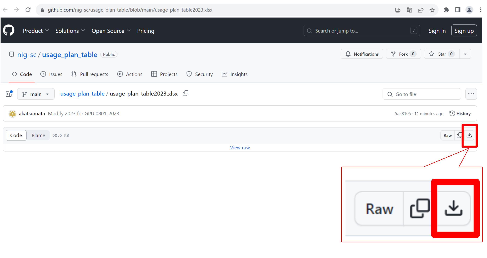

## Usage plan

- When you expand your available high-speed storage, or when you use the billing service, download the usage plan table, fill in and send to [Contact](/application/reference).
- For details on billing services, such as the use of high-speed storage exceeding 30TB and the personal genome analysis environment, refer to the "[How to use the billing service](/application/billing_services)" page.

### Download the usage plan table {#download-table}

<table>
<tr>
<td width="400" height="400" align="center">

</td>
<td valign="top">
Click here.

- [the usage plan table(2025)]https://github.com/nig-sc/usage_plan_table/blob/main/usage_plan_table2025_v1.1.0.xlsx)

&#x26A0; Currently, we are not accepting application for new use of the personal genomic analysis division and large-scale storage on the general analysis division. For more information, <a href="https://sc.ddbj.nig.ac.jp/en/blog/2022-05-13-suspension-of-applications">refer to this announcement page</a>.

</td>
</tr>
<tr>
<td width="400" height="400" align="center">

</td>
<td valign="top">
Click "↓". After clicking, the usage plan table will be downloaded.

</td>
</tr>
</table>

If not downloaded, [refer to FAQ](/guides/FAQ/faq_application/faq_usage_plan/).

### How to fill in the usage plan table 

- The usage plan table contains <b>two sheets: "Purpose of Use, etc." and "Usage TB". Please fill in both sheets</b> and submit that.
- Prepare and submit one usage plan table per responsible person. 

<table>
<tr>
<td width="400" height="400" align="center">
Purpose of use, etc.

</td>
<td valign="top">
"Purpose of use, etc." is on the first sheet of the downloaded usage plan.

Fill in the required information for 1-6.
</td>
</tr>
<tr>
<td width="400" height="400" align="center">
Usage TB

</td>
<td valign="top">
"Usage TB" is on the second sheet of the downloaded usage plan.
</td>

</tr>
</table>

You don't need to create and submit a separate application every time you apply for resource expansion. When your application changes, change and submit your previous usage plan table. When creating it, describe everyone who uses the supercomputer under the principal investigator.

## Group quotas for storage

The total amount of high-speed storage under 30TB for each responsible person is free, and a group are created for each responsible person. When you wish to set the quota for each responsible person, let us know.

### How to write the usage plan table for each account

### How to write the usage plan table for each group quota

## Sharing data between groups by setting up secondary groups, etc.

We accept requests for settings that allow data sharing among groups. In this case, when the total of the bundled groups exceeds 30TB, you are charged. The fee is apportioned by the quota amount among the responsible persons. (Note: In this case, the billing amount cannot be calculated using the usage plan.)

## About changing storage capacity

Refer to [FAQ (Change Storage Capacity)](/guides/FAQ/faq_application/faq_change_storagecapacity/).
