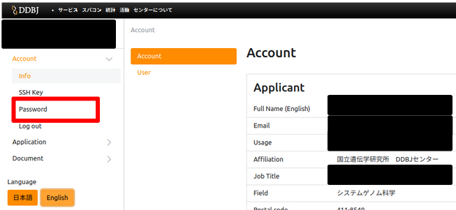
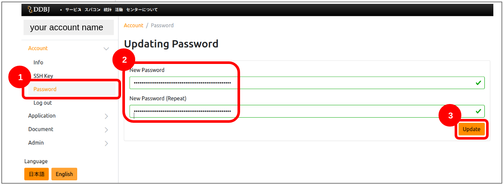

## Procedure

1. [Click here to go to the login page.](https://sc-account.ddbj.nig.ac.jp/auth/realms/master/protocol/openid-connect/auth?client_id=sc&scope=openid&response_type=code&redirect_uri=https%3A%2F%2Fsc-account.ddbj.nig.ac.jp%2Fapi%2Fauth%2Fcallback%2Fkeycloak&state=6ygcuJParJ3i8ZlDMnKicXvW3MxkWp4t06IBKOVAbIE&code_challenge=hDLDfyOsqUc58Z-xzzz1g5ybLDycWgY7UV8e-qu1jd8&code_challenge_method=S256)

2. The following login screen will de displayed, enter your account name and password. Click 'Sign In'.

You can see the following screen after clicking 'Sign In'.
Click 'Password'.

3. Register the new password.

After clicking 'Password', the following screen is displayed.
Enter your new password and click 'Update'.

Completed.

