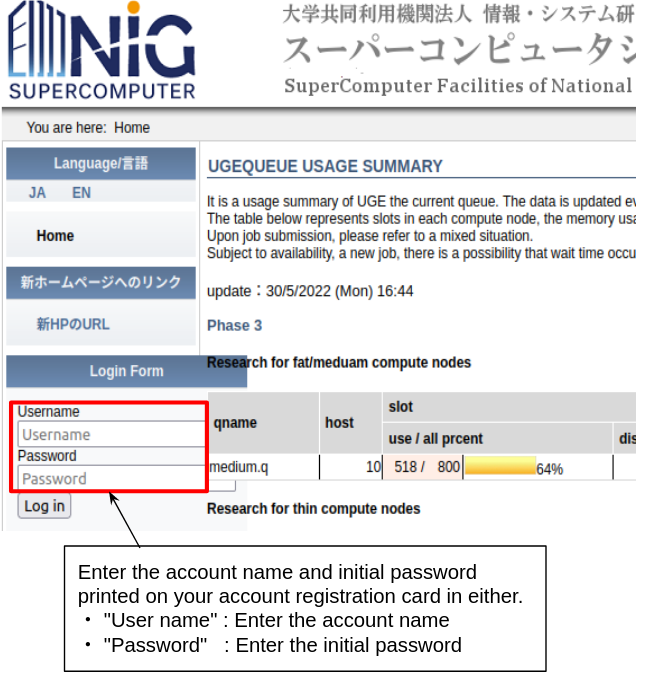
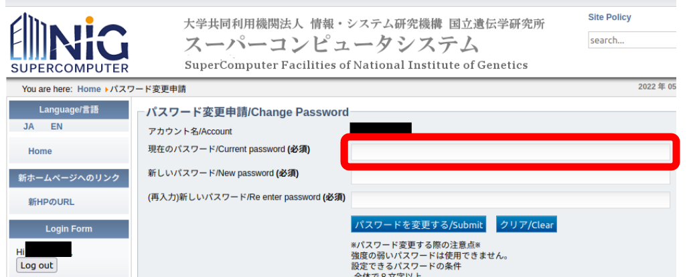
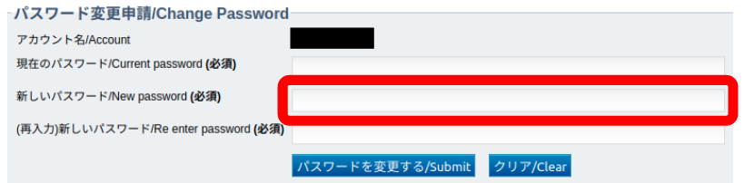
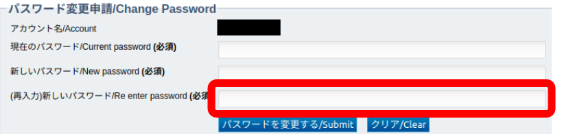
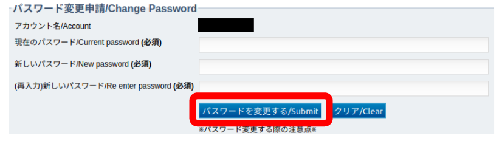

We strongly recommend that you change your initial password or your password regularly to prevent unauthorized access and to use it more securely.

## Procedure

1. Click "Password change application" on the ["User Registration/Change Request" page](/application/registration)。

2. Enter your user name and your password (initial or currently in use). Click the login button.

3. Enter your initial password or your password currently in the "Current Password" field.

4. Enter the password you want to use in the "New Password" field.

5. Re-enter the same password that you entered in step 4 in the "Re enter Password" field.

6. Click "Submit"

