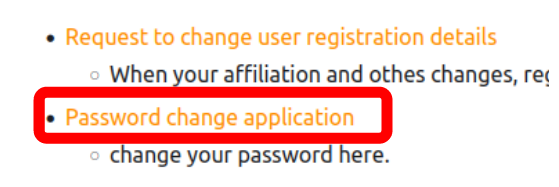
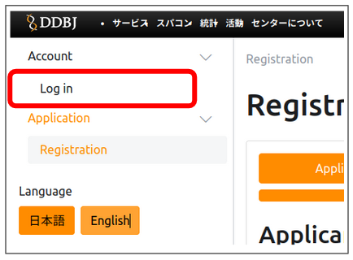

We strongly recommend that you change your initial password or your password regularly to prevent unauthorized access and to use it more securely.

## Procedure

1. Click "Password change application" on the ["User Registration/Change Request" page](/application/registration).

2. Click "Log in" and login your account page.

3. Register the new password.

① Click "Password".

② Enter the new password.

③ Click "Update".

Completed.

