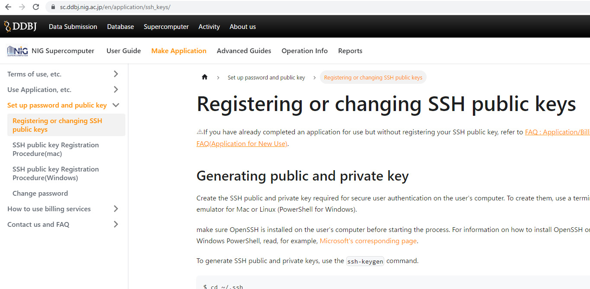
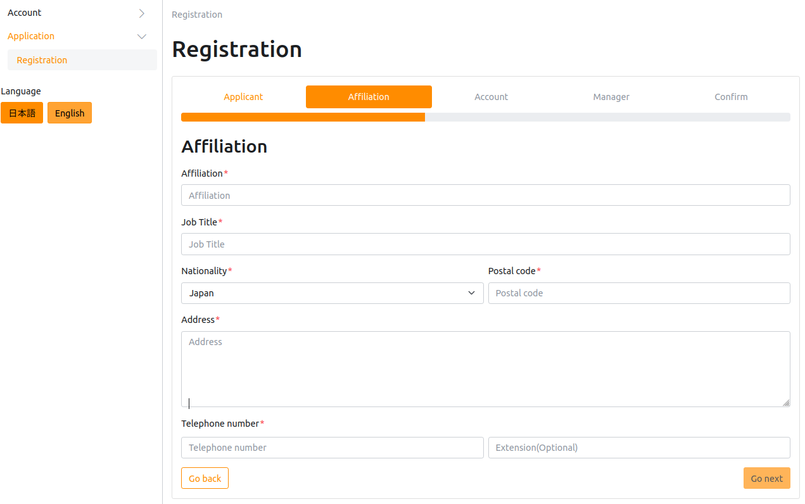
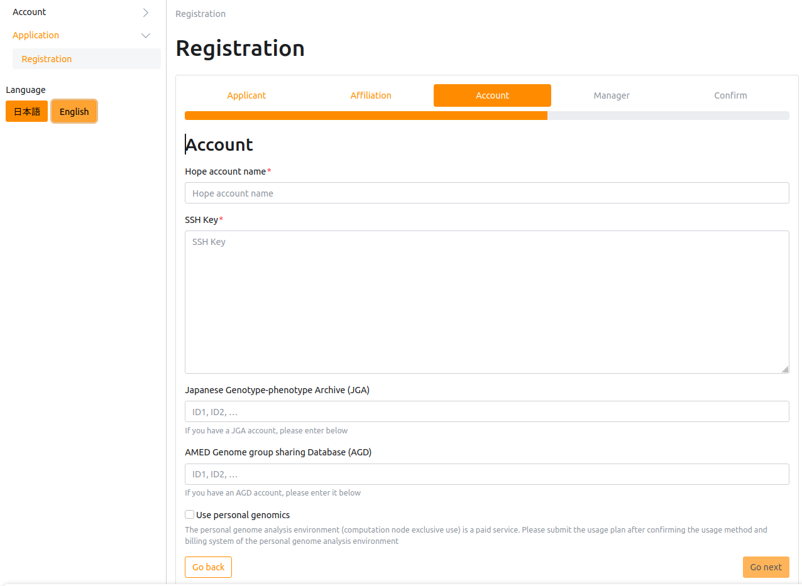
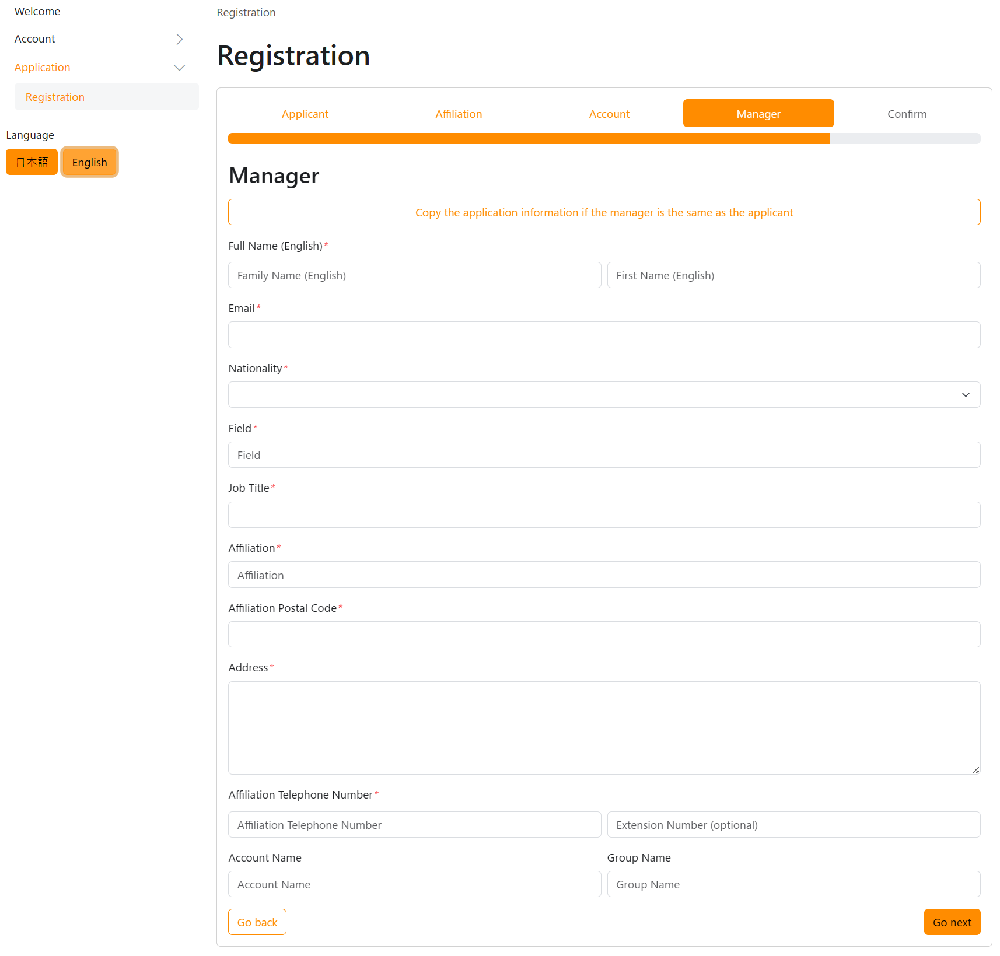
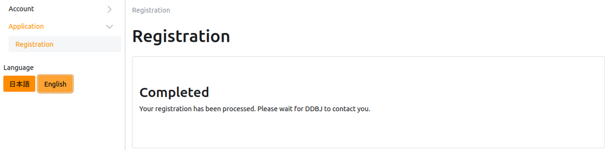

&#x26A0;  If you have already completed an the account application but without registering your SSH public key, refer to [<u>FAQ : Account Application, etc > New account registration</u>](/faq/faq_NewUser_registration/#🆀-when-applying-for-new-use-i-applied-for-use-without-entering-my-ssh-public-key-in-the-account-application-form-i-have-already-completed-the-account-application-but-without-registering-my-ssh-public-key-what-should-i-do).

## The NIG supercomputer Account Application

[&#x1f517;<u>This Application is accepted</u>](https://sc-account.ddbj.nig.ac.jp/application/registration) at any time. 

- 1TB of high-speed storage is available after the account application.
- If you extend the available storage or use a billing service, [<u>submit a usage plan table</u>](/application/resource_extension) after your application has been accepted.
  - &#x26A0;  Currently, we are not accepting Create an NIG supercomputer account of the personal genomic analysis division and large-scale storage on the general analysis division. For more information, [<u>refer to this announcement page</u>](/blog/2022-05-13-suspension-of-applications).

### How to apply for use

<table>
<tr>
<td width="400" valign="top">

</td>
<td width="400" valign="top">

Create an SSH public key. 
For instructions on how to create it, see below.

1. [<u>Windows</u>](/application/ssh_keys_ssh-keygen_win)
2. [<u>Mac</u>](/application/ssh_keys_ssh-keygen_mac)
3. [<u>Linux</u>](/application/ssh_keys_ssh-keygen_linux)

</td>
</tr>

<tr>
<td width="400" valign="top">

</td>
<td width="400" valign="top">

<a href="https://sc-account.ddbj.nig.ac.jp/application/registration">&#x1f517;<u>Access the page of registration for the NIG supercomputer account application</u>.</a> 

When you access that page, the screen shown on the left is displayed. Enter the form and click 'Go next'.

- To prevent electronic mail erroneous transmission, enter your email address of the organization you belong to, not a free email address.
- Enter ACCURATELY the purpose of use. Use of the supercomputer for purposes other than those entered here is prohibited.
- If an incorrect email address is entered, the application information can be compromised due to erroneous transmission, for which no liability can be accepted.
- Enter here if you already have a JGA or AGD account.
If you do not have one, do not enter anything.
    

</td>
</tr>

<tr>
<td>

</td>
<td>

Enter the address of your institution and click 'Go next'.  

An account certificate will be sent by post to your institution you have entered to verify your identity.

</td>
</tr>

<tr>
<td>

</td>
<td>

Copy and paste the SSH public key created in the first step into the form to register it. 
For instructions on how to register by copying and pasting, see below. 

1. [<u>Windows</u>](/application/ssh_keys_register_win)
2. [<u>Mac</u>](/application/ssh_keys_register_mac)
3. [<u>Linux</u>](/application/ssh_keys_register_linux)

:::note
If you use the personal genome analysis division, tick the box at the bottom.
:::

</td>
</tr>

<tr>
<td>

</td>
<td>

Enter the information of the responsible person and click 'Go next'. 

For security traceability reasons, we ask you to designate a responsible person when applying for use.
[<u>For more information on how to designate a responsible person, see here</u>](/application/#the-responsible-person).

</td>
</tr>

<tr>
<td>

</td>
<td>
The account application is completed. 

The account application is completed when the 'Completed' screen appears, as shown on the left.
 

After the account application has been completed, DDBJ will normally send an email to the applicant and the responsible person within one week.
 

 For more information, refer to the link below, 'Steps from user account application to start of use'.

<ul>
  <li><a href="https://sc.ddbj.nig.ac.jp/general_analysis_division/ga_application#steps-from-user-account-application-to-start-of-use"><u>The General Analysis division</u></a></li>
  <li><a href="https://sc.ddbj.nig.ac.jp/personal_genome_division/pg_application/#steps-from-user-account-application-to-start-of-use"><u>The Personal Genome Analysis division</u></a></li>
</ul>

</td>
</tr>

</table>

