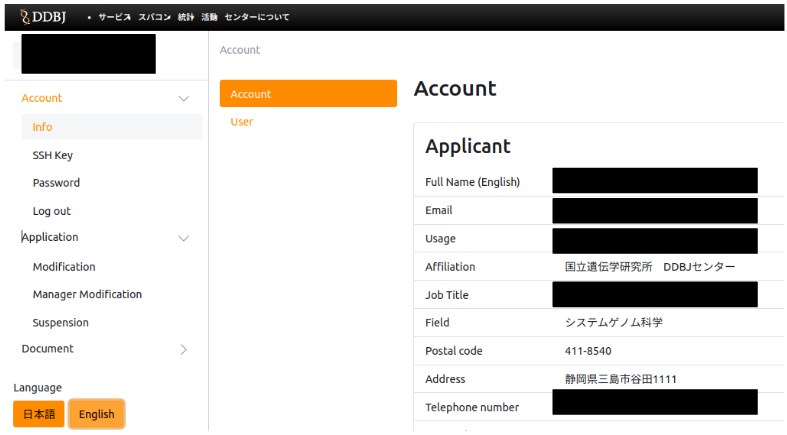

&#x26A0;  Currently, we are not accepting application for new use of the personal genomic analysis section and large-scale storage on the general analysis section. For more information, [refer to this announcement page](/en/blog/2022-05-13-suspension-of-applications).

If you have already completed an application for use but without registering your SSH public key, refer to [<u>FAQ : Application/Billing > FAQ(Application for New Use)</u>](/faq/faq_NewUser_registration#when-applying-for-new-use-i-applied-for-use-without-entering-my-ssh-public-key-in-the-usage-registration-application-form-i-have-already-completed-the-application-for-use-but-without-registering-my-ssh-public-key-what-should-i-do).

## Application for use

[Application for use is accepted](https://sc-account.ddbj.nig.ac.jp/en/application/registration) at any time. 1TB of high-speed storage is available after application for use.

- If you extend the available storage or use a billing service, [submit a usage plan table](/en/application/resource_extension) after your application has been accepted.

<table>
<tr>
<td width="400" valign="top">

</td>
<td width="400" valign="top">

When you access [the page of registration application for use](https://sc-account.ddbj.nig.ac.jp/en/application/registration), the screen shown on the left is displayed.

- To prevent electronic mail erroneous transmission, enter your email address of the organization you belong to, not a free email address.
- Enter ACCURATELY the purpose of use. Use of the supercomputer for purposes other than those entered here is prohibited.
    

</td>
</tr>

<tr>
<td>

</td>
<td>

- An account certificate will be sent by post to your institution to verify your identity. Enter the address of your institution.

</td>
</tr>

<tr>
<td>

</td>
<td>

- Create an SSH public key, copy and paste it into the form.
[For more information on how to create an SSH public key, see here](/en/application/ssh_keys).
- Enter here if you already have a JGA or AGD account.
If you do not have one, do not enter anything.
- If you use the personal genome analysis section, tick the box at the bottom.

</td>
</tr>

<tr>
<td>

</td>
<td>

For security traceability reasons, we ask you to designate a responsible person when applying for use.
[For more information on how to designate a responsible person, see here](/en/application/#the-responsible-person).

- If you know both the account name and the group name of the responsible person, enter them in the form at the top.
This allows you to omit entering the detailed data about the responsible person.

- Click the check box in the following cases. After clicking the check box, the screen shown on the left is displayed. Then enter the information of the responsible person.
  - If the account name of the responsible person is known, but the group name is unknown.
  - If neither the account name nor the group name of the responsible person is known.

</td>
</tr>

<tr>
<td>

</td>
<td>
The DDBJ will normally contact the applicant and the responsible person by email within one week after completion of the application.
</td>
</tr>

</table>

## Change of application details

If your affiliation or other details change, immediately [change your application details here](https://sc-account.ddbj.nig.ac.jp/auth/realms/master/protocol/openid-connect/auth?client_id=sc&scope=openid&response_type=code&redirect_uri=https%3A%2F%2Fsc-account.ddbj.nig.ac.jp%2Fapi%2Fauth%2Fcallback%2Fkeycloak&state=6ygcuJParJ3i8ZlDMnKicXvW3MxkWp4t06IBKOVAbIE&code_challenge=hDLDfyOsqUc58Z-xzzz1g5ybLDycWgY7UV8e-qu1jd8&code_challenge_method=S256).

<table>
<tr>
<td width="400" valign="top">

</td>
<td width="400" valign="top">

When accessing the page to change the application details, you can see first a login screen to the page.

</td>
</tr>

<tr>
<td>

</td>
<td>

From the page to change the application details, you can change your affiliation, SSH public key, password, etc., or request for termination of account use.

If the following screen appears instead of the Change of application details page shown on the left, click "Sing in with Keycloak". 

</td>
</tr>
</table>

After clicking, you can see the Change of application details as described in 2.

