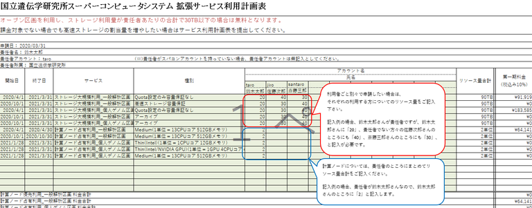
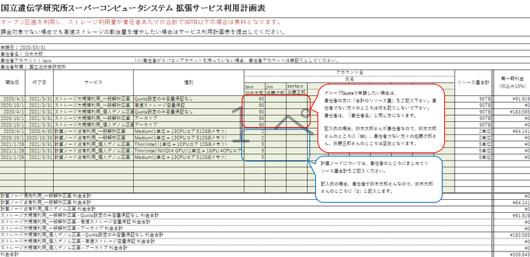

## Usage plan

- When you expand your available high-speed storage, or when you use the billing service, download the usage plan table, fill in the "Purpose of use, etc." and "Usage TB" and send to [Contact](/application/reference).

### Download the usage plan table

<table>
<tr>
<td width="400" height="400" align="center">

</td>
<td valign="top">
Click here and download the usage plan table.

[<ul><li>the usage plan(2022)</li></ul>](/files/usage_plan-ver2.3.4-2022.xlsx)

&#x26A0; Currently, we are not accepting application for new use of large-scale storage. For more information, refer to <a href="https://sc.ddbj.nig.ac.jp/en/blog/2022-05-13-suspension-of-applications">"May 13, 2022(Friday) - Suspend acceptance of new user registrations for the personal genome section and large-scale storage on the general analysis section"</a>

</td>
</tr>
</table>

<b>！！</b> When applying,<b> fill in both the "Purpose of use, etc." and "Usage TB"</b> and submit that.<b>！！</b>  

<table>
<tr>
<td width="400" height="400" align="center">
Purpose of use, etc.

</td>
<td valign="top">
"Purpose of use, etc." is on the first sheet of the downloaded usage plan.

Fill in the required information for 1-6.
</td>
</tr>
<tr>
<td width="400" height="400" align="center">
Usage TB

</td>
<td valign="top">
"Usage TB" is on the second sheet of the downloaded usage plan.
</td>

</tr>
</table>

- For details on billing services, such as the use of high-speed storage exceeding 30TB and the personal genome analysis environment, refer to the "[How to use the billing service](/application/billing_service)" page.

- Prepare and submit one "purpose of use, etc." and "Usage TB" for each responsible person. You don't need to create and submit a separate application every time you apply for resource expansion. When your application changes, change and submit your previous application and plan. When creating it, describe everyone who uses the supercomputer under the principal investigator.

## Group quotas for storage

The total amount of high-speed storage under 30TB for each responsible person is free, and a group are created for each responsible person. When you wish to set the quota for each responsible person, let us know.

### How to write the usage plan table for each account

### How to write the usage plan table for each group quota

## Sharing data between groups by setting up secondary groups, etc.

We accept requests for settings that allow data sharing among groups. In this case, when the total of the bundled groups exceeds 30TB, you are charged. The fee is apportioned by the quota amount among the responsible persons. (Note: In this case, the billing amount cannot be calculated using the usage plan.)

