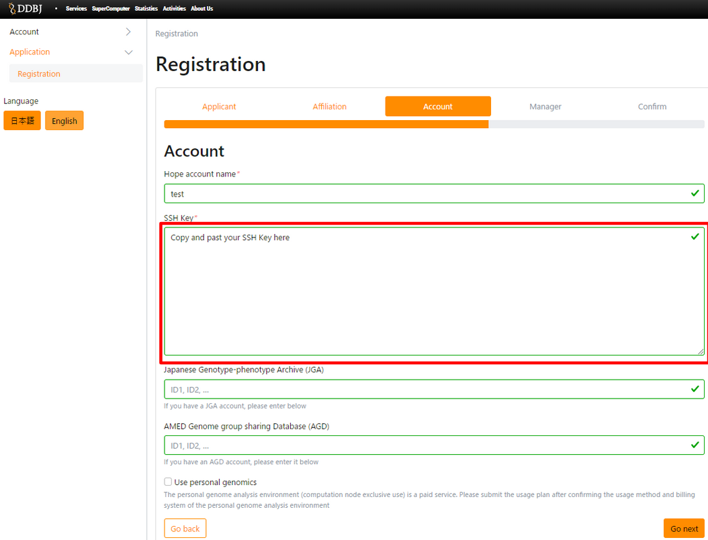

## Generating public and private key

Create the SSH public and private key required for secure user authentication on the user's computer.
To create them, use a terminal emulator for Mac or Linux (PowerShell for Windows).

make sure OpenSSH is installed on the user's computer before starting the process. For information on how to install OpenSSH on Windows PowerShell, read, for example, [Microsoft's corresponding page](https://docs.microsoft.com/en-us/windows-server/administration/openssh/openssh_install_firstuse).

To generate SSH public and private keys, use the `ssh-keygen` command.


```
$ cd ~/.ssh
$ ssh-keygen -t rsa -b 2048                                                      (1)
Generating public/private rsa key pair.
Enter file in which to save the key (/home/temp/.ssh/id_rsa):                    (2)
Enter passphrase (empty for no passphrase):                                      (3)
Enter same passphrase again:                                                     (4)
Your identification has been saved in /home/temp/.ssh/id_rsa.
Your public key has been saved in /home/temp/.ssh/id_rsa.pub.
The key fingerprint is:
e5:23:f0:fc:b7:60:70:80:79:91:f2:f1:6d:a8:ae:90 temp@host
```

- (1) Generate a 2048-bit key with RSA version 2.
- (2) Saving Public and private key: Specify the path here only if you want to change it. If not, press the Enter key.
- (3) Enter the passphrase.
- (4) Re-enter the passphrase.

SSH treats possession of the private key file as evidence of identity.
If the private key file is stolen, identity theft is possible.
It is possible to omit the passphrase setting, but it is strongly recommended to set it to reduce damage when the private key is stolen.


## Installation of public key on the NIG supercomputer gateway

```
$ ls ~/.ssh
id_rsa  id_rsa.pub
$ cat ~/.ssh/id_rsa.pub
ssh-rsa AAAAB3NzaC1yc2EAAAABIwAAAQEAznOdmkDHzjDpsNIhkl2VNjUXBlC3QePKDAzmu3FDCMgBYUDyiXAXLf85q25cylVq66gLUP63nlFJz4/SLO13w2Qf3Gyyj7ADJJZR3sD+Sf8vdlt2hShAT0kkKBmToBqv2Pqx2SfzRVedlyCE4YFieUVmZUkz95dxwSUklGXmQSvigkqCG86r0NlxCSMjYitDGWAyGMu37cvBYzH0+C2uthtbqTd1VYHfjtvewySSZsvbVVnjLme0Ah2cAyifVaSN4uslDBqkN62b3vaijoXPy9ieUzSP0/dgBhKN/m7yhnM/1s+foJnRI3wfDdqXPw3yOqPC/9EXrjnmdpEmpgMJTw== temp@host
$ 
```

When you check the save location of the key pair, you will find two files, `id_rsa` and `id_rsa.pub`, are created.
`id_rsa.pub` is the public key, so you can register the public key by copying all contents of the file and pasting it into the "SSH Key" below.

The entry field of your SSH public key

<table>
<tr>
<td>


</td>
<td>
<p>The entry field of your SSH public key is displayed on the "Account" page of the new user registration application form. </p>
<p>〔Registration procedure〕
<ol>
<li>Paste the key copied above on the bottom of the screen (red frame).</li>
<li>Fill in the required fields.</li>
<li>Press the "Next" button at the bottom of the screen to register the public key.</li></ol></p>
Click below to display the new user registration application form.
<ul>
<li><a href="https://sc-account.ddbj.nig.ac.jp/application/registration">the application form of new user registration(Japanese)</a></li>
<li><a href="https://sc-account.ddbj.nig.ac.jp/en/application/registration">the application form of new user registration(English)</a></li>
</ul>
</td>
</tr>

</table>
 

## Confirmation of connection to the NIG supercomputer gateway

Connect to the supercomputer system using the ssh command.

```
$ ssh youraccount@gw.ddbj.nig.ac.jp
Enter passphrase for key '/home/youraccount/.ssh/id_rsa':
Last login: Fri Sep 19 13:28:19 2014 from gw.ddbj.nig.ac.jp
---------------------------------------------------------------------
Thank you for using supercomputer system.
This node is in use for login service only. Please use 'qlogin'.
---------------------------------------------------------------------
[youraccount@gw ~]$
```

When prompted for the passphrase, enter the passphrase that you specified for key generation.
After authentication, it is complete to login to the supercomputer system.
If your private key is stored in a location other than `~/.ssh/id_rsa`, specify the private key path as shown below.

```
ssh -i ~/yourpath/id_rsa youraccount@gw.ddbj.nig.ac.jp
```

If you have trouble connecting, refer to [FAQ](/faq/faq_login).


