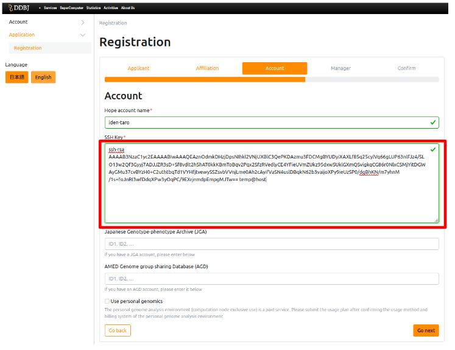

This page provides detailed completion instructions when registering SSH public key to the NIG  supercomputer with Windows.

PowerShell, which comes standard with Windows, is used as an example.

When the contents of the SSH public key you created are displayed, select all the contents displayed and copy them.

To select a range and copy that: Left-click the mouse just to the left of the first letter 's' of the first string 'ssh-rsa' and drag it straight to the end (in this case, the "S" (capital s) of "your_username@LAPTOP-USERS"). When dragged, the selected string is highlighted in gray, as shown in the screen below. Then release your hand from the mouse. On the gray highlighted string, right-click the mouse. After right-clicking, the highlight disappears. The copying is then complete. Right-clicking can be anywhere the gray highlighted area. Note that Ctrl + C will not make a copy.

On the <a href="https://sc-account.ddbj.nig.ac.jp/application/registration">Application for new use page</a>, click in the 'SSH key' frame on the 'Account' page, press Ctrl + V to paste them.

After pasting, press the 'Next' button and continue filling in the [continue filling in the account application form](/application/registration/#application-for-use).

[The SSH public key registration is completed when you conpletedd the registration of the account application on the "The NIG supercomputer Account Application" of the "Account Application and Change od Application Details" page and the "Completed" screen appears as shown below](/application/registration/#application-for-use)

&#x26A0; If you already have your account, register your public key in [<u>the Change of application details by clicking here</u>](/application/registration/#change-of-application-details).

 