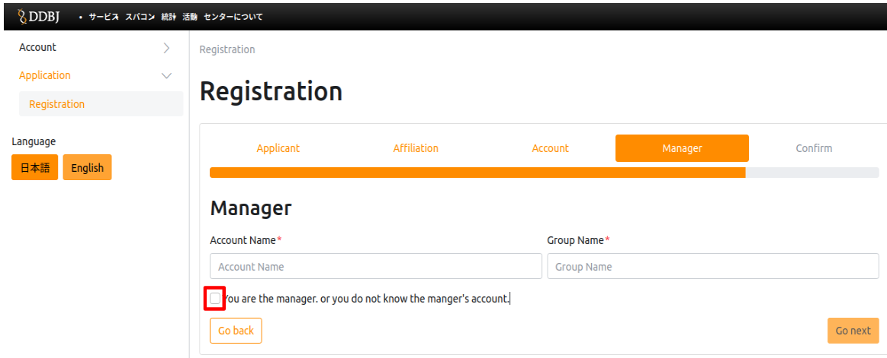
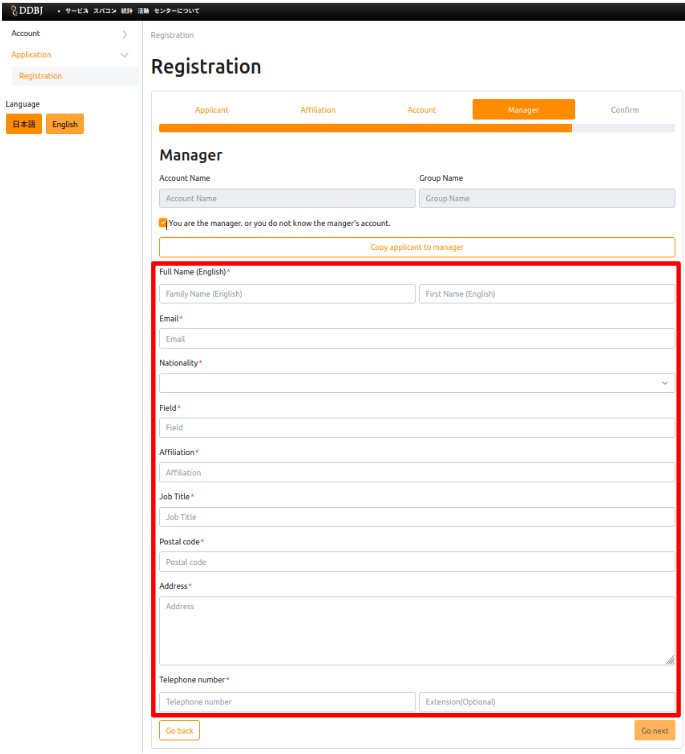
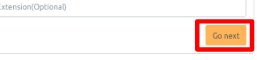

##  I want to logout from the application form of new user registration, but I cannot find the logout button.

The red frame below is the logout button.

Click it to log out.

## What should I enter "Account name" and "Group name" of the responsible person.

If you don't know the account name or group name of the responsible person, follow the steps below to type in the information. 

<table>
<tr>
<td>1.</td>
<td width="300">Check the box "You are the manager. or you do not know the manager's account.". </td>
<td height="400">

</td>
</tr>
<tr>
<td>2.</td>
<td width="300">Type in the information of the responsible person. </td>
<td height="400">

</td>
</tr>
<tr>
<td>3.</td>
<td width="300">Click the "Go Next" button. Clicking on the button will take you to the "Confirm" section on the next page. </td>
<td height="400">

</td>
</tr>
</table>
