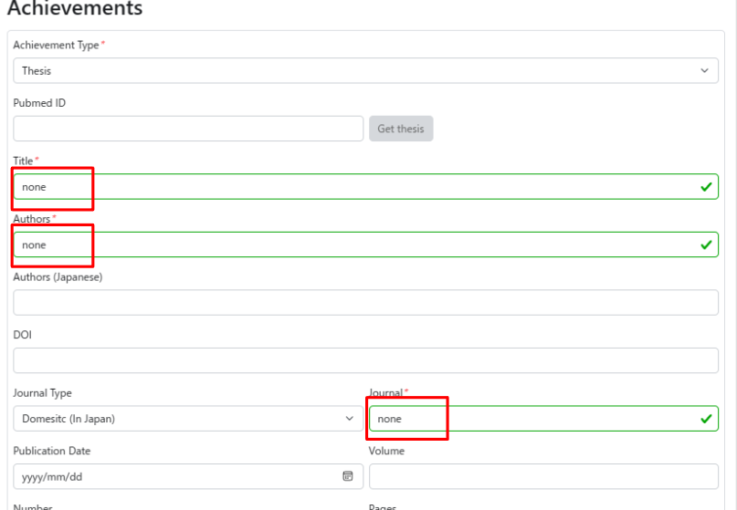

## Currently, no papers or other deliverables have been published. I have not yet published a paper, what should I do?

If you do not have any results to report, you can complete the procedure by entering 'none' as shown below.

