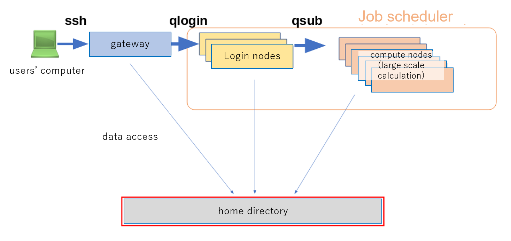

## System configuration of the general analysis division

The general analysis division of NIG supercomputer is a cluster configuration of bundling of many computers called nodes.

A job scheduler is a program that assigns an appropriate computer on a cluster computer system to a computation request from a user. The NIG supercomputer uses Grid Engine, the successor to Sun Grid Engine, which has been widely used in bioinformatics, as a job scheduler.

All nodes managed by Grid Engine mounts a Large capacity high-speed storage system (Lustre FS) and users' home directories are equally accessible from all nodes.

## Grid Engine Queue Type

Compute nodes managed by the Grid Engine are broadly devided into login nodes and compute nodes.

- Login nodes(login node) are calculators to develop users' programs or perform small, quick calculations interactively on the spot.
- Compute nodes(compute node) are compute node to perform calculations that take a long time or use a large amount of CPU or memory.

Compute requests called jobs to login and compute nodes are managed in Grid Engine with queues.
Jobs wait in queue and are automatically executed by Grid Engine as soon as a computer is available if calculation requirements exceed computer resources.

In the general analysis division of the NIG supercomputer, there is a Grid Engine queue for each type of compute node.

<table>
<tr>
  <th>Compute nodes Type</th>
  <th>Grid Engine queue name</th>
  <th>Hardware type</th>
  <th>Number of computers and total cores</th>
</tr>
<tr>
  <td rowspan="2">Login Nodes</td>
  <td>login</td>
  <td>Thin nodes Type1b 
  (AMD EPYC7702, 128 CPU cores/node, 
  4GB memory/CPU core)
  </td>
  <td>three computers 384 cores</td>
</tr>
<tr>

  <td>login_gpu</td>
   <td>Thin nodes Type2b  
   (Intel Xeon Gold 6136, 24 CPU cores/node,  
   16GB memory/CPU core)
   </td>
  <td>one computer 24 cores</td>
</tr>

<tr>
  <td rowspan="5">Compute Nodes</td>
  <td>epyc</td>
    <td>Thin nodes Type1b 
  (AMD EPYC7702, 128 CPU cores/node,  
  4GB memory/CPU core)  </td>
  <td>25 computers 3200 cores</td>

</tr>
<tr>
  <td>intel</td>
  <td>Thin nodes Type2a  
  (Intel Xeon Gold 6130, 32 CPU cores/node,  
  12GB memory/CPU core)
  </td>
  <td>32 computers 1024 cores</td>
</tr>
<tr>
  <td>gpu</td>
     <td>Thin nodes Type2b  
   (Intel Xeon Gold 6136, 24 CPU cores/node,  
   16GB memory/CPU core)
   </td>
  <td>seven computers 168 cores</td>
</tr>
<tr>
  <td>short</td>
     <td>Thin nodes Type1a  
   (AMD EPYC7501, 64 CPU cores/node, 
   8GB memory/CPU core)
   </td>
  <td>two computers 128 cores</td>
</tr>
<tr>
  <td>medium</td>
  <td>Medium nodes  
  (Intel Xeon Gold 6148, 80 CPU cores/node,  
  38.4GB moemory/CPU core)
  </td>
  <td>ten computers 800 cores</td>
</tr>

</table>

