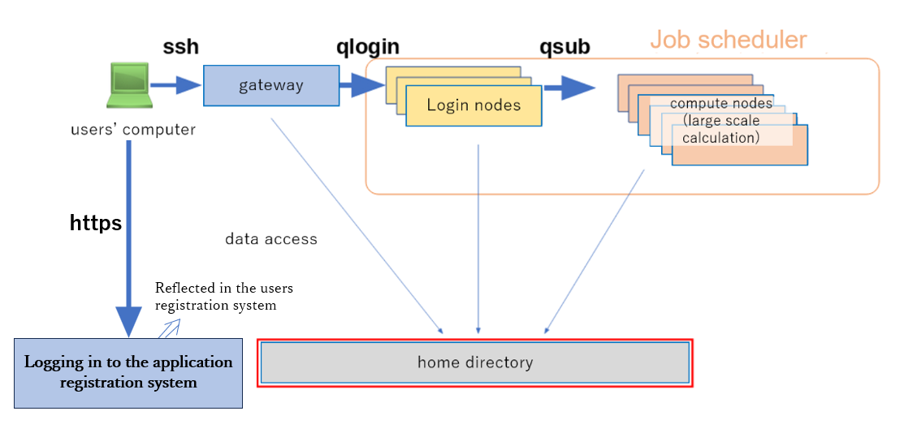

[<u>Before logging in, you need to complete application for use.</u>](/application/registration)

<details>
<summary>
利用申請の流れは、以下のようになります。</summary>

<p>

[<u>手順の詳細は、ここをクリックして「利用申請・変更」をご参照ください。</u>](/application/registration)


**1. [SSH公開鍵・秘密鍵の生成](/application/ssh_keys#1-%E5%85%AC%E9%96%8B%E9%8D%B5%E7%A7%98%E5%AF%86%E9%8D%B5%E3%81%AE%E7%94%9F%E6%88%90)**

**2. [申請登録](/application/registration#%E5%88%A9%E7%94%A8%E7%94%B3%E8%AB%8B)**

以下の情報を登録します。
 - 申請者情報
 - 所属機関の住所
 - 1．で生成したSSH公開鍵
 - 責任者情報

**3. 利用申請完了**

利用申請が完了すると、[<u>誓約書への署名を依頼するメールが届きますので、署名します。</u>](/application/signing_PDF)


署名が受理されると、郵送によりアカウント登録証がお手元に届き、ログインできるようになります。

ログイン方法は以下をご参照ください。

- [遺伝研スパコンへのログイン方法](/general_analysis_division/ga_login#%E3%83%AD%E3%82%B0%E3%82%A4%E3%83%B3%E3%81%AE%E6%89%8B%E9%A0%86)
- [申請登録フォームのマイページへのログイン方法](/application/registration#%E7%94%B3%E8%AB%8B%E5%86%85%E5%AE%B9%E3%81%AE%E5%A4%89%E6%9B%B4)

</p>
</details>


## Introduction

SSH connection is used for logging in to the general analysis division of the NIG supercomputer. 




## Gateway Node

There are two gateway nodes for the general analysis division of the NIG supercomputer.

- `gw.ddbj.nig.ac.jp`
- `gw2.ddbj.nig.ac.jp`


##  How to log in to the general analysis division with your account

1. Open a terminal emulator and enter ssh `username@gatewaynodename`. Then press enter. (The same way for the Windows PowerShell SSH client.)

```
$ ssh youraccount@gw.ddbj.nig.ac.jp
```

or

```
$ ssh youraccount@gw2.ddbj.nig.ac.jp
```

If your private key is stored in a location other than `~/.ssh/id_rsa`, specify the private key path as shown below.

```
ssh -i ~/yourpath/id_rsa youraccount@gw.ddbj.nig.ac.jp
```

2. Enter the passphrase for the SSH key pair and press enter in "Enter passphrase for key ...".

Enter "yes" to continue connecting ig the following message is displayed after entering the key passphrase.

```
Are you sure you want to continue connecting (yes/no)?
```

3.  Execute 'qlogin' command to log in to the login node.

```
$ qlogin
```

Enter "yes" to continue connecting if the following message is displayed after entering your password.

```
Are you sure you want to continue connecting (yes/no)?
```


### Execution example

You will see the following message means success on your display.

```
$ ssh youraccount@gw.ddbj.nig.ac.jp
Enter passphrase for key '/home/youraccount/.ssh/id_rsa': 
Last login: Sun Sep 26 15:03:33 2021 from XXX.XXX.XXX.XXX
---------------------------------------------------------------------
Thank you for using NIG supercomputer system.
This is the gateway node, do not run program here.
Please use 'qlogin' to login to a login node.
---------------------------------------------------------------------
$ qlogin
Your job 13867668 ("QLOGIN") has been submitted
waiting for interactive job to be scheduled ...
Your interactive job 13867668 has been successfully scheduled.
Establishing /home/geadmin/UGER/utilbin/lx-amd64/qlogin_wrapper session to host at138 ...
Last login: Sun Sep 26 15:29:09 2021 from gw1
$ 
```

If it does not work, refer to [FAQ](/faq/faq_login_general).


## Notes on available memory

The default available memory for a login node is 4GB.
Specify the amount of memory at `qlogin` as follows to increase this.

```
qlogin -l s_vmem=10G -l mem_req=10G
```

### Reference

- [How to use Java](/software/java) : Notes - when the Java program launches, you get an error message saying out of memory.
- [How to use Singularity](/software/Apptainer/) : [Building Images on Supercomputer - Generating Singularity Image from Docker Container Image](/software/Apptainer/#Building images on the supercomputer : Generating Apptainer (Sigularity) images from Docker container images)


## How to use the GPU node


For the purpose of developing programs using GPUs and testing their operation, we have a login node equipped with a GPU.
To use this login node, `qlogin` with the `-l gpu` option.

```
qlogin -l gpu
```


