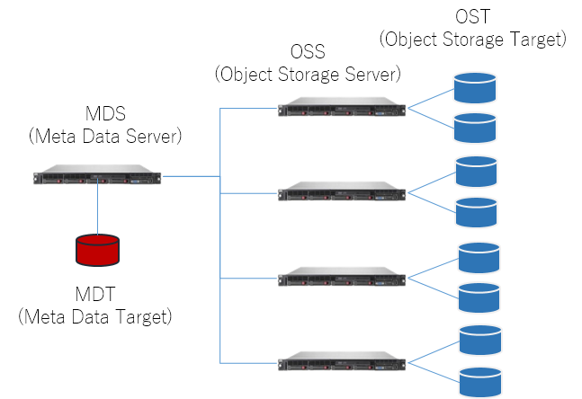

The home area of both the general analysis division and the personal genome analysis division of the NIG supercomputer is composed of the Lustre File System.

## Structure of Lustre File System

Lustre is a parallel and distributed shared file system widely used in supercomputers.
The file system consists of multiple servers and disk array devices.

- MDS (Meta Data Serve): A server that manages access to file meta information, file name, size, owner, actual data location, etc. MDT is mounted.
- MDT (Meta Data Target): A storage area that holds file system metadata.
- OSS (Object Storage Server): Servers that manages access to file data. OST is mounted.
- OST (Object Storage Target): A storage area that holds the actual data in the file system.



Reference：https://ddn.co.jp/issue/lustre.html


## Checking Quota


Each user has a limit on the available storage capacity for each user.

You can check the user's current home space usage and quota settings with the "lfs quota" command.


```bash
[username@at027 ~]$ lfs quota -u username /lustre7
Disk quotas for usr username (uid ****):
 Filesystem  kbytes   quota   limit   grace   files   quota   limit   grace
   /lustre7    1840       0  1000000000     -      23       0       0       -
```

| Item | Meaning and Explanation |
|----------|----------------------------------------------|
|kbytes | file sizes in use (KB) |
|quota | file sizes/number limit (soft limit)
|limit | absolute file sizes/number limit (hard limit) |
|grace | the allowable period for exceeding the limit (not set in this system)
|files | number of files in use
                        |

In the above command example, the user has a quota setting of 1TB on Lustre7, and the current usage is 1,840KB.
If the usage exceeds 1TB, new writing will not be allowed. Apply for large-scale use if necessary.
There is currently no limit on the number of files.


 
## How to set up striping

The feature of Lustre is that single file can be divided into multiple segments and stored on multiple OSTs in a distributed manner. This feature is called file striping. The advantage of file striping is that since single file is divided and stored on multiple OSTs, read/write operations can be performed on them in parallel from the client, and large files can be read/write at high speed. On the other hand, file striping increases the overhead of handling distributed data because it is distributed over multiple OSTs. For this reason, a higher speed can be expected when the target file size is 1 GB or larger. You can set the striping settings for each directory by yourself. If set, the writing of new files under that directory will be distributed to the specified number of OSTs.

### Example

Create a test directory. By default, stripe_count: 1 is set without striping.  To determine the stripe settings for a file or directory, use the lfs getstripe command:

```bash
[username@at027 ~]$ mkdir stripe_test
[username@at027 ~]$ lfs getstripe stripe_test
stripe_test
stripe_count:  1 stripe_size:   1048576 stripe_offset: -1
```

In this example, only single OST is used when a file created under the directory.

```bash
[username@at027 ~]$ cd stripe_test
[username@at027 stripe_test]$ touch test1
[username@at027 stripe_test]$ lfs getstripe test1
test1
lmm_stripe_count:  1
lmm_stripe_size:   1048576
lmm_pattern:       1
lmm_layout_gen:    0
lmm_stripe_offset: 37
        obdidx           objid           objid           group
            37        47983333      0x2dc2ae5                0
```

To set the striping, 4 or 8 is recommended, use the lfs setstripe command:

```bash
[username@at027 stripe_test]$ cd ..
[username@at027 ~]$ lfs setstripe -c 8 stripe_test
```

The striping setting is changed `stripe_count: 8`.


```bash
[username@at027 ~]$ lfs getstripe stripe_test
stripe_test
stripe_count:  8 stripe_size:   1048576 stripe_offset: -1
stripe_test/test1
lmm_stripe_count:  1
lmm_stripe_size:   1048576
lmm_pattern:       1
lmm_layout_gen:    0
lmm_stripe_offset: 37
        obdidx           objid           objid           group
            37        47983333      0x2dc2ae5                0
```

When you create a file under the directory, it is written in 8 OSTs distributed across the directory.

```bash
[username@at027 ~]$ cd stripe_test
[username@at027 stripe_test]$ touch test2
[username@at027 stripe_test]$ lfs getstripe test2
test2
lmm_stripe_count:  8
lmm_stripe_size:   1048576
lmm_pattern:       1
lmm_layout_gen:    0
lmm_stripe_offset: 7
        obdidx           objid           objid           group
             7        47380852      0x2d2f974                0
            23        46480541      0x2c53c9d                0
            16        46580671      0x2c6c3bf                0
            22        48432161      0x2e30421                0
            35        46545298      0x2c63992                0
            47        47992978      0x2dc5092                0
             5        47575428      0x2d5f184                0
            27        47862271      0x2da51ff                0
```
 
## Tips for using Lustre

The Lustre file system is generally suitable for accessing large files, sequential access, and parallel access to different files. Depending on how you use it, the expected performance may not be achieved. Keep the following in mind.


### If you want to handle many files

In Lustre, metadata is centrally managed by MDS, so file operations involving metadata operations (such as ls -l and creating many small files) concentrate  the load on MDS and are not as fast as equivalent operations on the local file system. Note that. We recommend that you avoid operations such as creating tens of thousands of small files in the same directory, and store them in multiple directories. As a guide, use 5,000 files or less per directory.


### For jobs with intensive access to specific files

For files with a capacity of GB or more, access performance can be improved by setting striping. Or, copy the file to the local disk (/data1) of each compute node when calculating and access to the local disk.

## Lustre on demand (LustreOD) service


If you need centralized access to specific files, you can significantly improve the processing speed by bundling NVMe SSDs installed in each compute node to configure Lustre FS.

It is possible to configure a dedicated Lustre file system by using the local disk of each compute node (3.2TB NVMe SSD in the case of /data1) as MDT or OST and starting the MDS and OSS services on each compute node. is. By occupying this dedicated Lustre, you can perform calculation processing independently of the shared Lustre.

To use it, apply for a billing service that occupies the calculation node. We will configure the Lustre file system using the local disk of the occupied compute node.

About the performance of LustreOD depends on the configuration, when measured by IOR in a configuration of 3 computing nodes (1 MDS + 2 OSS), 
About the performance of LustreOD depends on the configuration, when measured with IOR on 3 compute nodes (1 MDS + 2 OSS), Read was about 4.1GB / sec and Write was about 1.9GB / sec.