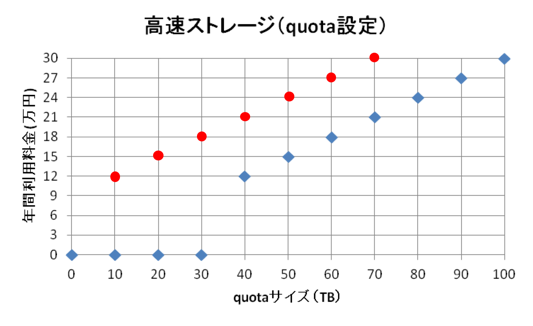

When you start using this service, check the [Acceptable Use Policy](../application/use_policy.md) and [Appendix for Rules of Use (table of charges)](./application/use_policy.md), [Download the usage plan table](./application/resource_extension.md), fill out the required information, and send an email to . After examining the purpose of use, we will send you a guide to permission to use the billing service.

Note: Depending on the congestion status of the NIG supercomputer, you may not be able to use this service.

The compute nodes and storage of the NIG supercomputer are roughly divided into two sections, the general analysis section and the personal genome analysis section. The following storage services are available in both sections.

## Large-scale use of high-speed storage (Quota setting only)

◯ Red dots: the price of the personal genomic analysis section  ◆Blue dots: the price of the general analysis section

- In the general analysis section of the NIG supercomputer, the total amount of quota setting per responsible person is free up to 30TB. Each user can apply in increments of 1TB up to 30T
- Apply in 10TB units. If a fraction appears in units of 10TB, it will be rounded up.
- Available capacity is best-effort only for quarter setting.

## Large-scale use of archive storage

- The price is the same for both the general analysis section and the individual genome analysis section of the NIG supercomputer.
- Apply in 10TB increments; any fractions of 10TB will be rounded up to the nearest 10TB.

## Note:

### About group quotas for storage

 For each responsible person, the total amount of high-speed storage 30TB or less is free. And groups are created for each responsible person. So there is a request to set quotas for each responsible person. If you wish, contact .

### About data sharing between groups by setting secondary groups, etc.

We also accept requests for settings that allow data sharing between groups. In that case, if the total of the bundled groups exceeds 30TB, you will be charged. Fees will be prorated according to the group quota. (In this case, note that the billing amount cannot be calculated using the "Usage TB" in the usage plan table.)

- For example, if Group A's high-speed storage quota setting is 25TB and Group B's high-speed storage quota setting is 10TB, 35TB will be rounded up to 40TB, so the 40TB fee of 111,112 yen (excluding tax) will be prorated 25:10.
