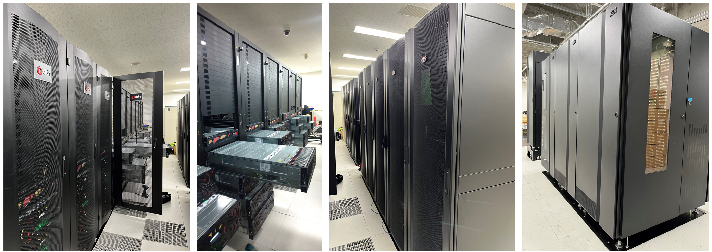

# NIG Supercomputer (2019 `=>` 2025)

The National Institute of Genetics (NIG) provides a cutting-edge supercomputer system equipped with large-scale cluster-based computation, large-scale shared memory computation, and high-capacity high-speed disk devices, serving as a large-scale computational infrastructure for information processing in life sciences and medical research.




:::warning
Due to limited disk capacity, the research institute does not back up data in users' home directories. Users are responsible for backing up their data.
:::


## Featured News {#featured-news}

:::danger Notice of Power Outage Due to Lightning Strike: Resumption of Supercomputer Service

[Due to the power outage caused by lightning around 13:40 on Friday, September 5, 2025, the NIG supercomputer had been out of service.](/blog/2025-09-08-blackout)  However, the login service was resumed at 12:00 on Tuesday, September 9, 2025. (For dedicated VMs that had not been confirmed to be running as of 12:00 on September 9, all of them were successfully restarted by 15:00 on Wednesday, September 10.)

- **[We shall be undertaking restoration work on the National Institute of Genetics' power supply equipment, which was impacted by a lightning strike, on 25th October 2025. Consequently, the NIG Supercomputer services will be temporarily unavailable from the evening of 24th October until the morning of 27th October. We sincerely apologise for any inconvenience this may cause and greatly appreciate your understanding.](/blog/2025-10-25-power-outage)**

:::


- [Supercomputer Service Suspension (24th–27th October 2025) Due to NIG Power Restoration Following 5th September Lightning Strike](/blog/2025-10-25-power-outage) (September 30, 2025) ＼ &#x1F195; ／
- [Notice of Discontinuation of Rhelixa Graphing Tool (RIAS Visualisation) by 31 October 2025](/blog/2025-09-29-news_Rhelixa-rias-visualisation-end-october-2025) (September 29, 2025) ＼ &#x1F195; ／
- [(Resolved) [Outage] SSH Connection Disruption on General Analysis Gateway Node on Tuesday, July 29, 2025](/blog/2025-07-29-ssh-failure_ga_gw) (July 29, 2025) 
- [(Restored) [Outage] Slurm Outage in General Analysis Division on Thursday, May 22, 2025](/blog/2025-05-22-Slurm_ga_maintenance) (May 22, 2025) 
- [(Ended) Network Maintenance due to Switchover to SINET6 on Wednesday, May 24, 2025](/blog/2025-05-24-network) (April 10, 2025)
- [Power Outage on April 7, 2025](/blog/2025-04-07-power-outage) (April 7, 2025)
- [Important Notices from the NIG Supercomputer: Third Term of 2024 (December–March)](/blog/2025-02-10-important_notice_2024_Dec-2025_Mar) (February 10, 2025) 
- [Announcement on Replacement to New Supercomputer](/blog/2024-12-05-supercomputer_replacement_announcement) (December 5, 2024) 
- [Extended Maintenance Period for Account Application System](/blog/2024-12-05-extened_account_system_maintenance) (December 5, 2024) 
- [Important Notices from the NIG Supercomputer: Second Term of 2024 (August–November)](/blog/2024-11-11-important_notice_2024_Aug-Nov) (November 11, 2024)
- [Maintenance of Account Application System](/blog/2024-10-25-account_system_maintenance) (October 25, 2024)
- [Important Notices from the NIG Supercomputer: First Term of 2024 (April–July)](/blog/2024-06-24-important_notice_2024_April-July) (June 24, 2024)


## Year-End Account Renewal Applications {#year-end-renewals}

The account application system is currently being revised for security enhancements, which is causing a delay in its reopening. Account renewal applications will be processed after the system is reopened. For 2024FY, account renewal for the supercomputer(2025) will be handled by the supercomputer administrator without use's application.


## Regular Maintenance in Fiscal Year 2025 {#2025-annual-maintenance}

The regular maintenance for fiscal year 2025 is scheduled around March 2026.


## Temporary Suspension of New Account Registrations for Large-Scale Users in General and Personal Genome Analysis Areas (May 13, 2022) {#registration-suspension}

Thank you for using the NIG supercomputer.

Due to the supercomputer's computational resources being highly constrained in terms of both CPU and disk, new account registrations for the following users will be temporarily suspended:

- Large-scale users in the general analysis area
- Users in the personal genome analysis area

The following applications will continue to be accepted:

- Additional resource usage requests for users who are already large-scale users in the general analysis area or personal genome analysis area.
- Regular user registrations for the general analysis area. In this case, disk usage is limited to an initial setting of up to 1TB.
- Applications for workshop usage will also continue to be accepted.

However, we ask for your understanding as it may not always be possible to meet your requests.

The resumption of new account registrations will be decided based on the availability of computational resources. Updates on the availability will be published on the homepage every four months. Prospective users are requested to refer to these updates and submit their usage plans in advance. Please note that the availability forecasts are not guaranteed, and requests may not always be fulfilled.


## Acknowledgements {#acknowledgement}

The activities of the NIG supercomputer system are evaluated through the acknowledgements received. If a paper utilizing this supercomputer system is accepted, please include an acknowledgement using the examples below.

Examples:

```
==============================================

<English Acknowledgement>
Computations were partially performed on the NIG supercomputer
at ROIS National Institute of Genetics.

==============================================

<Japanese Acknowledgement>
本研究は、情報・システム研究機構 国立遺伝学研究所が
有する遺伝研スーパーコンピュータシステムを利用しました。

================================================