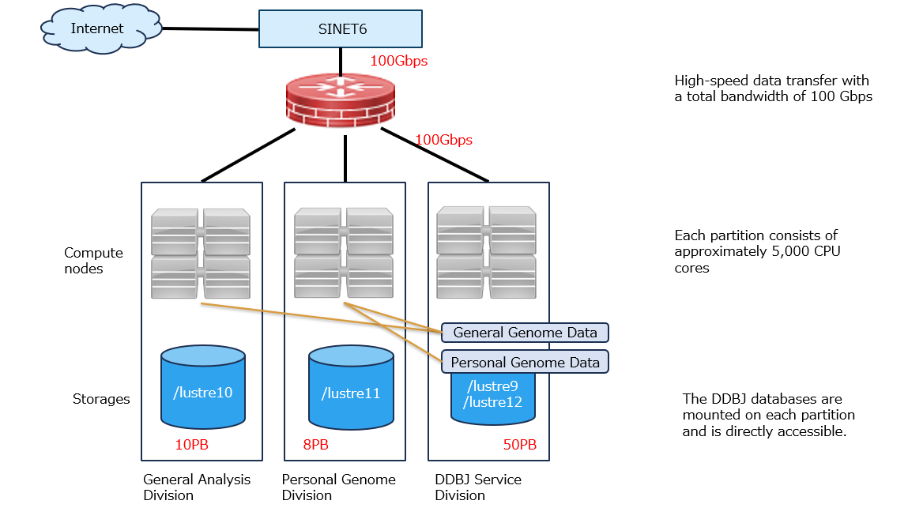
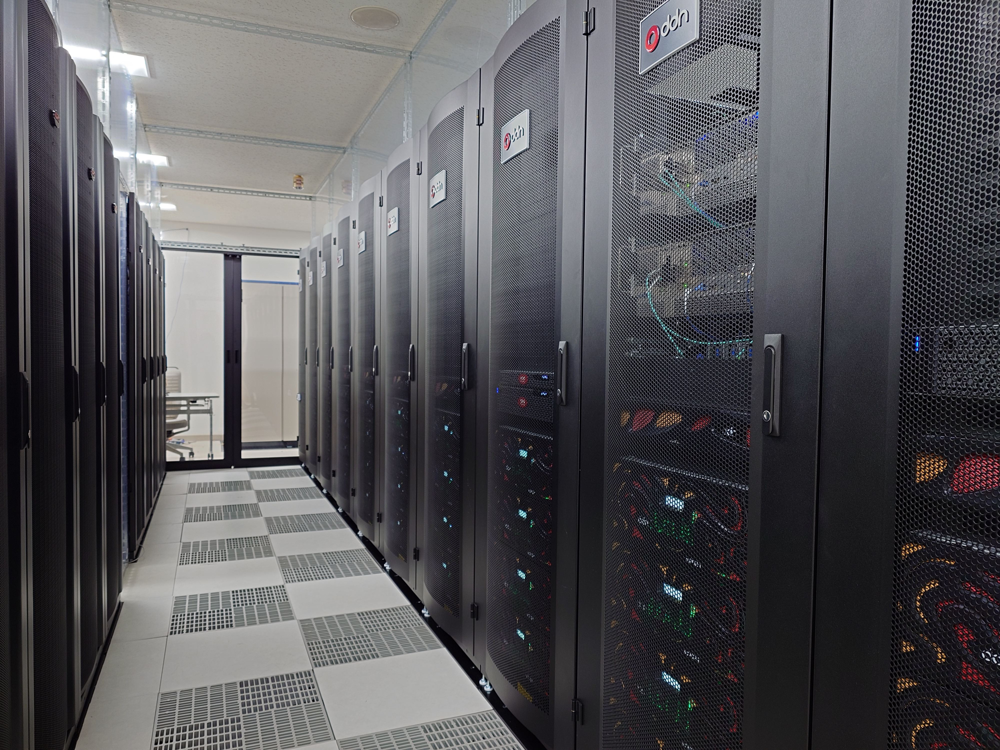

The NIG supercomputer system started its sixth phase of operation in March 2025.

This system is intended be used as a computational infrastructure for the construction of the international nucleotide sequence database, and will also be provided to a wide range of researchers both inside and outside the university as a computational infrastructure for research and education in the life sciences, with a focus on genetics, to strengthen the foundation of life and medical research in Japan and contribute to the development of new academic research.

- This system consists of a general analysis division, a personal genome analysis division and DDBJ operations division. The personal genome analysis division is a paid service that meets high security standards. (In principle, the NIG supercomputer can be used free of charge, but some additional services are available for a fee. )
<!-- [Click here for details](/application/billing_services). -->

- For the operation and analysis of life and medical databases, including the international nucleotide sequence database, we have a large storage system with a total capacity of 68PB, which enables to transfer a large amount of data to and from Japan via a high-speed network. (General analysis division: 10 PB, personal genome analysis division: 8 PB, DDBJ database: 50 PB)

- The network connection bandwidth to SINET6 has been upgraded from 40 Gbps to 100 Gbps.

- This system includes GPU-equipped nodes, which enable the latest AI analyses using the NVIDIA DGX B200, introduced first in Japan. Additionally, cost-effective computational nodes equipped with NVIDIA L40S and PEZY-SC3 for genome analysis have been installed. (The DGX B200 will begin operation on 1 June 2025, and the L40S began operations on 1 April 2025. The L40S offers genome analysis pipeline performance equivalent to the H100 at approximately one-third of the cost.)

- We are operating the Singularity container to facilitate the installation of genome analysis software and to ensure the reproducibility of the analysis. Currently, more than 2,000 types of genome analysis software are available in the Singularity container.

