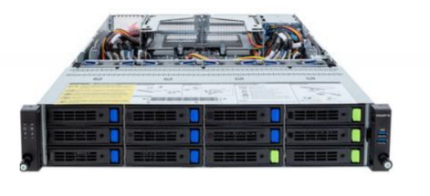
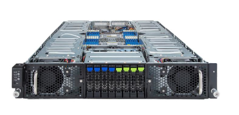

## Overview

<table>
<tbody>
<tr>
<th colspan="3">Classification</th>
<th>Specifications</th>
</tr>
<tr>
  <td rowspan="7">
  Compute Nodes
  </td>
  <td rowspan="2">
  HPC CPU optimized nodes

  Total number of CPU cores: 13,184 CPU 
  Total computing performance: 241.644 TFLOPS 
  Total memory capacity: 91.136 TB
  </td>
    <td>
    Type 1 
    AMD EPYC 9654 CPU 
    </td>
    <td>
    50 nodes 
    9,600 CPU cores 
    184.3 TFLOPS 
    76.8 TB total memory（8GB memory/CPU core）  
    </td>
    </tr>
    <tr>
    <td>
    Type 2 
    AMD EPYC 7702 CPU（Former Thin compute node Type 1b）
    </td>
    <td>
    28 nodes 
    3,584 CPU cores 
    57.344 TFLOPS 
    14.336 TB total memory（4GB memory/CPU core）
    </td>
    </tr>
     <tr>
  <td rowspan="2">

  Memory optimisation node 

  Total number of CPU cores: 960 
  Total computing performance: 18.0 TFLOPS 
  Total memory capacity: 21 TB

  </td>
  <td>
  Type 1 
  6TB memory installed
  </td>
  <td>

  2 nodes 
  384 CPU cores 
  7.2 TFLOPS 
  12 TB total memory（32GB memory/CPU core）

  </td>
  </tr>
  <tr>
  <td>
  Type 2 
  3TB memory installed
  </td>
  <td>

  3 nodes 
  576 CPU cores 
  10.8 TFLOPS 
  9 TB total memory（16GB memory/CPU core）

  </td>

  </tr>

    
  <tr>
  <td rowspan="3">
  Accelerator-optimised node
    </td>

      <td>
      Type 1 
      NVIDIA B200 on GPU 
      For AI computing
      </td>
      <td>
      4 nodes
      </td>
      </tr>

      <tr>
      <td>

      Type 2 
      GPU nodes for genome analysis
      

      </td>
      <td>
      3 nodes
      </td>
      </tr>
      <tr>
      <td>

      Type 3 
      Equipped with PEZY ZettaScaler3 as accelerator 
      For genome analysis
      </td>
      <td>
      
      2 nodes

      </td>
</tr>

<tr>
<td width="120" rowspan="3">
Storage

</td>
<td colspan="2">
Analysis storage 
For user home directories in the general analysis division and personal genome analysis division.
</td>
<td>
Lustre file system 
13.3PB
</td>
</tr>
<tr>
<td colspan="2">
Database storage 
For DDBJ database including DRA
</td>
<td>
Lustre file system 
40.5PB
</td>
</tr>
<tr>
<td colspan="2">
Tape equipment 
For backing up DDBJ databases
</td>
<td> 
15PB
</td>
</tr>

<tr>
<td colspan="3">
Inter-node interconnect network
</td>
<td>
InfiniBand HDR100 100Gbps fat tree  
For storage, full bi-division  
For compute nodes, 1/2 of full bi-section, but 400 Gbps full bi-section between accelerator-optimised node Type 1 
</td>
</tr>
</tbody>
</table>

## HPC CPU optimized nodes {#cpu-optimized-nodes}

### HPC CPU optimized nodes Type 1 (50 computers) {#cpu-optimizied-type-1}

Compute nodes with AMD EPYC 9654 processors.

**GIGABYTE R283-Z94** 

| component  | model number                                               | number of computation | performance per node, etc         |
|----------|---------------------------------------------------|------|--------------------------------|
| CPU      | AMD EPYC 9654 (96 cores)  Base 2.4GHz, Max 3.7GHz, 1.8TFlops |    2 | Total 192 cores, 3.6TFlops |
| Memory   | 64GB DDR5-4800                                    |   24 | Total 1536GB (8GB per CPU core) |
| Storage (OS)  | 1TB NVMe SSD                                 |    1 |                                |
| Storage (Data) | 30TB NVMe SSD                               |    1 |                                |
| Network  | InfiniBand HDR100                                 |    1 | 100Gbps                        |

 
### HPC CPU optimized node Type 2 (28 computers) {#cpu-optimized-type-2}

Compute nodes with AMD EPYC 7702 processors(This is the same as the former Thin compute node Type 1b)

**DELL PowerEdge R6525** 

| component |model number                                              | number of computation | performance per node, etc      |
|----------|-----------------------------------------------------------|-----------------------|--------------------------------|
| CPU      | AMD EPYC 7702 (64 cores)  Base 2.0GHz, Max 3.35GHz, 1.024TFlops |    2 | Total 128 ccores, 2.048TFlops     |
| Memory   | 32GB DDR4-2666                                     |   16 | Totak 512GB (4GB per CPU core) |
| Storage (OS)  | 1.6TB NVMe SSD                                |    1 |                                |
| Storage (Data) | 900GB SAS HDD                                |    1 |                                |
| Network  | InfiniBand 4xEDR                                   |    1 | 100Gbps                        |

## Memory optimisation node {#memory-optimized-nodes}

### Memory optimisation node (2 computers) {#memory-optimized-type-1}

This is a compute node with 6 TB of memory per computer.

**GIGABYTE R283-ZK0-AAL1** 

| component |model number                                       | number of computation | performance per node, etc      |
|----------|---------------------------------------------------------|------|-------------------------------------|
| CPU      | AMD EPYC 9654 (96 cores) Base 2.4GHz, Max 3.7GHz, 1.8TFlops  |    2 | Total 192 cores, 3.6TFlops          |
| Memory   | 128GB DDR5-4800                                         |   48 | Total 6.144 TB (32GB per CPU core) |
| Storage  | 30TB SATA HDD                                           |    1 | 30TB                                |
| Network  | InfiniBand HDR100                                       |    1 | 100Gbps                             |

### Memory optimisation node Type 2 (3 computers) {#memory-optimized-type-2}

It is a compute node with 3TB of memory in one computer.

**GIGABYTE R203-Z94-AAD2** 

| component |model number                                       | number of computation | performance per node, etc      |
|----------|---------------------------------------------------------|------|-------------------------------------|
| CPU      | AMD EPYC 9654 (96 cores) Base 2.4GHz, Max 3.7GHz, 1.8TFlops  |    2 | Total 192 cores, 3.6TFlopw          |
| Memory   | 128GB DDR5-4800                                         |   24 | Total 3.072TB (16GB per CPU core) |
| Storage  | 30TB SATA HDD                                           |    1 | 30TB                                |
| Network  | InfiniBand HDR100                                       |    1 | 100Gbps                             |

## Accelerator-optimised node {#accelerator-optimized-nodes}

### Accelerator-optimised node Type 1 (4 computers) {#accelerator-optimized-type-1}

It is a compute node equipped with eight NVIDIA B200 GPUs per node. It is a GPU-equipped compute node suitable for AI computations.

**NVIDIA DGX B200** 

<table border="0">
<tr><td width="300">

</td></tr>
</table>

| component | model number                                                    | number of computation | performance per node, etc          |
|----------|---------------------------------------------------------|------|---------------------------------|
| CPU      | Intel Xeon Platinum 8570 (56 cores) Base 2.1GHz, Max 4.0GHz, 1.97TFlops |    2 | Total 112 cores, 3.94TFlops      |
| Memory   | 合計2TB                                                   |    | Total 2TB (17.9GB per CPU core) |
| GPU      | NVIDIA Blackwell B200                                     |    8 |                                 |
| Storage (OS) | 1.9TB NVMe SSD                                        |    2 | Total 3.8TB                        |
| Storage (Data) | 3.84TB NVMe SSD                                     |    8  | Total 30.7TB                       |
| Network  | InfiniBand NDR                                            |    1 | 400Gbps                         |

### Accelerator-optimised node Type 2 (3 computers){#accelerator-optimized-type-2}

The calculation node equipped with 8 NVIDIA L40S GPUs per node, which offers high performance in terms of cost-to-FP32 ratio, is suitable for genome analysis.

**GIGABYTE G293-Z42-AAP1** 

| component | model number                                                    | number of computation | performance per node, etc          |
|----------|---------------------------------------------------------|------|---------------------------------|
| CPU      | AMD EPYCTM 9334 (32 cores) Base 2.7GHz, Max 3.9GHz, 1.38TFlops |    2 |  Total 64 cores, 2.76TFlops      |
| Memory   | Total 768GB                                                   |    | Total 768GB (12GB per CPU core) |
| GPU      | NVIDIA Ada Lovelace L40S                                     |    8 |                                 |
| Storage (OS) | 480GB SATA SSD                                        |    2 | Total 960GB (480GB per one node(RAID1))                       |
| Storage (Data) | 3.84TB NVMe SSD                                     |    4  | Total 15.36TB                       |
| Network  | InfiniBand NDR200  200Gbps                                            |    2 | 400Gbps                         |

### Accelerator-optimised node Type 3 (2台) {#accelerator-optimized-type-3}

This node is equipped with the PEZY-SC3 accelerator. It is a compute node suitable for genome analysis computations.

**PEZY ZettaScaler3.0** 

| component | model number                                                    | number of computation | performance per node, etc          |
|----------|---------------------------------------------------------|------|---------------------------------|
| CPU      | AMD EPYC 7713P (64 cores) Base 2.0GHz, Max 3.67GHz, 1.02TFlops      |    1 | Total 64 cores, 1.02TFlops   |
| Memory   | 128GB DDR4 3200MHz                                      |   16 | Total 2TB (32GB per CPU cores) |
| Accelerator | PEZY-SC3                                             |    4 |                                 |
| Storage (OS) | 0.256TB NVMe SSD                                      |    2 | Total 0.512TB                        |
| Storage (Data) | 4TB NVMe SSD                                   |    4  | Total 16TB                       |
| Network  | InfiniBand HDR100                                        |    1 | 100Gbps                         |

### (Appendix) GPU and Accelerator Performance Comparison {#gpu-and-accel-perf-comparison}

| Accerelater  | NVIDIA V100 | NVIDIA A100 | NVIDIA L40S | NVIDIA H100 | NVIDIA B200 | PEZY-SC3 | 
|--------------|-------------|-------------|-------------|-------------|-------------|----------|
| Benchmark Run Time of GATK Compatible Software [hh:mm:ss] | 3:07:29 | 2:06:14 | 1:45:05 | 1:56:24 | N/A    | 1:02:55      |
| Architecture | Volta       | Ampere      | Ada Lovelace| Hopper      | Blackwell   | PEZY     |
| Memory size [GB]       | 16 or 32 | 40 or 80 | 40         | 80 or 94   | N/D         |  32      | 
| Memory bandwidth [GB/s] | 900 | 2039 | 864         | 3352        | N/D         | 1200     |
| FP64 [TFlops]        | 7.8   | 9.7       | N/A         | 33.5        | N/D         | 19.66    |
| FP32 [TFlops]        | 15.7  | 19.5      | 91.6        | 66.9        | N/D         | 39.32    |
| FP16,BF16 [TFlops]   | 112   | 624       | 733         |  1979       | N/D         | 78.64    |
| FP8 [TFlops]         | N/A | N/A         |  1466       |  3958       | N/D         | N/A      |
| TF32 tensor core [TFlops] | 125     | 312         | 366         | 989         | N/D         | N/A      |
| FP16 tensor core [TFlops] | N/A     | 624         | 733         | 1979        | N/D         | N/A      |
| FP8  tensor core [TFlops] | N/A     | N/A         | 1466        | 3958        | N/D         | N/A      |
| INT8 tensor core [TOPS] | N/A     |  1248 | 1466       | 3958        | N/D         | N/A      |

- N/A : Not Available, N/D : Not Disclosed
- Benchmark run times for GATK compatible software is the computing time when using the NA18945 sample from [the 1KGP 30x data set](https://www.internationalgenome.org/data-portal/data-collection/30x-grch38). For more details on the benchmark, check [the Benchmark(NVIDIA Parabriks) page on our website](https://sc.ddbj.nig.ac.jp/advanced_guides/benchmark_parabricks).

## Storage {#storage}

### Analysis storage {#analysis-storage}

| Usage                      |  Capacity |  Peak Performance | Configuration                                             |
|--------------------------|-------|-----------|--------------------------------------------------|
| home directories in the general analysis division      | 10PB | read 60GB/sec, write 70GB/sec | DDN ES400NVX2 + DDN SS9024 |
| home directories in the personal genome analysis division | 8PB  | read 40GB/sec, write 40GB/sec | DDN ES400NVX2 + DDN SS9024 |

### Database storage {#database-storage}

| Usage                      |  Capacity |  Peak Performance | Configuration                                             |
|------------------|-------------------|------------|--------------------------------------------------|
| DDBJ database storage       |  40PB             | read 150GB/sec, write 150GB/sec   | DDN ES400NVX2 + DDN SS9024 |
| DDBJ database storage       |  10PB             | read 60GB/sec, write 70GB/sec | DDN ES400NVX2 + DDN SS9024 |

