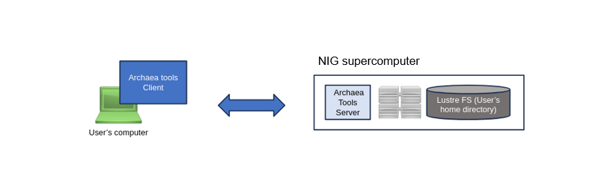

To upload and download files to and from the NIG supercomputer, you can generally use widely-used file transfer software such as `scp` or `sftp`. However, these tools tend to experience slower transfer speeds when transferring large files over long distances.

Archaea tools, developed by Clalink Technology, Inc., enable high-speed communication at 100 Gbps even over long-distance connections.


Reference

- For official manuals, [&#x1f517;see the official Bytix page 'Documents'](https://support.bytix.tech/document/).
- For the latest version, [&#x1f517;refer to the Bytix official page 'Download "latest version"'](https://support.bytix.tech/latest/).
- [FAQ Archaea tools(formerly HCPtools)](/guides/FAQ/faq_software/faq_archaea_tools/)


## Overview of Usage Steps

To transfer data using Archaea tools, follow the steps below:

1. Install the Archaea client software on your local machine  
2. Place the provided configuration file
3. Execute the data transfer command to upload or download your files


## Installing the client software {#install-client-software}

On the NIG supercomputer, Archaea tools can be used to transfer data between the user's local machine and the supercomputer.

To use Archaea tools, you need to install the client software on your client machine which is the machine that communicates with the NIG supercomputer (typically, your personal computer).



Refer to the following official documentation for installation instructions, depending on your operating environment.
- [&#x1f517;Mac OS](https://support.bytix.tech/docs/archaea/tools/1.5_en/B_setup_client/B02_macOS/)
- [&#x1f517;Windows](https://support.bytix.tech/docs/archaea/tools/1.5_en/B_setup_client/B01_Windows)
- Linux (including for Windows WSL2 environments)
    - [&#x1f517;Ubuntu Linux](https://support.bytix.tech/docs/archaea/tools/1.5_en/B_setup_client/B04_Ubuntu)
    - [&#x1f517;RedHat Linux 7](https://support.bytix.tech/docs/archaea/tools/1.5_en/B_setup_client/B03_RHEL)


## How to setup the configuration file {#setup-configfile}

To transfer data to and from the NIG supercomputer, you need to place a configuration file for Archaea tools (formerly HCPtools) in the home directory of your client machine.

:::Info
Instructions on how to write the configuration file can be found in the official documentation at the following link. 
for the most up-to-date information, refer to the official documentation.

- https://support.bytix.tech/docs/archaea/tools/1.5/G_configurationRef/G03_conffile_client

:::

Since there are many configuration files and manual setup can be complex,  
we recommend cloning the pre-configured settings for the NIG supercomputer from GitHub to your client machine’s home directory using `git clone`. (Do not place the configuration files in your home directory of NIG supercomputer.)


Linux (including for Windows WSL2 environments)
```
cd $HOME
git clone https://github.com/nig-sc/Bytix_Archaea/ .hcp
```

Mac OS
```
cd $HOME
git clone https://github.com/nig-sc/Bytix_Archaea/ .hcp
```

Windows (PowerShell)
```
cd $HOME
git clone https://github.com/nig-sc/Bytix_Archaea/ _hcp
```

The following files are created when you git clone.

```
$ tree .hcp
.hcp
├── README.md
├── hchmod.conf
├── hchown.conf
├── hcp-common.conf
├── hcp-ls.conf
├── hcp.conf
├── hln.conf
├── hmkdir.conf
├── hmv.conf
├── hpwd.conf
├── hrm.conf
└── hsync.conf

1 directory, 12 files
```

Next, add the **absolute path** to your private key (used when logging into the NIG supercomputer)  
to the configuration file `hcp-common.conf` as shown below:

`hcp-common.conf` (macOS)
```
PrivateKeyFile /Users/youraccount/.ssh/id_ed25519    # Specify the private key
AcceptableCryptMethod   PLAIN                # Encryption: None
AcceptableDigestMethod  SHA256               # Digest format: SHA256
DisableDataIntegrityChecking yes             # Allow no digest format
```

`hcp-common.conf` (Windows PowerShell)
```
PrivateKeyFile C:\Users\youraccount\.ssh/id_ed25519    # Specify the private key
AcceptableCryptMethod   PLAIN                # Encryption: None
AcceptableDigestMethod  SHA256               # Digest format: SHA256
DisableDataIntegrityChecking yes             # Allow no digest format
```

`hcp-common.conf` (Linux)
```
PrivateKeyFile /home/youraccount/.ssh/id_ed25519    # Specify the private key
AcceptableCryptMethod   PLAIN                # Encryption: None
AcceptableDigestMethod  SHA256               # Digest format: SHA256
DisableDataIntegrityChecking yes             # Allow no digest format
```


## The file transfer with Archaea tools(formerly HCPtools){#filetransfer-archaeatools}

### Upload files to the NIG supercomputer {#upload}


To transfer files from your local machine to the NIG supercomputer,  
launch a terminal emulator on your client machine and execute the following command:

```
hcp --user youraccountname --hpfp \
   your_file.txt \
   dtn1.ddbj.nig.ac.jp:/home/your_account/
```

### Download files from the NIG supercomputer {#download}

To transfer files from the NIG supercomputer to your local machine,  
launch a terminal emulator on your client machine and execute the following command:

If you would like to transfer a file with the same name as on the supercomputer to the current directory on your local machine (represented by the final `.` in the command), use the following:

```
hcp --user youraccountname --hpfp  \
    dtn1.ddbj.nig.ac.jp:/home/your_account/your_file.txt \
    .
```

To recursively copy an entire directory from the NIG supercomputer to the current directory on your local machine (represented by the final `.` in the command),  
add the `-R` option as shown below:

```
hcp -R --user youraccountname --hpfp  \
    dtn1.ddbj.nig.ac.jp:/home/your_account/data_dir \
    .
```


### NOTE. {#note}

For the first time when you transfer data, the following message will be displayed. Enter yes.

```
Are you sure you want to continue connecting [yes/no] ?
```


## Frequently used options for file transfer {#options}

For more information of options, refer to [&#x1f517;the official manual](https://support.bytix.tech/document/).


- `--hpfp` : Specify UDP (HpFP2) communication to speed up communication over long distances
    - Without this option, TCP communication ehich uesd usually widely is performed.
- `-p` : preserve information about file permission
- `-R` : copy all files under each directory, recursively
- `-r` : resume the previous copy
    - For more information, see [[the command reference]](https://support.bytix.tech/docs/archaea/tools/1.5_en/D_commandRef/D01_hcp#r-resume).
- `-y` : verify blocks of data transfered by message digest
- `-z` : compress blocks of data transfered


## Other Commands {#other-commands}


| command  | feature                                          |
|----------|--------------------------------------------------|
| `hrm`    | delete files on the server                       |
| `hcp-ls` | list files on the server                         |
| `hmkdir` | create directories on the server                 |
| `hpwd`   | retrieve the working directory on the server     |
| `hmv`    | move files on the server                         |
| `hlm`    | create symbolic links, etc. on the server        |
| `hchmod` | change the file's permission on the server       |
| `hchown` | change the file's owner on the server            |
| `hsync`  | synchronize files on the server                  |

For more information, refer to [&#x1f517;the official manual](https://support.bytix.tech/document/).


[def]: https://support.bytix.tech/docs/archaea/tools/1.5_en/D_commandRef/D01_hcp#r-resume
