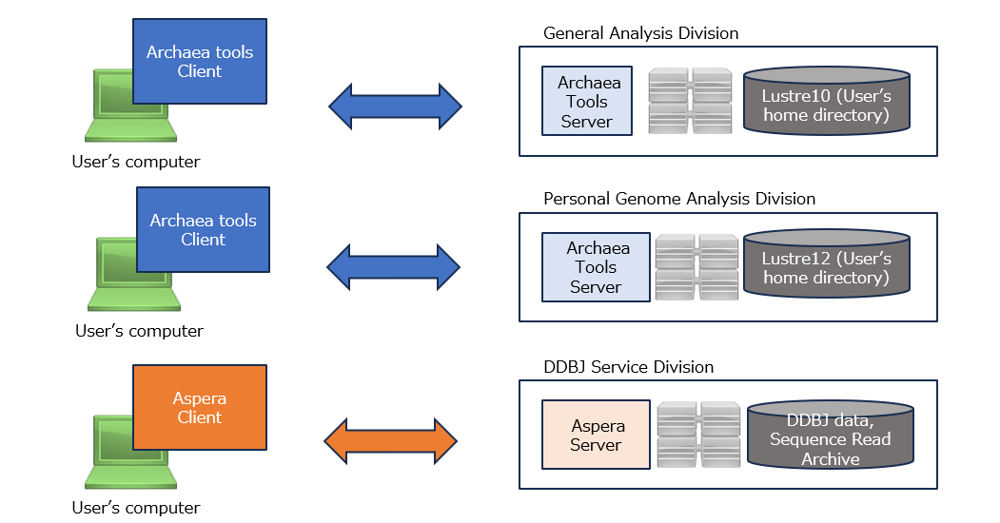
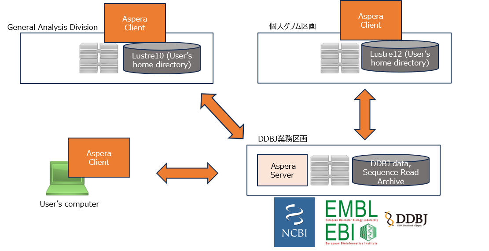

In addition to commonly used protocols such as SCP and SFTP, the NIG supercomputer also supports Aspera and Archaea tools, which are optimized for large-scale data transfers over long distances.

- Aspera can be used to download data from sources such as NCBI, EBI, and DDBJ to the NIG supercomputer or to users’ personal computers. The total transfer bandwidth is limited to 10 Gbps across the entire NIG supercomputer.
- Archaea tools are available for transferring data between the user’s home directory on the supercomputer and their personal computer. There is no bandwidth limitation due to licensing.

The NIG supercomputer is currently connected to SINET6 at 100 Gbps.
**Using Archaea tools allows users to take full advantage of the NIG supercomputer’s high-speed network.**


Since Aspera Server is not installed in the general analysis division and the personal genome analysis division, users cannot upload or download data via Aspera from their computers. If you need to transfer data from your computer to those division, please use Archaea Tools.




 On the other hand, if you install ascp (Aspera client) in the general analysis division and the individual genome area, you will be able to upload and download data via Aspera from DDBJ, NCBI, and EBI.




## How to Use Archaea Tools {#usage-archaea}

Preparing content...

## How to Use Aspera {#usage-aspera}

Aspera is a commercial software solution designed for efficient transfer of large files.  
Its key features include minimal degradation of transfer speed, particularly when communicating over long distances, and the ability to achieve transfer speeds very close to the theoretical bandwidth, provided it is properly tuned. On the NIG supercomputer, an Aspera server with a total bandwidth cap of 10 Gbps is available.  
(Note: The overall bandwidth of the NIG network is 100 Gbps.)


### Aspera Usage Guide

For example, to download `SRR1448774.fastq.gz` (2.7GB) from the EBI server, execute the following command:

```
apptainer exec ./ascp3_ubuntu22.sif ~/.aspera/connect/bin/ascp -P33001 -i ~/.aspera/connect/etc/asperaweb_id_dsa.openssh era-fasp@fasp.sra.ebi.ac.uk:/vol1/fastq/SRR144/004/SRR1448774/SRR1448774.fastq.gz /path/to/download_dir/
```

Here is an example of executing the command:

```
you@a001:~/path/to/workdir/apptainer_ascp3 (2025-04-22 16:54:17)
$ apptainer exec ./ascp3_ubuntu22.sif ~/.aspera/connect/bin/ascp -P33001 -i ~/.aspera/connect/e
tc/asperaweb_id_dsa.openssh era-fasp@fasp.sra.ebi.ac.uk:/vol1/fastq/SRR144/004/SRR1448774/SRR1448774.fastq.gz /path/to/download_dir/
tc/asperaweb_id_dsa.openssh era-fasp@fasp.sra.ebi.ac.uk:/vol1/fastq/SRR144/004/SRR1448774/SRR1448774.fastq.gz $HOME/works/
you@a001:~/path/to/workdir/apptainer_ascp3 (2025-04-22 16:57:55)
$
```

For a detailed explanation of the options and usage, refer to [Software > CopyTool > How to Use Aspera client(ascp)](/guides/software/CopyTool/aspera_client/).


## To transfer files with SSH protocol (scp, sftp)

You can use `scp`, `sftp`, etc. to transfer files to the gateway server (`gw.ddbj.nig.ac.jp`) of the general analysis division of the NIG supercomputer.

Example on Linux and Mac:

In this state, to `scp` the `your_file.txt` file in the current directory to the NIG supercomputer, execute the following command. 

`you` is the account name of the NIG supercomputer.


```
scp your_file.txt you@gw.ddbj.nig.ac.jp:/home/you
```

Example on Windows (PowerShell): 

1. At first, start PowerShell. Then, by default, PowerShell starts with your home directory in Windows as the current directory ("youwin" is your Windows user name). Execute the following command to check that the SSH private key is in the following location. In this case, the SSH private key is the `id_rsa` file.

```
PS C:\Users\youwin> ls .ssh


    Directory: C:\Users\youwin\.ssh


Mode                 LastWriteTime         Length Name
----                 -------------         ------ ----
-a----        2023/11/28     16:18            160 config
-a----        2022/11/01     16:33           1766 id_rsa
-a----        2024/01/22     12:44           4885 known_hosts
-a----        2024/01/22     12:41           5453 known_hosts.old
```

2. In this state, to scp the `your_file.txt` file in the download folder to the NIG supercomputer, execute the following command. 

`you` is the account name of the NIG supercomputer.

```
PS C:\Users\youwin> scp .\Downloads\your_file.txt
you@gw.ddbj.nig.ac.jp:/home/you
```
