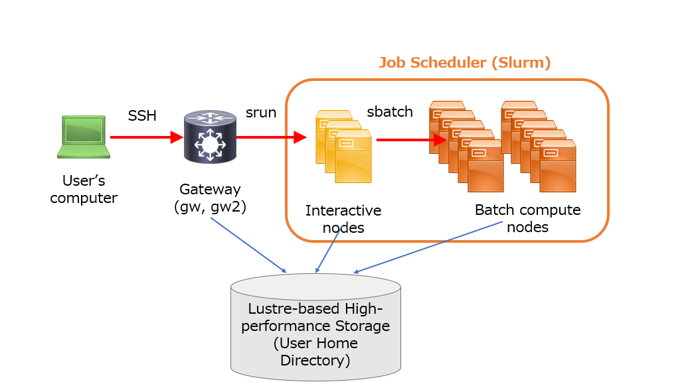

## System configuration of the general analysis division

The general analysis division of NIG supercomputer is a cluster configuration of bundling of many computers called nodes.

A job scheduler is a program that assigns an appropriate computer on a cluster computer system to a computation request from a user. Starting with the 2025 system,　the NIG supercomputer has adopted Slurm, a job scheduler that is now widely used across a broad range of research disciplines.　For more details, please refer to [How to use Slurm](/guides/software/JobScheduler/Slurm/).

All nodes managed by Slurm mounts a Analysis storage system (Lustre FS) and users' home directories are equally accessible from all nodes.

