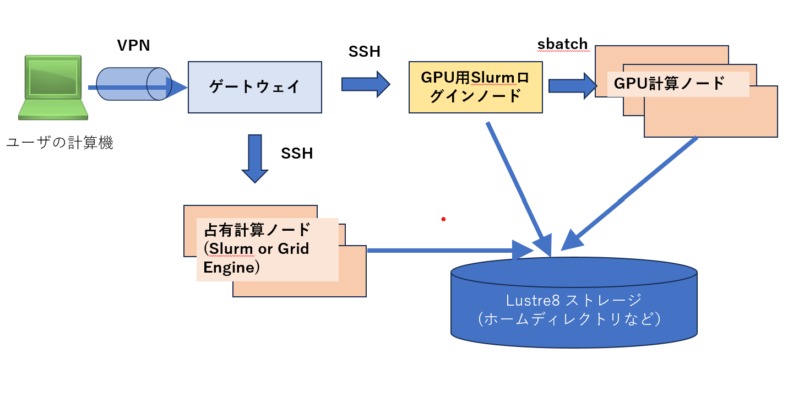

The Accelerator-Optimized Node Type 2 is a compute node equipped with eight NVIDIA L40S GPUs per node.

The NVIDIA L40S offers excellent FP32 performance for its price, making it well-suited for genome analysis.

Although it has less memory than GPUs designed for AI, it can still be used for AI workloads including Alphafold3.

:::info Reference: GPU and Accelerator Performance Comparison

| Accelerator                                           | NVIDIA V100 | NVIDIA A100 | NVIDIA L40S  | NVIDIA H100 | NVIDIA B200 | PEZY-SC3 |
| ----------------------------------------------------- | ----------- | ----------- | ------------ | ----------- | ----------- | -------- |
| GATK-Compatible Software Benchmark Time $$hh\:mm\:ss] | 3:07:29     | 2:06:14     | 1:45:05      | 1:56:24     | N/A         | 1:02:55  |
| Architecture                                          | Volta       | Ampere      | Ada Lovelace | Hopper      | Blackwell   | PEZY     |
| Memory Size $$GB]                                     | 16 or 32    | 40 or 80    | 40           | 80 or 94    | 192         | 32       |
| Memory Bandwidth $$GB/s]                              | 900         | 2039        | 864          | 3352        | 8,000       | 1200     |
| FP32 $$TFlops]                                        | 15.7        | 19.5        | 91.6         | 66.9        | 80          | 39.32    |
| TF32 Tensor Core $$TFlops]                            | 125         | 312         | 366          | 989         | 2,200       | N/A      |

- N/A: Not Available, N/D: Not Disclosed
- Benchmark times are based on the 1KGP 30x dataset (NA18945 sample) available at [https://www.internationalgenome.org/data-portal/data-collection/30x-grch38](https://www.internationalgenome.org/data-portal/data-collection/30x-grch38).
  For details, see the benchmark page [here](https://sc.ddbj.nig.ac.jp/advanced_guides/benchmark_parabricks).

:::

## Applying for Access

Currently, due to the limited number of available GPU nodes, they are installed in the *Personal Genome Analysis* section.
Even if your analysis does not involve personal genome data, you are required to create an account in this section and submit a usage plan.

## Logging into the Interactive Node {#logging-ininteractive-node}

Due to the especially limited number of GPU nodes, we ask users to prioritize efficient use of these systems by submitting jobs via a dedicated GPU Slurm job scheduler.

To submit jobs to this Slurm partition, log in via SSL-VPN to the *Personal Genome Analysis* gateway, then run the following command to log into the GPU-exclusive Slurm interactive node:

```
ssh at022vm02
```



## Submitting Jobs to Slurm {#submit-job-to-slurm}

To run a job using the L40S GPU, specify the following Slurm options:

- `--partition=l40s --account=l40s`: Specifies the L40S GPU partition
- `--gres=gpu:N`: Number of GPUs to use (where `N` can be from 1 to 8)

### Creating a Job Script

Here is a simple test script to check the GPU status. Save it with any file name (e.g., `gputest.sh`):

```bash
#!/usr/bin/bash
# Simple GPU test script

nvidia-smi
```

### Submitting the Job with sbatch

To run `gputest.sh` using one GPU, use the `sbatch` command like this:

```bash
you-pg@at022vm02:~$ sbatch --partition=l40s --account=l40s --gres=gpu:1 gputest.sh
Submitted batch job 228259
```

### Checking the Results

Once the job finishes, a file named `slurm-<jobID>.out` will be created in your current directory. You can confirm that the job ran successfully on a GPU node by checking its content:

```bash
you-pg@at022vm02:~$ cat slurm-228259.out
Tue Jun  3 14:13:25 2025
+-----------------------------------------------------------------------------------------+
| NVIDIA-SMI 570.124.06             Driver Version: 570.124.06       CUDA Version: 12.8  |
|-----------------------------------------+------------------------+----------------------+
| GPU  Name                 Persistence-M | Bus-Id          Disp.A | Volatile Uncorr. ECC |
| Fan  Temp   Perf          Pwr:Usage/Cap |           Memory-Usage | GPU-Util  Compute M. |
|                                         |                        |            MIG M.     |
|=========================================+========================+======================|
|   0  NVIDIA L40S                    On  |   00000000:25:00.0 Off |                 0     |
| N/A   35C    P8             33W /  350W |       1MiB /  46068MiB |   0%      Default     |
+-----------------------------------------+------------------------+----------------------+

+-----------------------------------------------------------------------------------------+
| Processes:                                                                              |
|  GPU   GI   CI              PID   Type   Process name                        GPU Memory |
|        ID   ID                                                             Usage        |
|=========================================================================================|
|  No running processes found                                                           |
+-----------------------------------------------------------------------------------------+
```

This output confirms that the job was successfully executed on a GPU node.


