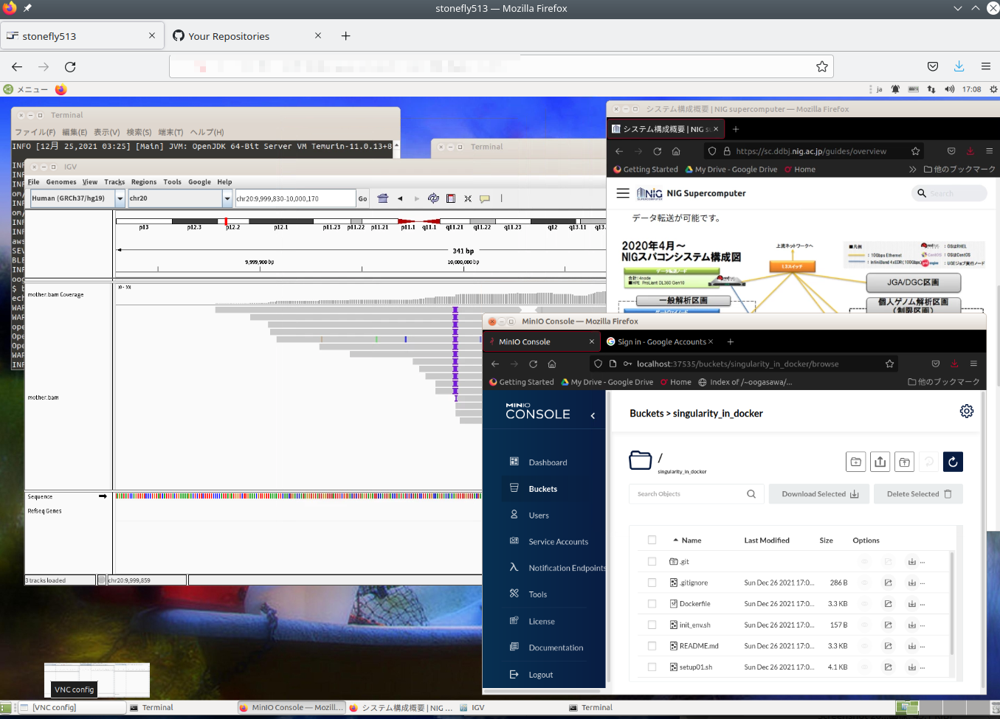
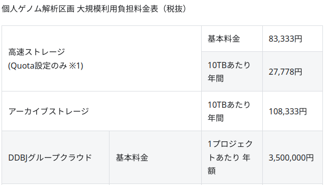

DDBJ Group Cloud is a service for sharing data that requires access restrictions, including personal genome data, within a research group.

- OwnCloud or MinIO can be used to fine-tune database access permissions rights.
  - [OwnCloud Official Website](https://owncloud.com/)
  - [MinIO Official Website](https://min.io/)

- In combination with Remote Desktop, downloading of data to the user's client computer can be prohibited. (Please indicate the amount of compute resources you want to use in the the Extended Service Usage Plan submitted at the time of application.)
    - The remote desktop environment is used from the web browser of the user's computer (e.g. Windows or Mac).
    - Data sharing is also possible by accessing the data sharing middleware (MinIO or OwnCloud shown in the window at the bottom right of the screen) on the Linux desktop. Data download from the data sharing middleware to the user's computer can be configured to be possible or not by the default settings of the environment.
    - Analysis calculations can be performed using a GUI environment on a Linux desktop.
    - By adding computation nodes, jobs can be run using the job scheduler from a terminal emulator in the Linux environment running on the remote desktop.

## How to apply for use

 When using the service, check the Terms of Use and the separate table of Terms of Use (fee schedule), download [the Extended Service Usage Plan](/application/resource_extension), fill in the required information, and send it to  by e-mail.  After reviewing the purpose of use, we will send you an invitation to use the billing service. Please note that this service may not be available depending on the congestion of the NIH's supercomputer.

- [Supercomputer(2025) Terms of Use and the separate table of Terms of Use (fee schedule) ](/application/terms_and_policies/terms_of_use_2025)

## Usage Fees

In addition to the storage usage fee, a separate basic fee of 3.5 million yen will be charged for security monitoring and other management purposes.

Excerpt from the separate table of usage rules (fee schedule).

If you use a remote desktop or compute nodes, node charges apply.
For details, check Terms of policy Appendix (Price list).

- [Supercomputer(2025) Terms of Use](/application/terms_and_policies/terms_of_use_2025)
