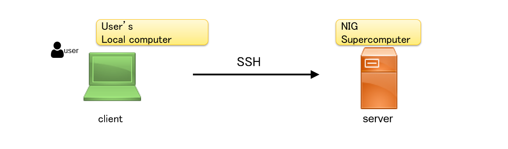

## &#x1F180; Causes and Solutions for the SSH "Permission denied (publickey)" Error {#error-pubkey-auth}

- "Client" means the user's local computer.
- "Server" means the RIKEN supercomputer.

The relationship between the client and server is shown in the diagram below.



&#x1F150; 

### Check File Permissions (for client machines using Linux, macOS, or Windows WSL)

Please refer to the table below to ensure that file permissions are correctly configured on both the client side (your local computer) and the server side (the NIG supercomputer).

<table cellpadding="6" cellspacing="0">
  <thead>
    <tr>
      <th>Path (Example)</th>
      <th>Purpose</th>
      <th>Permission</th>
      <th>Notes</th>
    </tr>
  </thead>
  <tbody>
    <tr>
      <td>/home/USERNAME/</td>
      <td>Home directory</td>
      <td>750, 711, or 700</td>
      <td>The home directory must not be writable by others. This applies on both the client and server sides.</td>
    </tr>
    <tr>
      <td>~/.ssh/</td>
      <td>Directory for SSH keys and configuration files</td>
      <td>700</td>
      <td>Required on both the client and server sides.</td>
    </tr>
    <tr>
      <td>~/.ssh/id_ed25519<br />(or id_rsa)</td>
      <td>Private key</td>
      <td>600</td>
      <td>Should exist only on the client side. Do not store this on the server.</td>
    </tr>
    <tr>
      <td>~/.ssh/authorized_keys</td>
      <td>List of authorised public keys</td>
      <td>600</td>
      <td>Contains public keys allowed to connect to the server. Exists only on the server side.</td>
    </tr>
    <tr>
      <td>~/.ssh/known_hosts</td>
      <td>Stores known host keys of SSH servers</td>
      <td>600 or 644</td>
      <td>Exists only on the client side. Not needed on the server.</td>
    </tr>
  </tbody>
</table>

#### How to Check Permissions (1): Using the `stat` Command

The `stat` command can be used to display file permissions in numeric format.

```
stat -c "%a %n" your-file
```

Example Output:

```
you@MINIPC:~ (2025-05-05 14:07:49)
$ stat -c "%a %n" ~/.ssh
700 /home/you/.ssh
you@MINIPC:~ (2025-05-05 14:08:06)
$ stat -c "%a %n" ~/.ssh/*
600 /home/you/.ssh/authorized_keys
664 /home/you/.ssh/config
600 /home/you/.ssh/id_ed25519
644 /home/you/.ssh/id_ed25519.pub
600 /home/you/.ssh/id_rsa
644 /home/you/.ssh/id_rsa.pub
600 /home/you/.ssh/known_hosts
```

#### How to Check Permissions (2): Using `ls -l`

You can also use the commonly used `ls` command to display file permissions when listing files.

The `rwx` symbols represent access rights and correspond to the following numeric values:
- `r` (read) = 4  
- `w` (write) = 2  
- `x` (execute) = 1

The sum of these values gives the numeric permission.  
For example:
- `rwx------` corresponds to `700`
- `rw-r--r--` corresponds to `644`

Example Output:


```
🎯 you@MINIPC:~ (2025-05-05 14:08:37)
$ ls -l ~/.ssh
合計 80
-rw------- 1 you you     0  4月 10 18:21 authorized_keys
-rw-rw-r-- 1 you you  1373  5月  5 13:37 config
-rw------- 1 you you   419  5月  2 07:52 id_ed25519
-rw-r--r-- 1 you you   105  5月  2 07:52 id_ed25519.pub
-rw------- 1 you you  1766  3月 14 14:09 id_rsa
-rw-r--r-- 1 you you   105  3月 14 14:09 id_rsa.pub
-rw------- 1 you you 10368  5月  2 08:05 known_hosts
```

- "USERNAME" means the user's account name.
- SSH logs can be checked in `/var/log/auth.log` or by using `journalctl -u ssh`.


### 2. Key Pair Mismatch

Make sure the private key on the client (`id_rsa`, etc.) matches the public key listed in the server's `authorized_keys`. SSH authentication will fail if the key pair doesn't match.

### 3. Check the Username

Verify that you're using the correct username (`USERNAME`) when attempting to connect via SSH.


## &#x1F180; When I log in to SSH, I get the error "WARNING: REMOTE HOST IDENTIFICATION HAS CHANGED!" {#error-ssh-login}

&#x1F150; When you try to log in to the NIG supercomputer, the following message may appear and you may not be able to log in.

```
$ ssh gw.ddbj.nig.ac.jp
@@@@@@@@@@@@@@@@@@@@@@@@@@@@@@@@@@@@@@@@@@@@@@@@@@@@@@@@@@@
@       WARNING: POSSIBLE DNS SPOOFING DETECTED!          @
@@@@@@@@@@@@@@@@@@@@@@@@@@@@@@@@@@@@@@@@@@@@@@@@@@@@@@@@@@@
The RSA host key for gw.ddbj.nig.ac.jp has changed,
and the key for the corresponding IP address 133.39.228.101
is unknown. This could either mean that
DNS SPOOFING is happening or the IP address for the host
and its host key have changed at the same time.
@@@@@@@@@@@@@@@@@@@@@@@@@@@@@@@@@@@@@@@@@@@@@@@@@@@@@@@@@@@
@    WARNING: REMOTE HOST IDENTIFICATION HAS CHANGED!     @
@@@@@@@@@@@@@@@@@@@@@@@@@@@@@@@@@@@@@@@@@@@@@@@@@@@@@@@@@@@
IT IS POSSIBLE THAT SOMEONE IS DOING SOMETHING NASTY!
Someone could be eavesdropping on you right now (man-in-the-middle attack)!
It is also possible that a host key has just been changed.
The fingerprint for the RSA key sent by the remote host is
SHA256:xkyH37QZowWjidMSCIbOZa7Vw1p46Dxt4nF9nFJG+hk.
Please contact your system administrator.
Add correct host key in /home/username/.ssh/known_hosts to get rid of this message.
Offending RSA key in /home/username/.ssh/known_hosts:X
RSA host key for gw.ddbj.nig.ac.jp has changed and you have requested strict checking.
Host key verification failed.
```

There are two gateway nodes of the NIG supercomputer: `gw.ddbj.nig.ac.jp` and `gw2.ddbj.nig.ac.jp`. By executing `ssh-keygen -R gw.ddbj.nig.ac.jp` , `ssh-keygen -R gw2.ddbj.nig.ac.jp` respectively, this error will disappear. **<font color="red">Execute it on the user's computer</font>, not on the NIG supercomputer.**

When you execute it, the error will disappear, but you will be asked `Are you sure you want to continue connecting (yes/no)? `. Select `yes'.<br/>

This confirmation message is displayed the first time when connecting from a user's computer to the NIG supercomputer server, to make sure that the connection is to a legitimate server and not to a spoofed fake server. 

It will be asked only once the first time and will not be displayed again the next time.


## &#x1F180; SSH connections frequently disconnected. {#disconnect-ssh}

&#x1F150; Add the following to `~/.ssh/config`.

```
Host *
    ServerAliveInterval 20
    TCPKeepAlive no
```

For more information, click the link below.

&#x1f517;https://unix.stackexchange.com/questions/602518/ssh-connection-client-loop-send-disconnect-broken-pipe-or-connection-reset


## &#x1F180; I can login from Windows PowerShell, but not from Ubuntu Linux on WSL2 (Windows Subsystem for Linux)? {#wls2-login}

&#x1F150; Yes, you can login.

Current Windows runs on a virtual machine from the beginning to use WSL2, and Ubuntu on WSL2
Linux runs as another virtual machine. (For example, see this link &#x1f517; https://www.thomasmaurer.ch/2019/06/install-wsl-2-on-windows-10/)

In other words, it operates with two completely independent virtual machines in one physical computer.
The disk space is also independent, and these two virtual computers operate in a networked state on a single physical computer.

Although they look similar, PowerShell runs on a virtual machine running the Windows OS, but the screen with the Ubuntu prompt is running on a virtual machine with the Ubuntu Linux OS.

Therefore, you need to copy the private key created in PowerShell to Ubuntu Linux.

For example:
```
you@wsl2:~$ cp /mnt/c/Users/you/.ssh/id_rsa .ssh
you@wsl2:~$ ssh your_account@gw2.ddbj.nig.ac.jp
Enter passphrase for key '/home/you/.ssh/id_rsa':
Last login: Thu Dec  1 15:33:59 2022 from XXX.XXX.XXX.XXX
---------------------------------------------------------------------
Thank you for using NIG supercomputer system.
This is the gateway node, do not run program here.
Please use 'qlogin' to login to a interactive node.
---------------------------------------------------------------------
your_account@gw4:~ (2022-12-01 15:34:50)
$
```
