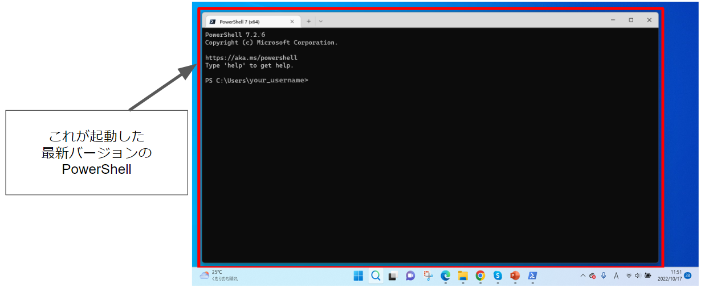
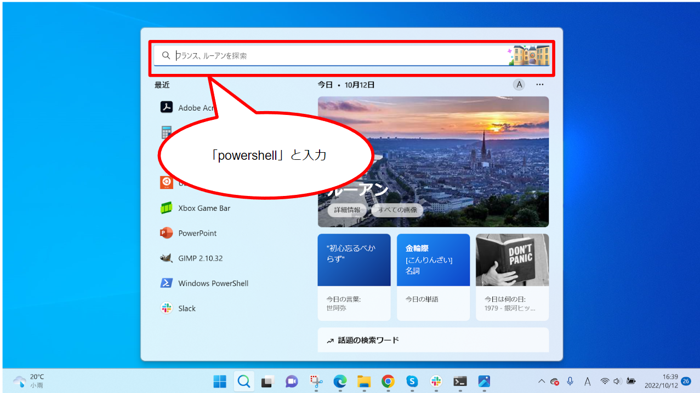
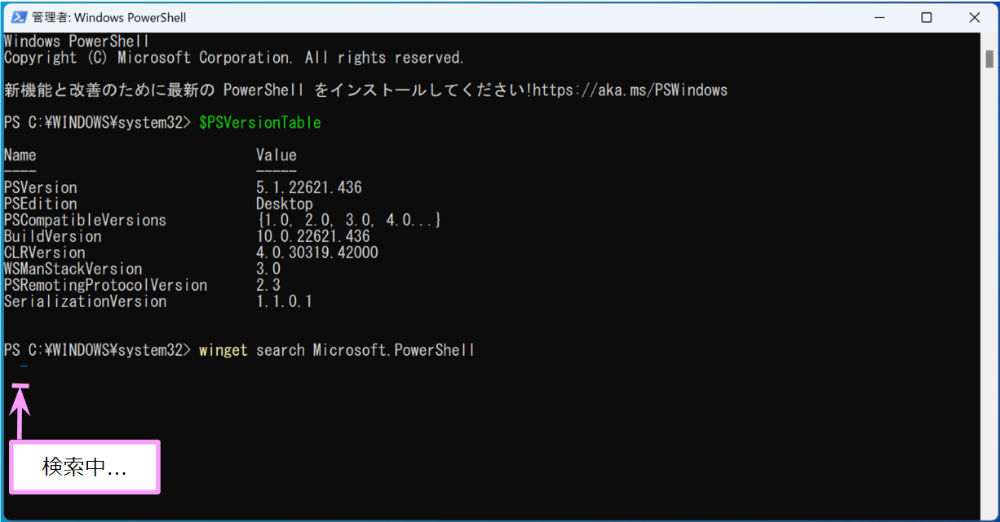
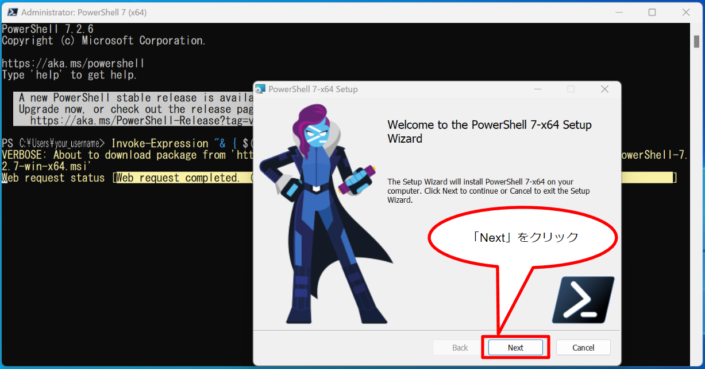
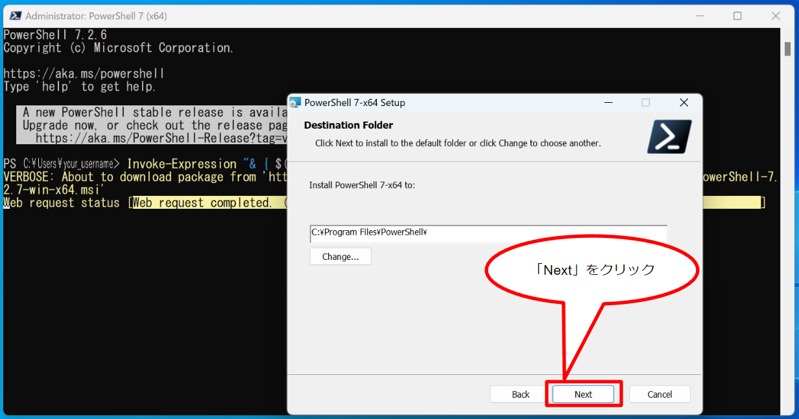

## &#x1F180; How to install the latest version of PowerShell {#install-latest-powershell}

&#x1F150; This division explains how to update the PowerShell that comes standard with Windows to the latest version.

How to check the version: for more information [see "How to check the version of PowerShell" on this page](/guides/FAQ/faq_general_analysis_division/faq_sshkeys_windows/#check-powershell-version).

- [Check which version of PowerShell you are using](/guides/FAQ/faq_general_analysis_division/faq_sshkeys_windows/#check-powershell-version#curren-ver) by execuing the `$PSVersionTable` command.
- To [search for the latest version of PowerShell](/guides/FAQ/faq_general_analysis_division/faq_sshkeys_windows/#check-powershell-version#latest-ver), execute the `winget search Microsoft.PowerShell` command.

If it is not the latest version, the following screen appears.


### - Installing PowerShell on Windows {#install-latest-powershell#how-to-install}

From the command prompt on PowerShell, type the following command and press the Enter key.

```
winget install --id Microsoft.Powershell --source winget
```


The installation will start.


If the following screen appears, click 'Yes'.


The installation proceeds and the following screen is displayed. At this point, the installation is still in progress. Wait a second for the installation to complete.


The installation is complete when the message "Installation completed."


The latest version of PowerShell has been installed on the user's Windows PC.

Now that the installation is complete, start the installed latest version of PowerShell to check the operation.


### - Operation check {#install-latest-powershell#operation-check}

To start the latest version of PowerShell, use the `pwsh` command; using the `powershell` command will launch an older version of PowerShell. &#x1f517;<a href="https://learn.microsoft.com/en-gb/powershell/scripting/whats-new/differences-from-windows-powershell?view=powershell-7.2#renamed-powershellexe-to-pwshexe">Please refer to the Microsoft Official Home Page for an explanation of this situation.</a>

Click the Windows symbol and click in the search box.


Type 'pwsh'.


When entered, the executable file 'PowerShell 7 (x64)' will appear in the search results, click 'Open'.


Click to start the latest version of PowerShell that you just installed.

On this page, PowerShell 7.2.6 will be launched because we have installed PowerShell 7.2.6, which is the latest as of 19 October 2022.



At this time, the PowerShell 7.2.6 screen will appear as follows.


Once you have launched the latest version, check that the PowerShell you are launching is indeed the latest version. To check, execute the `$PSVersionTable` command. You can see the following screen when it indicates that the latest version is running.

If you see the following message on the screen when you start the latest version, you are told that a more recent version has been released.


```
 A new PowerShell stable release is available: v7.2.7
   Upgrade now, or check out the release page at:
     https://aka.ms/PowerShell-Release?tag=v7.2.7
```

When a more recent version is released than the latest version installed this time, the executable file is immediately uploaded to Github on the official Microsoft website and becomes ready for installation, but there is a time lag before the latest version is reflected in the `winget` command, so this message is displayed.

For further instructions on how to upgrade to the more recent version, see [instructions on how to upgrade on this page](/guides/FAQ/faq_general_analysis_division/faq_sshkeys_windows/#check-powershell-version#latest-ver).

&#x1F4D6; About the time difference
- 19 Oct 2022 - The latest version 7.2.6 was installed at this point.
- 20 Oct 2022 - A more recent version 7.2.7 was released.
- 21 Oct 2022 - Checked and found that the executable file had been uploaded to Github, but it was not yet reflected in the `winget` command.
- 26 Oct 2022 - When the `winget search Microsoft.PowerShell` command was executed, the latest version had been updated and that 7.2.7 was the latest.

&#x1F4D6; Confirmed Github page on the Microsoft Official Home Page: &#x1f517;https://github.com/PowerShell/PowerShell/releases/


### - References {#install-latest-powershell#references}

- &#x1f517;<a href="https://learn.microsoft.com/en-gb/powershell/scripting/install/installing-powershell-on-windows?view=powershell-7.2#install-powershell-using-winget-recommended">Microsoft - Official Home Page - Install PowerShell using Winget (recommended)</a>
- &#x1f517;<a href="https://learn.microsoft.com/en-gb/powershell/scripting/whats-new/differences-from-windows-powershell?view=powershell-7.2#renamed-powershellexe-to-pwshexe">Microsoft - Official Home Page - Differences between Windows PowerShell 5.1 and PowerShell 7.x</a>


## &#x1F180; How can I open PowerShell? {#how-to-open-powershell}

&#x1F150; Type "powershell" in the search box.



When entered, the screen appears as follows.


Click 'Open'.


After clicking, PowerShell is launched


## &#x1F180; How to check the version of PowerShell {#check-powershell-version}

&#x1F150;

### - Check which version of PowerShell you are using {#check-powershell-version#curren-ver}

Type the following command and press the Enter key.

```
$PSVersionTable
```


The version is displayed.


### - Search for the latest version of PowerShell {#check-powershell-version#latest-ver}

Type the following command and press the 'Enter' key.

```
winget search Microsoft.PowerShell
```


Then, the search is started.



When it is finished, possible installation versions is listed.


When installing, install the official stable release. This is the one that does not have '.Preview' at the end.


## &#x1F180; Though the latest version of PowerShell has installed, the message `A new PowerShell stable release is available` is displayed. {#a-new-powershell-stable-release-is-available}

&#x1F150; Enter the following command and press the Enter key to further upgrade to the latest version. The `winget` command is not yet reflected in the `winget` command, so get it directly from the script on the Github page.

```
Invoke-Expression "& { $(irm https://aka.ms/install-powershell.ps1) } -UseMSI"
```


Click 'Next'.



Click 'Next'.



Make sure that the top two checkboxes are ticked. They will appear checked from the beginning, but if they are not, check them. Then click on 'Next'.


Make sure that both checkboxes are ticked. They will appear checked from the beginning, but if they are not, check them. Then click on 'Next'.


Click 'Install'.


The installation will start and the following screen will appear. Ensure that the button on the top line is selected and click 'OK'.


When clicked, PowerShell 7.2.6 that was running is automatically closed and only the 'PowerShell 7-x64 Setup' window is open, as shown in the image below, and the installation starts.


Click 'OK'.


Check the 'Launch PowerShell' checkbox and click 'Finish'. Checking the box will automatically restart the system.


PowerShell 7.2.7 will start automatically. When it starts, the following screen appears.


When launched, type the following command and press the Enter key.

```
$PSVersionTable
```


Then the version of Windows PowerShell currently running will be displayed as 7.2.7.


This display confirms that PowerShell 7.2.7 is indeed installed.

The installation of the latest version has been completed.


## &#x1F180; What are the main differences between PowerShell 5.1 and 7.2.6?

&#x1F150; By default, the differences are as follows

- Executable file location

PowerShell 5.1 

```
C:\Windows\SysWOW64\WindowsPowerShell\v1.0\powershell.exe
```


PowerShell 7.2.6

```
C:\Program Files\PowerShell\7\pwsh.exe
```

- Executable file name

PowerShell 5.1

```
powershell.exe
```

PowerShell 7.2.6

```
pwsh.exe
```

In PowerShell 7.2.6, the executable file is installed with the name 'pwsh.exe', so when searching for PowerShell, type 'pwsh' instead of 'powershell'.

For more  information, refer &#x1f517;<a href="https://learn.microsoft.com/en-gb/powershell/scripting/whats-new/differences-from-windows-powershell?view=powershell-7.2#renamed-powershellexe-to-pwshexe">Microsoft - Official Home Page - Differences between Windows PowerShell 5.1 and PowerShell 7.x</a>


## &#x1F180; I would like to know more about installation using `winget`. {#install-with-winget}

&#x1F150; Please refer to the Installing PowerShell on Windows page on the Microsoft official Home Page. &#x1f517;<a href="https://learn.microsoft.com/en-gb/powershell/scripting/install/installing-powershell-on-windows?view=powershell-7.2#install-powershell-using-winget-recommended">Click here to move that page.</a>
