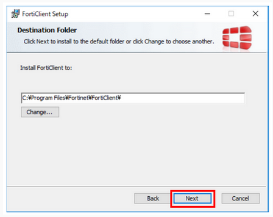
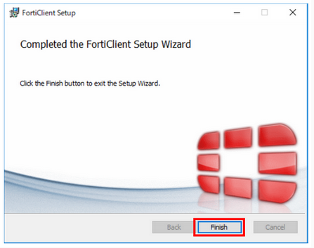

## Download the SSL-VPN client software "FortiClient" {#download-forticlient}

Click on the following URL to access the official ForiClient website page. You will see several software, of which download 'FortiClient VPN only'.

- FortiClient official website: [https://www.fortinet.com/support/product-downloads](https://www.fortinet.com/support/product-downloads)

For more detailed download instructions, see [FAQ](/guides/FAQ/faq_personal_genome/faq_forticlient/faq_forticlient#how-to-DL-VPN).

## Install the SSL-VPN client software "FortiClient" {#install-forticlient}

1. Run the installation program saved in the download folder.
If "User Account Control" is displayed, select "Yes" to allow it.

2. Check the box for "Yes, I have read and accept the" and click "Next".

3. Select the set-up type of the user's computer. 

The type to select depends on whether virus checking software is installed on the user's computer or not.

Notes.
- **Ensure that the checkboxes are ticked as shown in the image below.**
- **If other unchecked items are ticked, the system may not work properly.**

【If virus checking software is installed on the user's computer】

Ensure "Secure Remote Access" is checked on the "Choose Setup Type" screen and click "Next".

【If virus checking software is not installed on the user's computer】

Ensure "Secure Remote Access", "Additional Security Features" and "AntiVirus" are checked on the "Choose Setup Type" screen and click "Next".

4. On the "Destination Folder" screen, just click "Next". *Normally, no changes are required.

5. Click "install". Installation will be started.

6. Click 'Finish'. Installation is completed.

